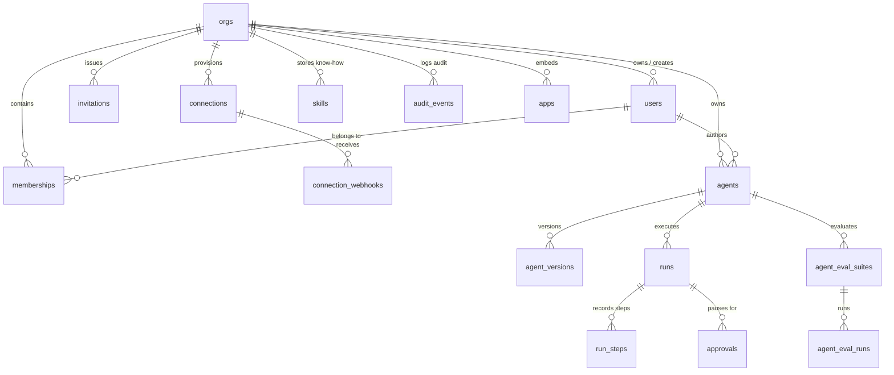
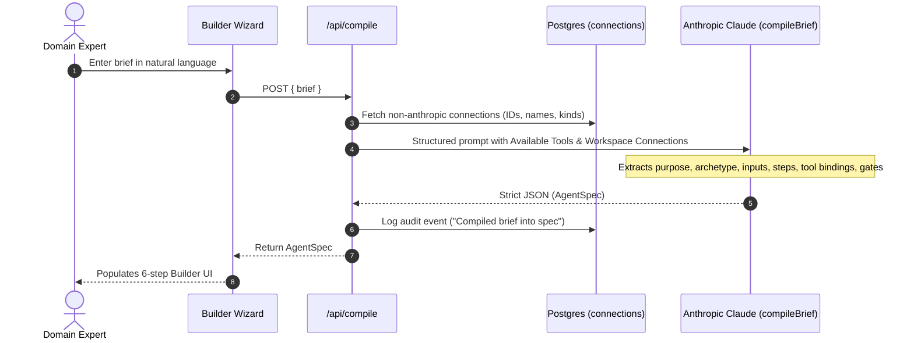
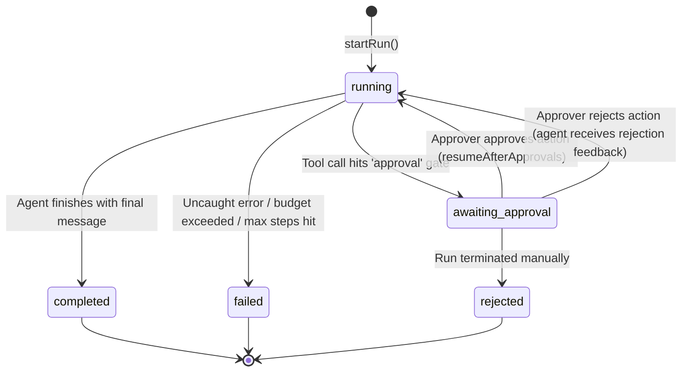
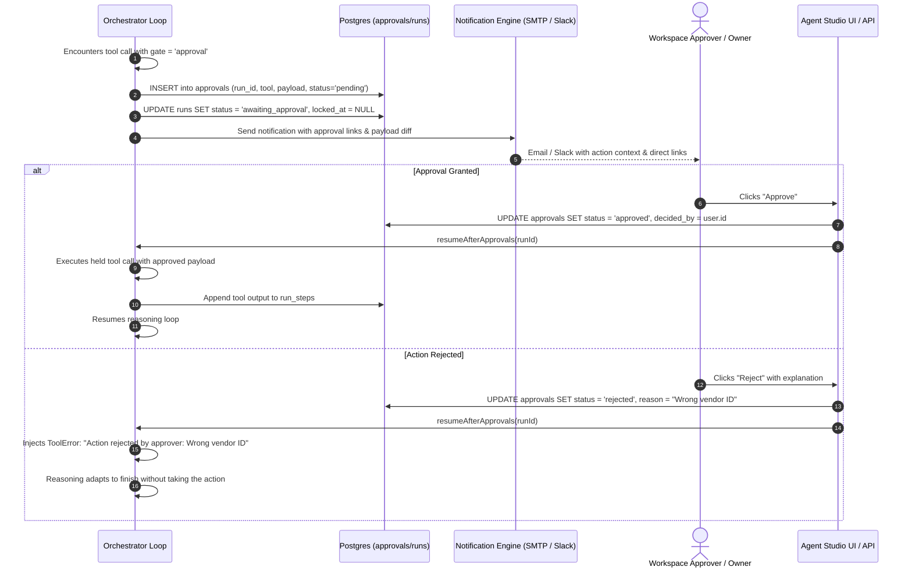
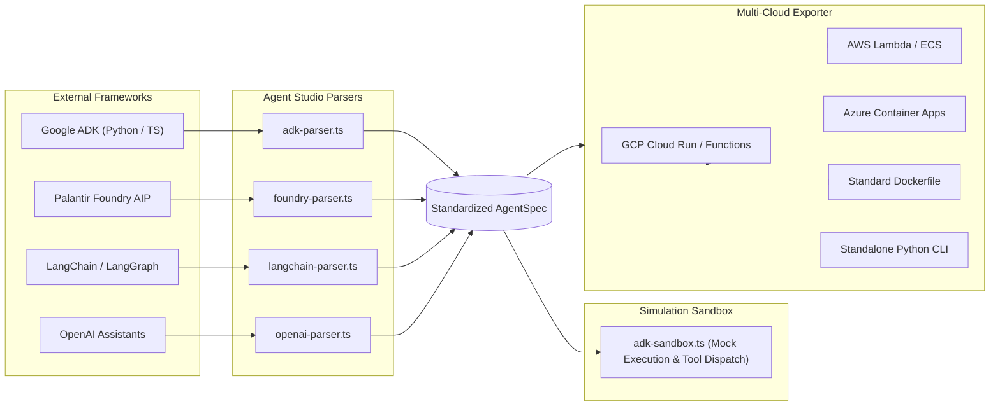

# Technical Design Document (TDD): Agent Studio

## 1. Executive Summary & Architectural Philosophy

**Agent Studio** is an enterprise-grade, domain-agnostic, no-code autonomous agent engineering platform. It bridges the divide between non-technical domain experts and governed production execution by transforming plain-language requirements into mathematically grounded, structured, and auditable specifications (`AgentSpec`).

### Core Design Principles
1. **Spec-Driven, Not Prompt-Driven**: Natural language briefs are compiled into a formal, typed JSON specification (`AgentSpec`). Users and runtime engines interact with the declarative spec, never with raw, unconstrained prompt strings.
2. **Strict Bifurcation of Build and Run**: Creating or reconfiguring an agent occurs in a dedicated 6-step builder wizard. Executing an agent generates a strictly validated, dynamic form derived directly from the agent's declared inputs (`SpecInput`).
3. **Defense-in-Depth Governance & Human-in-the-Loop (HITL)**: Actions with real-world side effects (medium and high risk) are strictly gated behind asynchronous, multi-channel approval gates with lease-locked state resumption.
4. **Zero-Trust Connection Tenancy**: Third-party credentials (databases, SMTP, APIs, Slack, Anthropic keys) are encrypted at rest with AES-256 and never returned to the client. Workspaces bring their own keys or fall back to system defaults.
5. **Progressive Disclosure**: Context windows are safeguarded by disclosing skill metadata (name and one-line summaries) in system prompts while lazily pulling full instruction bodies only when an agent invokes `load_skill`.
6. **Multi-Tenant Isolation with Sovereign Workspaces**: Users can hold concurrent memberships across multiple organizations (`orgs`) with fine-grained roles (`admin`, `builder`, `approver`, `owner`) without cross-tenant state leakage.

---

## 2. High-Level System Architecture

Agent Studio runs as a stateful, long-lived server application built on Next.js App Router (Node.js 22+ runtime) backed by PostgreSQL 16 and a decoupled background heartbeat scheduler.

```mermaid
flowchart TB
    subgraph ClientLayer ["Client & Embedding Layer"]
        UI["Web App (Next.js 14 / React 18 / Vanilla CSS)"]
        Canvas["App Canvas & Swarm Visualizer"]
        SDK["Agent Studio Bridge SDK (iframe/postMessage)"]
        ExtClient["External Systems / Webhooks / REST API v1"]
    end

    subgraph APILayer ["Next.js App Router (Node.js 22+)"]
        AuthMiddleware["Auth & RBAC Middleware (jose JWT)"]
        APIRoutes["Route Handlers (/api/*)"]
        V1Public["Public REST API (/api/v1/*)"]
        CronRoute["Cron Ingestion (/api/cron)"]
        WebhookRoute["Inbound Webhooks (/api/webhooks)"]
        Compiler["Brief-to-Spec Compiler"]
    end

    subgraph CoreEngine ["Agent Studio Core Runtime"]
        Orchestrator["Execution Orchestrator (Plan-Act-Observe Loop)"]
        LeaseMgr["Atomic Lease & Lock Manager (5 min lease)"]
        DLP["Guardrails & DLP Masking Engine"]
        ProgressiveSkills["Progressive Skill Resolver"]
        BudgetEngine["Spend Tracking & Budget Cap Engine"]
        Exporter["Multi-Cloud Exporter Engine (JSZip)"]
        EvalEngine["Regression Test & Eval Harness"]
    end

    subgraph IntegrationLayer ["Tools & Connectors"]
        ToolExecutor["Tool Execution Runtime"]
        MCPClient["Model Context Protocol (MCP) Client"]
        DocEngines["Doc Parsers (PDF, DOCX, XLSX, CSV)"]
        DocGenerators["Doc Generators (DOCX, XLSX, Markdown)"]
        Crypt["Crypto Vault (AES-256 Secrets Encryption)"]
    end

    subgraph ExternalServices ["External Infrastructure"]
        Postgres[(PostgreSQL 16 Engine)]
        LocalStorage[("Storage / Artifacts Directory")]
        AnthropicAPI["Anthropic Claude API (Sonnet 3.5 / Haiku)"]
        RemoteMCP["Remote MCP Servers"]
        TargetClouds["GCP / AWS / Azure / Docker Deployments"]
        NotificationTargets["SMTP Mailers / Slack Webhooks"]
    end

    subgraph SchedulerProcess ["Standalone Daemon"]
        HeartbeatDaemon["Scheduler Daemon (scripts/scheduler.mjs)"]
    end

    UI --> AuthMiddleware
    Canvas --> AuthMiddleware
    SDK --> APIRoutes
    ExtClient --> V1Public
    ExtClient --> WebhookRoute

    AuthMiddleware --> APIRoutes
    APIRoutes --> Compiler
    APIRoutes --> Orchestrator
    CronRoute --> Orchestrator
    HeartbeatDaemon -.->|HTTP POST with x-cron-secret| CronRoute

    Compiler --> AnthropicAPI
    Orchestrator --> LeaseMgr
    Orchestrator --> DLP
    Orchestrator --> ProgressiveSkills
    Orchestrator --> BudgetEngine
    Orchestrator --> ToolExecutor
    Orchestrator --> AnthropicAPI

    ToolExecutor --> MCPClient
    ToolExecutor --> DocEngines
    ToolExecutor --> DocGenerators
    ToolExecutor --> Crypt

    MCPClient --> RemoteMCP
    ToolExecutor --> NotificationTargets
    ToolExecutor --> Postgres

    Orchestrator --> Postgres
    Orchestrator --> LocalStorage
    Exporter --> TargetClouds
    EvalEngine --> Orchestrator
```



---

## 3. Domain Model & Data Architecture

The underlying persistence layer uses PostgreSQL 16 with idempotent migrations managed through `db/schema.sql`.

### 3.1 Entity-Relationship Overview



### 3.2 Key Database Entities

1. **`orgs`**: Sovereign workspace root. Stores name, timezone (for localized cron evaluation), `owner_id`, and `monthly_spend_cap_cents`.
2. **`users` & `memberships`**: Multi-workspace tenancy. A user has an email and password hash, with fine-grained roles defined per workspace in `memberships` (`admin`, `builder`, `approver`).
3. **`connections`**: Standing enterprise credentials (`postgres`, `http`, `smtp`, `slack`, `anthropic`, `files`). Sensitive connection parameters (`password`, `apiKey`, `token`) are symmetrically encrypted into `secret_enc`.
4. **`agents` & `agent_versions`**:
   - `agents` holds mutable draft specifications (`draft_spec`), lifecycle status (`draft`, `published`, `retired`), schedule configuration, and next execution timestamp (`next_run_at`).
   - `agent_versions` holds immutable snapshots of published specifications with incremental integer versions and change notes.
5. **`runs` & `run_steps`**:
   - `runs` tracks state transitions (`running`, `awaiting_approval`, `completed`, `failed`, `rejected`), cumulative token costs, and lease ownership (`locked_at`).
   - `run_steps` tracks granular timeline steps (thoughts, tool inputs, raw tool outputs, execution status, and durations).
6. **`approvals`**: Human-in-the-loop pending actions, holding the gated tool name, summarized payload, status (`pending`, `approved`, `rejected`), decision reasoning, and approver identity.
7. **`skills`**: Reusable workspace operating instructions. Attached to agents by ID and loaded dynamically during runs.
8. **`audit_events`**: Append-only compliance ledger recording actor, action, target entity, timestamp, and detailed diffs.
9. **`apps`**: Custom embedded tools and canvas applications with sandbox permissions and iframe display modes (`canvas`, `fullscreen`, `side_by_side`).
10. **`agent_eval_suites` & `agent_eval_runs`**: Regression and assertion testing framework tracking accuracy, tool precision, and hallucination scores.

### 3.3 The Core Specification Schema: `AgentSpec`

The declarative JSON structure defining an agent is typed in `src/lib/types.ts`:

```typescript
export interface AgentSpec {
  name: string;
  archetype: "analyst" | "author" | "operator" | "sentinel";
  purpose: string;
  brief: string;
  domain: string;
  sources: { connectionId: string; label?: string; scope?: string }[];
  steps: string[];
  tools: { id: string; gate: "auto" | "approval" }[];
  skills: string[]; // Skill IDs resolved dynamically at runtime
  inputs: SpecInput[]; // Typed form controls: text, longtext, number, date, choice, file
  output: { format: string; instructions: string };
  trigger: {
    type: "manual" | "schedule" | "event";
    schedule?: string;
    condition?: string;
    input?: string;
    inputs?: Record<string, string>;
  };
  guardrails: {
    maxSteps: number;
    requireCitations: boolean;
    escalateOnAmbiguity: boolean;
    stayInScope: boolean;
    extra: string;
    dlpEnabled?: boolean;
    redactCreditCards?: boolean;
    redactEmails?: boolean;
    redactCredentials?: boolean;
    redactPhoneNumbers?: boolean;
    customDlpPatterns?: { name: string; pattern: string; replacement: string }[];
    rateLimitRpm?: number;
    rateLimitTpm?: number;
  };
  swarm?: {
    enabled: boolean;
    strategy: "router" | "parallel" | "sequential";
    supervisorRole?: string;
    workers: { agentId: string; name: string; role: string; taskPrompt?: string }[];
  };
}
```

---

## 4. Subsystem Deep Dives

### 4.1 The Brief-to-Spec Compiler
Located in `src/lib/ai.ts` and invoked via `/api/compile`.



* **Compilation Constraints**:
  - The model key connection is never exposed to the compiler prompt.
  - Automatically identifies input requirements (e.g. references to "ledger", "csv", "invoice" convert into typed file pickers; numbers convert to typed thresholds).
  - Automatically maps tools to default risk gates (medium/high risk tools cannot default to `auto` gating).

---

### 4.2 The Execution Orchestrator & Plan–Act–Observe Loop
Located in `src/lib/orchestrator.ts`.



#### Orchestration Flow & Concurrency Controls
1. **Atomic Claiming with Distributed Leases**:
   - `advance(runId, user)` performs an atomic query:
     ```sql
     UPDATE runs SET locked_at = now()
     WHERE id = $1 AND status = 'running'
       AND (locked_at IS NULL OR locked_at < now() - interval '5 minutes')
     RETURNING *;
     ```
   - Prevents duplicate tool invocation if multiple workers or webhooks trigger the same run.
2. **Dynamic Context Assembly**:
   - Gathers decrypted connection configurations, attached skill stubs, and DLP options.
   - Dynamically constructs the system prompt:
     - Formats declared steps and operational boundaries.
     - Adds guardrails (anti-hallucination, citation rules, scope boundaries).
     - Injects progressive disclosure stubs for all attached skills.
3. **Execution Turn Loop**:
   - Posts conversation history and available tool declarations to Anthropic Claude.
   - Parses streaming/block responses:
     - **Text / Thoughts**: Streamed and stored as thought steps.
     - **Tool Calls**: Evaluates tool gate.
       - If `auto`: Invokes tool immediately, logs duration and result, masks PII via DLP, appends result to message history, loops.
       - If `approval`: Persists step, pauses execution, inserts approval record into `approvals`, releases run lock, transitions run status to `awaiting_approval`, dispatches email and Slack notifications.

---

### 4.3 Progressive Disclosure Skill System

Instead of overwhelming the LLM context window with hundreds of skill instructions:
1. **Metadata in System Prompt**: Only the name and one-line summary of each attached skill are embedded in the base system instructions:
   ```
   SKILLS AVAILABLE IN THIS WORKSPACE:
   - "GAAP Lease Accounting": Step-by-step guidance for ASC 842 / IFRS 16 lease classification.
   - "Customer Tone of Voice": House tone, banned phrases, and escalation guidelines.
   ```
2. **On-Demand Retrieval via `load_skill`**:
   - The runtime registers an implicit tool: `load_skill(name: string)`.
   - The agent calls `load_skill` only when its reasoning indicates it needs the full guideline.
   - The orchestrator fetches the markdown body from the `skills` table and returns it directly to the model context.
3. **Decoupled Lifecycle**:
   - Skills are workspace-scoped. Updating a skill takes effect on the next agent turn across all referencing agents without requiring each agent to be republished.

---

### 4.4 Human-in-the-Loop (HITL) Governance & Approval Gates

Medium and high-risk operations (sending emails, modifying databases, invoking external APIs, posting to Slack) are protected by a human-in-the-loop safety net:



---

### 4.5 Tool Runtime & Extensibility

The runtime exposes 8 built-in core tools (`src/lib/tools.ts`) alongside custom extensions:

| Tool ID | Risk | Required Connection | Description & Implementation |
|---|---|---|---|
| `search_web` | Low | None | Web search executed server-side via Anthropic's native search capabilities. |
| `fetch_web_page` | Low | None | HTTP client fetching URLs, parsing HTML, extracting clean text. |
| `query_database` | Low | `postgres` | Read-only SQL execution on connected data warehouses. Non-SELECT statements rejected unless connection explicitly permits writes. |
| `read_document` | Low | None | In-memory extraction of uploaded files: PDF (`pdf-parse`), DOCX (`mammoth`), XLSX (`xlsx`), CSV (`papaparse`), TXT. |
| `call_api` | Medium | `http` | REST client supporting arbitrary HTTP verbs, URL path interpolation, and encrypted headers. |
| `send_email` | Medium | `smtp` | Real outbound email dispatch using `nodemailer` through workspace SMTP credentials. |
| `post_slack` | Medium | `slack` | Outbound JSON payload dispatch to Slack incoming webhooks. |
| `write_file` | Low | None | File generation written to workspace artifact storage (Markdown, CSV, DOCX via `docx`, XLSX via `xlsx`). |

#### Model Context Protocol (MCP) Integration
Implemented in `src/lib/mcp-client.ts`:
- Connects to remote or local MCP tool servers.
- Performs schema introspection (`tools/list`).
- Normalizes JSON Schemas into typed parameter tables for the builder UI and dynamic LLM tool calling.

---

### 4.6 Multi-Agent Swarm Orchestration & App Canvas

Agent Studio supports multi-agent collaboration and custom embedded web canvases:
1. **Swarm Execution Strategies**:
   - **Router / Supervisor**: A supervisor agent triages the initial user request and delegates sub-tasks to worker agents.
   - **Parallel**: Multiple specialized agents execute concurrently over different parts of the input, aggregating results into a final deliverable.
   - **Sequential Pipeline**: Output from Agent A feeds directly as input to Agent B.
2. **Embedded App Canvas (`src/components/AppCanvasViewer.tsx`)**:
   - Embeds third-party tools, dashboards, and custom UIs directly within the workspace.
   - **Bridge SDK (`agent-studio-bridge.js`)**: Uses `postMessage` protocol allowing embedded applications to trigger agent runs, stream events, request human approvals, and pass bi-directional context.

---

### 4.7 Multi-Framework Interoperability & Code Sandbox

The studio provides bi-directional interoperability across industry agent ecosystems:



---

### 4.8 Evaluation & Regression Harness (Evals)

Located in `src/lib/evals.ts`:
- **Test Suites (`agent_eval_suites`)**: Collections of test cases assessing safety, tool choice precision, and grounding.
- **Automated Assertions**:
  - `expectedTools` and `forbiddenTools` adherence.
  - `mustInclude` and `mustNotInclude` keyword and regex matching.
  - LLM-as-a-judge scoring for hallucination detection and response quality.
- **Regression Scoring**: Compares eval runs between agent versions, displaying pass/fail rates, latency deltas, and token cost changes.

---

### 4.9 Scheduling & Unattended Background Runs

Agent Studio runs scheduled agents without requiring heavy background worker frameworks:
1. **Decoupled Heartbeat Daemon**:
   - `scripts/scheduler.mjs` wakes every 60 seconds and performs an HTTP POST to `/api/cron` with `x-cron-secret`.
   - The same endpoint can be driven by AWS EventBridge, Google Cloud Scheduler, or native Kubernetes cron jobs.
2. **Transaction-Safe Worker Locking**:
   - `/api/cron` initiates a PostgreSQL transaction with:
     ```sql
     SELECT id, org_id, name, owner_id, published_ver, schedule, o.timezone
     FROM agents a
     JOIN orgs o ON o.id = a.org_id
     WHERE a.status = 'published'
       AND a.next_run_at <= now()
       AND a.schedule IS NOT NULL
     ORDER BY a.next_run_at
     LIMIT 20
     FOR UPDATE OF a SKIP LOCKED;
     ```
   - Advances `next_run_at` immediately before releasing the transaction, guaranteeing zero duplicate firings even under multiple racing schedulers.

---

## 5. Security, Tenancy & Compliance Architecture

### 5.1 Multi-Tenant Isolation
- **Organizational Boundary**: Every domain table enforces foreign key scoping to `org_id`.
- **RBAC Matrix**:
  | Role | View Agents & Runs | Run Agent | Edit / Draft | Publish / Retire | Delete Agent | Manage Org & Members |
  |---|:---:|:---:|:---:|:---:|:---:|:---:|
  | **Owner** | Yes | Yes | Yes | Yes | **Yes** | **Yes** |
  | **Admin** | Yes | Yes | Yes | Yes | No | **Yes** |
  | **Builder** | Yes | Yes | Yes | No | No | No |
  | **Approver** | Yes | Yes | No | No | No | No |

### 5.2 Cryptography & Secrets Vault
- Credentials are encrypted at rest using AES-256-GCM via `src/lib/crypto.ts`.
- Initialization vectors (IV) are unique per encrypted field.
- Decrypted secrets exist only in ephemeral execution memory and are stripped prior to client transmission or audit logging.

### 5.3 Data Loss Prevention (DLP) & Guardrails
- Implemented in `src/lib/guardrails.ts`:
  - **Credit Card Redaction**: Luhn-validated pattern matching.
  - **High-Entropy Secret Detection**: Detects Bearer tokens, Anthropic/OpenAI keys (`sk-...`), GitHub tokens, AWS keys (`AKIA...`), and RSA private keys.
  - **PII Redaction**: Redacts emails, phone numbers, and US SSNs.
  - **Rate Limiting**: Workspace token and request bucket enforcement (`rateLimitRpm`, `rateLimitTpm`).

### 5.4 Spend Governance
- Workspaces can configure hard spending caps (`monthly_spend_cap_cents`).
- Every model turn tracks exact prompt, completion, and cache tokens, calculating USD costs via `src/lib/pricing.ts`.
- If a workspace exceeds its monthly ceiling, active runs are terminated and new runs are refused.

---

## 6. Public REST API & Webhook Specifications

### 6.1 Public REST API v1 (`/api/v1/*`)
External applications invoke published agents programmatically via API keys or session tokens:
- `POST /api/v1/agents/:id/invoke`: Synchronously or asynchronously triggers an agent run with custom parameters.
- `GET /api/v1/runs/:id`: Polls run progress, timeline steps, outputs, or pending approval requests.
- `POST /api/v1/approvals/:id/decide`: Programmatically resolves a pending approval gate (`approved` | `rejected`).

### 6.2 Inbound Webhooks (`/api/webhooks`, `/api/connections/:id/webhooks`)
- Listens for external events (e.g. ERP updates, GitHub events, Stripe webhooks).
- Logs payloads in `connection_webhooks`.
- Fires agents whose trigger configuration matches the incoming webhook criteria.

---

## 7. Deployment & Infrastructure Architecture

### 7.1 Container Architecture
Agent Studio compiles into an Alpine container using a 3-stage Dockerfile:
1. **`deps` stage**: Alpine Node 22 installs package dependencies with `npm ci`.
2. **`build` stage**: Next.js production build (`npm run build`).
3. **`run` stage**:
   - Stripped unprivileged user `app:app`.
   - Volume mount at `/data/storage` for generated deliverables and uploads.
   - Built-in HTTP health check endpoint: `/api/health`.

### 7.2 Scalability & State Management
- **Stateless Web Nodes**: Next.js web application instances can scale horizontally behind any load balancer.
- **Database-Backed Coordination**: Concurrency coordination relies on PostgreSQL row locks (`skip locked`) and leases (`locked_at`), avoiding dependencies on Redis clusters for core orchestration.
- **Resilient Workflows**: Unfinished runs from terminated or crashed instances automatically unlock after the 5-minute lease expiry and can be resumed by available nodes.

---

## 8. Summary Checklist of System Capabilities

| Capability Area | Status | Key Modules |
|---|---|---|
| **No-Code Compilation** | Complete | `src/app/api/compile/route.ts`, `src/lib/ai.ts` |
| **Agent Spec Engine** | Complete | `src/lib/types.ts`, `src/lib/spec-diff.ts` |
| **Orchestration Loop** | Complete | `src/lib/orchestrator.ts`, `src/lib/tools.ts` |
| **Human Approvals** | Complete | `src/lib/approvals.ts`, `src/lib/notify.ts` |
| **Progressive Skills** | Complete | `src/lib/skills.ts` |
| **Tool Sandbox & MCP** | Complete | `src/lib/mcp-client.ts`, `src/lib/adk-sandbox.ts` |
| **Framework Interop** | Complete | `adk-parser.ts`, `foundry-parser.ts`, `langchain-parser.ts`, `openai-parser.ts` |
| **Multi-Cloud Export** | Complete | `src/lib/agent-exporter.ts` |
| **Evals Harness** | Complete | `src/lib/evals.ts`, `src/components/AgentEvalsView.tsx` |
| **Multi-Agent Canvas** | Complete | `src/components/AppCanvasViewer.tsx`, `src/components/SwarmCanvas.tsx` |
| **DLP & Guardrails** | Complete | `src/lib/guardrails.ts`, `src/lib/crypto.ts` |
| **Scheduler Daemon** | Complete | `scripts/scheduler.mjs`, `src/app/api/cron/route.ts` |
